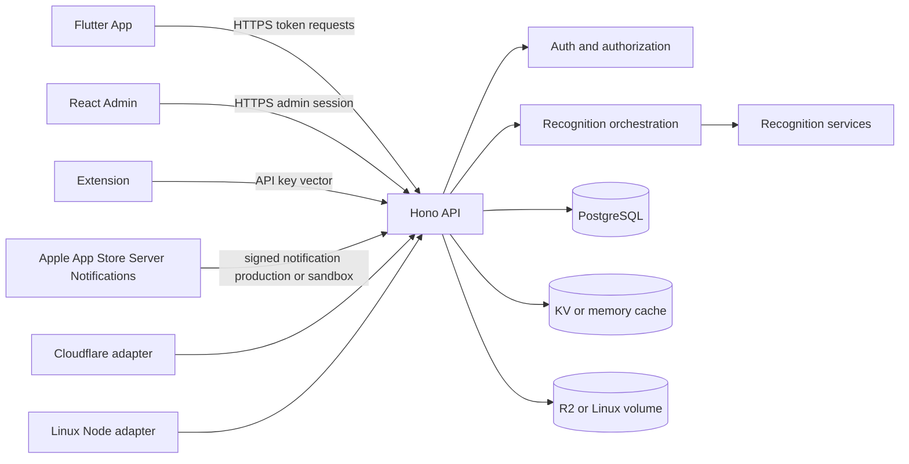

# Kando 数据流图

```mermaid
flowchart LR
  App[Flutter App] -->|HTTPS token requests| API[Hono API]
  Admin[React Admin] -->|HTTPS admin session| API
  Plugin[Extension] -->|API key vector| API
  Apple[Apple App Store Server Notifications] -->|signed notification production or sandbox| API
  API --> Auth[Auth and authorization]
  API --> Scan[Recognition orchestration]
  API --> DB[(PostgreSQL)]
  API --> Cache[(KV or memory cache)]
  API --> Image[(R2 or Linux volume)]
  Scan --> External[Recognition services]
  CF[Cloudflare adapter] --> API
  Linux[Linux Node adapter] --> API
```

供应链数据流：官方registry与工具分发站点 → pnpm/Flutter/Gradle → CI与开发机 → Worker、Admin与移动制品。
