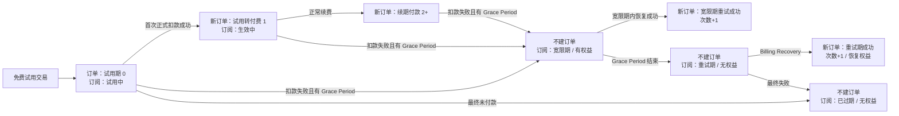
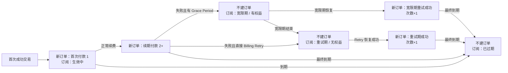
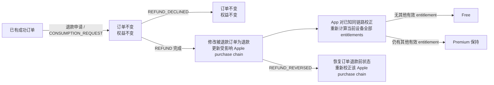
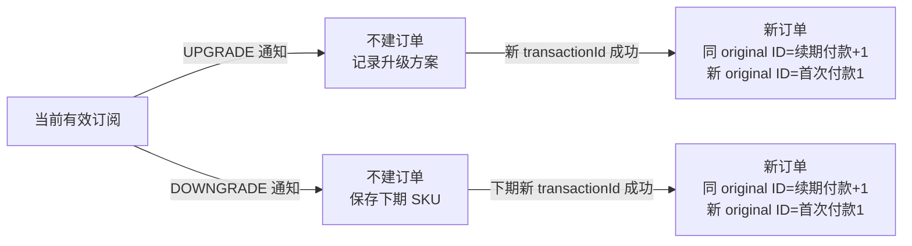
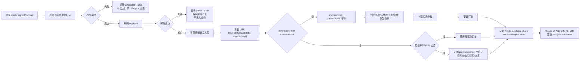

# TCG Admin 后台新增需求 PRD  
## 订单统计 & 苹果通知消息

| 文档信息 | 内容 |
|---|---|
| 产品 | TCG Admin |
| 需求模块 | 数据统计 / 订单统计 / 苹果通知消息 |
| 文档版本 | V1.1 订阅真值收口版 |
| 日期 | 2026-08-11 |
| 时间口径 | 页面展示统一使用 UTC+0 |
| 适用范围 | iOS App Store 订阅、免费试用、自动续订及 Lifetime 一次性购买 |
| 页面属性 | 查询型、只读型后台页面 |

---

## 0. Apple Subscription / Premium 统一口径与优先级

涉及 Premium ownership、Apple entitlement、StoreKit、App Store Server Notifications V2、Apple Server API、Purchase / Restore 即时解锁、退款 / 过期 / 宽限期 / Billing Retry 等生命周期状态，以及客户端与服务端状态冲突处理时，统一以《Apple Subscription & Premium 权益统一方案》及当前 App v1.1 PRD 已确认规则为上位口径。

本 Admin PRD 只定义：

- Apple 通知与交易事实如何接收、验证、保存和加工；
- 订单统计与订阅链路生命周期状态如何展示；
- Admin 页面查询、筛选、详情和只读能力；
- 为上述页面与 App 生命周期校正提供的后端产品结果。

统一原则：

1. **Apple 是最终权威数据源。**
2. **Premium 不属于 App UID / App 账号。** UID 只用于订单、通知、统计和客服排查等业务关联。
3. 服务端维护的是 Apple purchase chain（`environment + originalTransactionId`）的 verified lifecycle state，不得把该状态解释为“UID 拥有 Premium”。
4. App Purchase / Restore 经 StoreKit verified 后客户端立即解锁，不等待 Server Notification、Admin 订单或后台同步完成。
5. Server Notification / Apple Server API 用于后续续订、Grace Period、Billing Retry、Expired、Refund、Revoked 等生命周期维护与校正。
6. Admin 是只读查询层，不提供人工开启 / 关闭 Premium、修改 Apple entitlement 或改变 Premium ownership 的能力。
7. 服务端不可仅凭 UID 为某台设备建立 Premium 资格；App 只能对当前设备已知的同一 Apple 购买链路使用服务端 lifecycle state 做校正。

---

## 1. 需求背景

TCG App 即将接入 Weekly、Yearly、Lifetime 等付费商品，需要在后台增加两类数据能力：

1. **订单统计**  
   将 Apple 交易、订阅状态及通知消息加工为运营可理解的业务订单记录，用于查询用户的首次付款、试用转付费、正常续费、扣款失败恢复、订阅过期及退款等情况。

2. **苹果通知消息**  
   保存 App Store Server Notifications V2 的通知消息，便于开发、测试和产品查询 Apple 实际发送的主通知类型、子通知类型及完整消息内容，排查订单状态异常。

两者职责必须分开：

- **苹果通知消息**保存 Apple 原始通知与验签 / 解码结果，是数据事实层。
- **订单统计**是对通知消息、交易数据和历史状态进行加工后的业务结果层。
- **服务端订阅链路状态**维护 `environment + originalTransactionId` 对应 Apple purchase chain 的 lifecycle state，用于 App 对已知同链路做状态校正，但不是 UID Premium ownership。
- Apple 通知类型不直接等于订单状态，订单状态也不直接等于 App UID 的 Premium 状态，三者不得混为同一个字段。

---

## 2. 需求目标

### 2.1 订单统计目标

- 查询某个用户、订单、SKU 或时间范围内的订单记录。
- 区分正式环境和测试环境。
- 区分首次付款、续期付款、试用转付费、失败恢复、过期、退款完成等业务状态。
- 明确扣款次数的累计规则，避免试用、失败、过期、退款等非成功扣款事件错误增加次数。
- 同时展示用户本地币种金额及折算后的美元金额。
- 为运营、产品、测试提供统一、可解释的订阅订单口径。

### 2.2 苹果通知消息目标

- 查询 Apple 实际发送的订阅通知。
- 根据 UID、原始交易 ID、订单 ID、通知类型、环境和创建时间快速定位消息。
- 查看整条解码后的 Apple 通知内容。
- 保留原始消息，支持后续重新解析或排查新增字段。
- 不在该页面修改订单、用户权益或重新处理通知。

---

## 3. 范围说明

### 3.1 本期包含

- 左侧导航新增两个二级菜单。
- 订单统计查询、列表、刷新、导出和分页。
- 订单业务状态的生成与状态流转规则。
- 扣款次数计算规则。
- 原始金额、美元金额和汇率固化规则。
- 苹果通知消息查询、列表、详情及完整 JSON 展示。
- 正式、测试环境区分。
- 查询、空状态、加载状态和失败状态。
- 后端数据存储及幂等要求。
- App Store Server Notifications V2 正式 / 测试环境接收能力。
- Apple JWS 验签、Payload 解码、原始 `signedPayload` 与 Decoded Payload 保存。
- `transactionId` / `originalTransactionId` 交易与订阅链路维护。
- Notification 重复投递幂等、业务消费失败可恢复 / 重试、乱序 / 晚到保护。
- Refund / Revoked / Expired / Grace Period / Billing Retry / Billing Recovery 等 Apple 生命周期状态维护。
- 必要时通过 Apple Server API 查询当前交易 / 订阅状态进行校正。
- App 与服务端 Apple lifecycle state 的同步能力；该同步仅用于当前设备已知同一 Apple 购买链路的生命周期校正。

### 3.2 本期不包含

- 后台新增、编辑或删除订单。
- 人工订阅权益管理功能，例如后台手动开启 / 关闭 Premium、手工修改 Apple entitlement 或修改 Premium ownership。
- 后台开启或关闭用户自动续订。
- 手动重新消费 Apple 通知。
- 退款审核、退款操作和退款原因编辑。
- 订单详情二级页面。
- 图表、收入趋势或转化漏斗。
- 角色级、页面级细分权限。
- Google Play 订单和通知。
- 财务结算、税费及 Apple 分成对账。

---

# 4. 导航结构

在现有左侧一级菜单 **「数据统计」** 下增加：

```text
数据统计
├── 安装统计
├── 订单统计（新增）
└── 苹果通知消息（新增）
```

规则：

- 「订单统计」和「苹果通知消息」均为二级菜单。
- 点击二级菜单后，一级菜单保持展开。
- 当前二级菜单显示选中态。
- 两个页面均沿用现有后台权限：有后台访问权限即可查看。
- 页面均为只读，不提供新增、编辑和删除入口。

---

# 5. 核心名词与数据口径

## 5.1 UID

App 内部用户唯一标识。

产品规则：

- 订单及苹果通知数据最终需要能够关联到 UID。
- UID 与 Apple 交易之间具体使用 `appAccountToken`、映射表或其他字段关联，由开发根据实际接入方案决定，产品层面不强制指定技术方案。
- 无法立即关联 UID 时，订单和通知仍需正常保存，页面 UID 显示 `--`。
- 后续获得可靠 UID 后，**支持补关联历史订单和历史通知**。
- UID 补关联只补充用户关系，不得修改历史订单 ID、原始交易 ID、金额、订单时间、扣款次数等交易事实。
- UID 不承担 Premium ownership，不得把 `uid`、`appAccountToken` 或“该 UID 曾有 Premium 订单”作为当前设备 Premium 授权依据。
- 同一 Apple transaction / originalTransactionId 可以与 UID 建立业务关联，但该关联只用于查询、统计和排查，不代表 `UID → Apple purchase owner`。

## 5.2 原始交易 ID

对应 Apple `originalTransactionId`。

用途：

- 标识一条订阅购买链路。
- 同一条自动续订链路中的首次购买、续订、失败恢复等交易通常通过原始交易 ID 关联。
- 扣款次数以“环境 + 原始交易 ID”为主要累计范围。
- 页面查询支持精确匹配。
- `originalTransactionId` 标识 Apple purchase chain，不等于 App UID 的订阅所有权；不得由该字段反向建立 `UID → Premium owner`。

## 5.3 订单 ID

对应 Apple `transactionId`。

用途：

- 标识一次具体交易，如首次购买、续订或恢复扣款。
- 同一个原始交易 ID 下可以有多个订单 ID。
- 成功扣款次数必须按不同订单 ID 去重，重复通知不得重复累计。
- 页面查询支持精确匹配。

## 5.4 Apple 通知类型

由以下两个字段组成：

- 主通知类型：`notificationType`
- 子通知类型：`subtype`

Apple 主通知和子通知用于描述原始事件，不直接作为订单统计中的业务状态。

## 5.5 订单状态与当前订阅状态

为避免把“真实交易结果”和“订阅生命周期状态”混在同一个字段，本期最终拆为两个概念。

### A. 订单状态

订单状态描述**这一笔 Apple 交易本身发生了什么**。

订单表中的订单状态固定为：

1. 试用期
2. 首次付款
3. 试用转付费
4. 续期付款
5. 宽限期重试成功
6. 重试期成功
7. 退款

说明：

- 订单状态以交易为粒度。
- 新的有效 `transactionId` 才允许创建新的交易订单。
- 退款成功不新建退款订单，而是修改实际被退款的 `transactionId` 对应订单。
- 升级、降级通知本身不作为订单状态；真正产生新交易后，再按首次付款或续期付款记录。

### B. 当前订阅状态

以下状态不代表新交易，不应为了展示而创建一条 `$0.00` 的新订单：

- 试用中
- 生效中
- 宽限期
- 重试期
- 已过期

其中：

- 原需求中的「宽限期」调整为当前订阅状态。
- 原需求中的「订阅过期」调整为当前订阅状态。
- Billing Retry 期间使用「重试期」。
- 当前订阅状态与订单记录通过 `environment + originalTransactionId` 所属订阅链路关联。
- 当前订阅状态是 **Apple purchase chain 级生命周期状态**，不是“某个 UID 当前是否 Premium”的账号级状态。
- Admin 展示该链路状态，不提供人工修改；App 仅在当前设备已知同一 Apple 购买链路时使用服务端状态做生命周期校正。

这样可以保证：

- 历史“首次付款/续期付款”不会因为后来进入宽限期或过期而被覆盖。
- 运营仍能看到该订单所属订阅链路目前处于宽限期、重试期还是已过期。
- 订单数、付款次数和收入统计不会混入大量未发生交易的状态记录。

## 5.6 自动续订状态

展示值：

- 是
- 否

来源：

- 自动续订商品：读取 Apple 续订信息中的 `autoRenewStatus`。
- Lifetime 一次性商品固定为“否”。
- 表格展示的是该条订单事件发生时的状态快照，不使用后台查询时的最新值覆盖历史记录。


## 5.7 环境

页面展示：

- 正式：Apple `Production`
- 测试：Apple `Sandbox`

规则：

- TestFlight 和 Sandbox 交易统一展示为“测试”。
- 正式与测试记录不得混算扣款次数。
- 正式、测试环境中的相同订单 ID 也必须按不同环境隔离处理。

## 5.8 订单时间

订单统计不使用“付款时间”作为统一字段，统一使用：

**订单时间（UTC+0）**

原因：

- 试用期、宽限期和订阅过期等状态可能没有发生新扣款。
- 使用“付款时间”会导致业务含义错误。

不同状态的订单时间见第 8 章。

## 5.9 创建时间

苹果通知消息中的「创建时间（UTC+0）」指：

- 服务端成功将该条 Apple 通知消息写入数据库的时间。
- 对应后台字段 `created_at`。
- 不等同于 Apple `signedDate`。
- 每条通知消息必须存在创建时间。

## 5.10 Apple entitlement 与 Premium 的后台口径

本后台不得维护“UID Premium ownership”字段作为授权真值。服务端需要维护的是 Apple verified purchase chain lifecycle state。

统一关系：

```text
Apple transaction / originalTransactionId
→ 服务端 Apple verified lifecycle state
→ 订单 / 当前订阅状态 / entitlement 链路状态
→ App 在当前设备已知同一购买链路时用于生命周期校正
```

不得实现：

```text
UID = Premium owner
UID 在后台有 Premium 订单 → 任意设备自动 Premium
后台人工设置 UID Premium=true/false
```

客户端 Purchase / Restore 已通过 StoreKit verified 时，Admin 订单尚未出现、Notification 尚未送达或后台同步失败，不得被解释为购买失败，也不得要求客户端等待后台订单后才解锁。

---

# 6. 数据分层与记录粒度

## 6.1 苹果通知消息记录粒度

- 每收到一条 Apple 通知，保存一条通知消息记录。
- 同一订单 ID 可以对应多条不同通知。
- 同一原始交易 ID 可以对应多条通知和多个订单 ID。
- Apple 实际请求中存在原始 `signedPayload` 时，**先保存原始接收内容，再进行 JWS 验签与解码**。
- JWS 验签成功后，完整保存 Decoded Payload 与结构化通知字段。
- JWS 验签失败或 Payload 无法解码时，保留原始接收记录与失败原因，但不得创建订单、更新订阅链路状态或改变 entitlement。
- 通知消息长期保留，不主动删除。
- 通知重复送达时，业务消费必须幂等；是否额外保存重复接收日志由开发决定。
- 原始消息保存与业务消费必须解耦；后续订单 / 生命周期处理失败不得导致原始通知丢失。

## 6.2 订单统计记录粒度

订单统计以 **Apple 实际交易 `transactionId`** 为记录粒度。

核心原则：

> 一笔有效 Apple 交易对应一条订单；没有新的有效 `transactionId`，不得为了表示订阅状态而虚构一条新订单。

订单唯一识别基础：

```text
environment + transactionId
```

### 会新建订单的场景

| 场景 | 是否新建 | 订单状态 / 处理 |
|---|---:|---|
| 免费试用开始 | 是 | 试用期，扣款次数 0 |
| 首次直接付款 | 是 | 首次付款，扣款次数 1 |
| Lifetime 首次购买 | 是 | 首次付款，扣款次数 1 |
| 免费试用首次转正式付费 | 是 | 试用转付费，扣款次数 1 |
| 正常续期成功 | 是 | 续期付款，次数 +1 |
| 宽限期内恢复扣款成功 | 是 | 宽限期重试成功，次数 +1 |
| Billing Retry 恢复扣款成功 | 是 | 重试期成功，次数 +1 |
| 升级后 Apple 实际产生新成功交易 | 是 | 按原始交易 ID 判断续期付款或首次付款 |
| 降级在下一周期实际成功扣款 | 是 | 按原始交易 ID 判断续期付款或首次付款 |
| RESUBSCRIBE 产生新成功交易 | 是 | 按原始交易 ID 判断续期付款或首次付款 |

### 不新建订单的场景

| 场景 | 是否新建 | 处理 |
|---|---:|---|
| 进入宽限期 | 否 | 更新当前订阅状态=宽限期 |
| 进入 Billing Retry | 否 | 更新当前订阅状态=重试期 |
| 宽限期结束 | 否 | 当前订阅状态=重试期，并按产品规则回收权益 |
| 订阅过期 | 否 | 当前订阅状态=已过期 |
| 自动续订开启/关闭 | 否 | 更新自动续订状态 |
| UPGRADE 通知本身 | 否 | 记录方案变化，等待真实新交易 |
| DOWNGRADE 通知本身 | 否 | 记录下期方案，等待真实新交易 |
| 退款申请 | 否 | 只保存通知 |
| 退款被拒绝 | 否 | 只保存通知 |
| 退款撤销 | 否 | 恢复退款影响，不创建新订单 |

## 6.3 退款成功的订单处理

退款成功不创建新的退款订单。

处理规则：

1. 仅在 Apple 明确返回 `REFUND`，确认退款完成后处理。
2. 根据 `transactionId` 找到实际被退款订单。
3. 将该订单的订单状态更新为「退款」。
4. 保留原始金额、USD 金额、SKU、原始交易 ID 和原扣款次数。
5. 增加退款完成时间。
6. 退款订单不再计入有效收入。
7. 退款不会导致历史扣款次数重新编号。
8. 退款完成后重新计算**受影响 Apple purchase chain** 的 verified lifecycle / entitlement 状态，不得按 UID 直接关闭 Premium。
9. 服务端将该链路最新 Apple verified 状态提供给 App；App 仅在当前设备已知同一购买链路时进行生命周期校正，并重新计算当前设备全部 Apple-verified entitlements：仍有其他有效 entitlement 则保持 Premium，否则变为 Free。
10. `CONSUMPTION_REQUEST`、退款申请中、`REFUND_DECLINED` 均不修改订单，也不得提前把受影响链路标记为无权益。

## 6.4 当前订阅状态记录

宽限期、重试期、过期等不产生新订单，需单独维护订阅链路当前状态。

建议关联键：

```text
environment + originalTransactionId
```

至少支持保存：

- UID
- 原始交易 ID
- 当前 SKU
- 下期 SKU
- 当前订阅状态
- 自动续订状态
- 当前 Apple entitlement 是否有效（链路级）
- 宽限期结束时间
- 是否处于 Billing Retry
- 订阅到期时间
- 最近有效订单 ID
- 更新时间

具体使用单独数据表、扩展表或其他技术结构由开发决定，产品只要求最终查询结果和状态关系正确。

该状态记录以 Apple purchase chain 为粒度，不是 UID 级 Premium 表。即使记录中有关联 UID，也不得通过 UID 将该链路权益自动授予其他设备或其他 Apple 购买上下文。

# 7. 订单统计页面

## 7.1 页面基础信息

页面标题：

**订单统计**

页面说明：

**查询并查看用户订阅、续期、试用及 Lifetime 购买记录。**

页面右上角不增加新增订单按钮。

---

## 7.2 查询区域

查询条件支持组合查询。

规则：

- 不同查询字段之间为 AND。
- 多选字段内部为 OR。
- 点击查询后从第 1 页展示。
- 点击重置后清空条件并恢复默认列表。

### 7.2.1 查询字段

| 顺序 | 字段 | 控件 | 默认值 | 查询规则 |
|---:|---|---|---|---|
| 1 | UID | 输入框 | 空 | 精确查询 |
| 2 | 订单 ID | 输入框 | 空 | 精确查询 |
| 3 | 国家/地区 | 可搜索多选下拉 | 全部 | 中文国家名称，多选 |
| 4 | SKU | 可搜索多选下拉 | 全部 | 实际商品动态返回 |
| 5 | 订单状态 | 多选下拉 | 全部 | 交易订单状态 |
| 6 | 当前订阅状态 | 多选下拉 | 全部 | 当前生命周期状态 |
| 7 | 安装时间（UTC+0） | 日期时间范围 | 空 | 开始时间至结束时间 |
| 8 | 订单时间（UTC+0） | 日期时间范围 | 空 | 开始时间至结束时间 |
| 9 | 自动续订 | 单选下拉 | 全部 | 全部、是、否 |
| 10 | 环境 | 单选下拉 | 全部 | 全部、正式、测试 |
| 11 | 扣款次数 | 单选下拉 | 全部 | 0、1、2、3、4、5次及以上 |

### UID

- Placeholder：请输入用户 ID。
- 输入前后空格自动清除。
- 精确查询。

### 订单 ID

- Placeholder：请输入订单 ID。
- 对应 Apple `transactionId`。
- 精确查询。

### 国家/地区

- 页面使用中文国家/地区名称。
- 不显示国旗图标。
- 支持多选。
- 选项根据实际订单数据动态返回。

### SKU

- 对应 Apple 商品 `productId`。
- 支持多选。
- 选项按实际商品动态返回。

### 订单状态

多选项：

- 试用期
- 首次付款
- 试用转付费
- 续期付款
- 宽限期重试成功
- 重试期成功
- 退款

### 当前订阅状态

多选项：

- 试用中
- 生效中
- 宽限期
- 重试期
- 已过期

### 安装时间

- UTC+0 日期时间范围。
- 查询用户首次安装/首次启动时间。
- 开始时间不可晚于结束时间。

### 订单时间

定义：

> 当前订单交易实际成立或退款完成的业务时间。

各订单状态取值：

- 试用期：试用开始时间。
- 首次付款：首次扣款成功时间。
- 试用转付费：首次正式扣款成功时间。
- 续期付款：本次续期成功时间。
- 宽限期重试成功：恢复扣款成功时间。
- 重试期成功：恢复扣款成功时间。
- 退款：退款完成时间。

订单时间必须存在。

### 自动续订

- 全部
- 是
- 否

Lifetime 固定展示为“否”。

### 环境

- 全部
- 正式
- 测试

### 扣款次数

- 全部
- 0 次
- 1 次
- 2 次
- 3 次
- 4 次
- 5 次及以上

`5 次及以上` 表示 `charge_count >= 5`。

### 查询

点击后：

- 校验查询条件。
- 页码回到第 1 页。
- 显示 Loading。
- 请求过程中防止重复提交。

### 重置

点击后：

- 清空 UID、订单 ID。
- 国家、SKU、订单状态、当前订阅状态、自动续订、环境、扣款次数恢复“全部”。
- 安装时间、订单时间清空。
- 页码回第 1 页。
- 恢复默认列表。

## 7.3 订单列表

列表标题：

**订单列表**

右上角：

- 刷新
- 导出

默认排序：

1. 订单时间倒序；
2. 订单时间相同时，按订单记录创建时间倒序。

### 7.3.1 表格字段顺序

| 顺序 | 字段 |
|---:|---|
| 1 | UID |
| 2 | 订单 ID |
| 3 | 国家/地区 |
| 4 | 安装时间（UTC+0） |
| 5 | 订单时间（UTC+0） |
| 6 | SKU |
| 7 | 订单状态 |
| 8 | 当前订阅状态 |
| 9 | 自动续订 |
| 10 | 环境 |
| 11 | 原始金额 |
| 12 | 金额（USD） |
| 13 | 扣款次数 |

### UID

- 有关联时展示 UID。
- 暂未关联显示 `--`。
- 后续补关联后历史订单同步展示 UID。

### 订单 ID

- 展示 Apple `transactionId`。
- 长内容允许省略，Hover 展示完整值。

### 国家/地区

- 使用中文国家/地区名称。
- 不显示国旗。
- 无数据显示 `--`。

### 安装时间

格式：

```text
YYYY-MM-DD HH:mm:ss
```

统一 UTC+0，无值显示 `--`。

### 订单时间

格式：

```text
YYYY-MM-DD HH:mm:ss
```

统一 UTC+0，不允许为空。

### SKU

展示该笔交易实际 `productId`。

### 订单状态

使用只读状态标签，展示该笔交易本身的状态。

### 当前订阅状态

展示该订单所属 `originalTransactionId` 当前的订阅生命周期状态。

该字段可以随 Apple 后续生命周期变化更新，但不得覆盖历史订单自身的交易状态。

### 自动续订

- 是
- 否

使用只读标签，不提供开关。

### 环境

- 正式
- 测试

### 原始金额

- 使用该笔交易发生时的本地币种金额。
- 历史商品调价不得改写历史订单。
- 免费试用为 0。
- 退款后仍展示原交易金额，不显示负数。

### 金额（USD）

- 通过项目现有汇率接口换算。
- 汇率来源、更新频率和失败兜底沿用现有项目逻辑。
- 入库后固化，不因后续汇率变化重新计算。
- 退款后保留原美元金额。
- 后续收入统计按退款状态扣减，不把订单金额写成负数。

### 扣款次数

表示同一订阅链路成功扣款交易的序号，详细规则见第 9 章。

## 7.4 分页

保留现有后台分页样式：

- 总数据量
- 上一页
- 页码
- 下一页
- 页码跳转

规则：

- 切换分页保留全部查询条件。
- 默认每页数量沿用现有后台统一配置。
- 页码越界时自动回到最后一个有效页。

---

## 7.5 刷新

点击刷新：

- 保留当前查询条件。
- 保留当前页码。
- 重新请求当前列表。
- 刷新期间防止重复点击。

---

## 7.6 导出

导出格式统一为：

**XLSX 表格文件**

规则：

- 导出当前查询条件下的全部订单，不只导出当前页。
- 无查询结果时导出按钮不可用。
- 大数据量可由开发采用异步生成方式。

导出字段：

1. UID
2. 原始交易 ID
3. 订单 ID
4. 国家/地区
5. 国家/地区代码
6. 安装时间（UTC+0）
7. 订单时间（UTC+0）
8. SKU
9. 订单状态
10. 当前订阅状态
11. 自动续订
12. 环境
13. 原始金额数值
14. 原始币种
15. 金额（USD）
16. 扣款次数
17. 退款完成时间（如有）
18. Apple 主通知类型
19. Apple 子通知类型

# 8. 订单状态、订阅状态与 Apple 通知映射

## 8.1 总体原则

1. **新交易看 transactionId。**
2. 新的有效 `transactionId` 才可能新建订单。
3. 宽限期、重试期、过期属于订阅生命周期，不创建虚拟订单。
4. 退款完成修改被退款订单，不创建新的退款订单。
5. 同一个订单 ID 被多个通知引用不得重复计数。
6. 订单状态判断需结合通知、交易信息、续订信息、历史订阅状态及原始交易 ID。
7. Apple 通知是触发信号，最终以 Apple 实际交易和订阅状态为准。
8. 本章“有权益 / 无权益”描述的是对应 Apple purchase chain 的 lifecycle entitlement 结果，不代表后台按 UID 人工授予 / 回收 Premium。
9. App 侧最终 Free / Premium 需按当前设备已知购买链路和全部 Apple-verified entitlements 重新计算。

## 8.2 试用期

- 典型来源：`SUBSCRIBED + INITIAL_BUY`，且实际交易为免费试用。
- Apple 存在有效试用 `transactionId` 时新建订单。
- 订单状态：试用期。
- 当前订阅状态：试用中。
- 扣款次数：0。
- 原始金额/USD：0。
- 订单时间：试用开始时间。

## 8.3 进入宽限期

典型来源：

```text
DID_FAIL_TO_RENEW + GRACE_PERIOD
```

处理：

- 不新建订单。
- 不修改上一笔成功订单的订单状态。
- 当前订阅状态改为「宽限期」。
- 扣款次数保持不变。
- 该 Apple purchase chain 在宽限期内 entitlement 继续有效；App 对已知同链路保持 Premium。
- Apple 有宽限期结束时间时保存。

## 8.4 宽限期重试成功

典型来源：

```text
DID_RENEW + BILLING_RECOVERY
```

且恢复前当前订阅状态为「宽限期」。

处理：

- Apple 产生新的有效交易 ID 后新建订单。
- 订单状态：宽限期重试成功。
- 当前订阅状态：生效中。
- 扣款次数：上一次成功次数 +1。
- 金额：本次实际成功扣款金额。
- 订单时间：恢复扣款成功时间。

## 8.5 进入重试期

来源可能包括：

- `DID_FAIL_TO_RENEW` 无 `GRACE_PERIOD`。
- `GRACE_PERIOD_EXPIRED` 后继续 Billing Retry。
- Apple 当前状态明确处于 Billing Retry。

处理：

- 不新建订单。
- 当前订阅状态：重试期。
- 扣款次数不变。
- 该 Apple purchase chain entitlement 无效；App 刷新时重新计算当前设备全部 entitlements。

产品规则：

> 宽限期内该链路有权益；宽限期结束进入重试期后该链路无权益。

## 8.6 重试期成功

典型来源：

```text
DID_RENEW + BILLING_RECOVERY
```

且恢复前当前订阅状态为「重试期」。

处理：

- 新的有效 transactionId 到达后新建订单。
- 订单状态：重试期成功。
- 当前订阅状态：生效中。
- 扣款次数 +1。
- 恢复该 Apple purchase chain 的有效 entitlement；App 对已知同链路刷新后恢复 Premium。
- 订单时间：恢复扣款成功时间。

## 8.7 首次付款

适用：

- Weekly 首次直接付费。
- Yearly 首次直接付费。
- Lifetime 首次购买。
- RESUBSCRIBE 返回新的 originalTransactionId 后首次成功付款。
- 升级/降级后 Apple 实际给出新的 originalTransactionId，并形成新的订阅链路。

处理：

- 新建订单。
- 订单状态：首次付款。
- 当前订阅状态：生效中。
- 扣款次数：1。
- Lifetime 自动续订：否。

## 8.8 续期付款

包括：

- 正常自动续费。
- RESUBSCRIBE 沿用旧 originalTransactionId 后的新成功交易。
- 升级/降级后继续沿用原 originalTransactionId 的新成功交易。

不包括：

- 试用第一次转正式付费。
- 宽限期恢复成功。
- Billing Retry 恢复成功。

处理：

- 新 transactionId 时新建订单。
- 订单状态：续期付款。
- 扣款次数：原次数 +1。

## 8.9 订阅过期

典型来源：

- `EXPIRED + VOLUNTARY`
- `EXPIRED + BILLING_RETRY`
- `EXPIRED + PRICE_INCREASE`
- `EXPIRED + PRODUCT_NOT_FOR_SALE`
- `EXPIRED` 无 subtype

处理：

- 不新建订单。
- 不把历史成功订单状态改为“订阅过期”。
- 当前订阅状态：已过期。
- 该 Apple purchase chain entitlement 无效；App 刷新时重新计算当前设备全部 entitlements。
- 历史扣款次数保持不变。

## 8.10 试用转付费

条件：

- 前序存在免费试用。
- 当前出现新的成功 transactionId。
- 当前金额 > 0。
- 当前原始交易 ID 下此前正式成功扣款次数为 0。

处理：

- 新建订单。
- 订单状态：试用转付费。
- 当前订阅状态：生效中。
- 扣款次数：1。
- 后续正常续期从 2 开始。

## 8.11 退款

仅指 Apple 已经完成退款。

触发：

```text
REFUND
```

处理：

- 不新建订单。
- 根据 transactionId 修改实际被退款订单。
- 订单状态改为退款。
- 订单时间更新为退款完成时间；同时后端保留原交易时间数据，避免丢失交易事实。
- 原始金额和 USD 金额保持原订单金额。
- 扣款次数保持该订单原序号。
- 退款完成后重新计算被退款交易所属 Apple purchase chain 的 verified lifecycle / entitlement 状态。
- 服务端不得按 UID 直接限制 Premium；App 对当前设备已知同一购买链路完成校正后，重新计算当前设备全部 Apple-verified entitlements：仍有其他有效 entitlement 则保持 Premium，否则变为 Free。

以下均不得改为退款：

- CONSUMPTION_REQUEST
- 退款申请中
- REFUND_DECLINED

## 8.12 退款撤销

收到：

```text
REFUND_REVERSED
```

处理：

- 不新建订单。
- 取消对应交易的退款有效标记。
- 恢复该订单退款前的交易状态。
- 重新获取 / 判断该 Apple purchase chain 当前 verified lifecycle / entitlement 状态。
- 如果 Apple 当前状态有效，则恢复该链路有效 entitlement；App 对已知同链路刷新后重新计算最终 Premium。
- 权益判断以 Apple 最终生效结果为准，不以退款申请过程为准；不得依据 UID 或历史订单直接恢复 Premium。

# 9. 扣款次数计算规则

## 9.1 定义

扣款次数表示：

**同一环境、同一原始交易 ID 下，成功产生实际扣款的交易序号。**

累计键：

```text
environment + originalTransactionId
```

成功交易去重键：

```text
environment + transactionId
```

## 9.2 会增加扣款次数的交易

| 订单状态 | 规则 |
|---|---|
| 首次付款 | 第一次成功付款 = 1 |
| 试用转付费 | 第一次正式成功扣款 = 1 |
| 续期付款 | 上一次成功次数 +1 |
| 宽限期重试成功 | 上一次成功次数 +1 |
| 重试期成功 | 上一次成功次数 +1 |

试用期：

- 扣款次数 = 0。

## 9.3 不增加扣款次数的事件

- 进入宽限期。
- 进入重试期。
- 宽限期结束。
- 订阅过期。
- 自动续订状态变化。
- UPGRADE/DOWNGRADE 通知本身。
- 退款申请。
- 退款被拒绝。
- 退款完成。
- 退款撤销。

退款不减少历史扣款次数。

## 9.4 计算步骤

1. 按环境和原始交易 ID 查找历史成功付款交易。
2. 按 Apple 实际交易时间顺序排列。
3. 以 `environment + transactionId` 去重。
4. 免费试用不计成功扣款，显示 0。
5. 实际成功扣款依次编号 1、2、3……
6. 同一 transactionId 重复通知不得重复计数。
7. 退款只改变该交易退款状态，不重排历史序号。
8. 退款撤销也不重新编号。
9. 正式和测试环境完全分开累计。

## 9.5 特殊场景

### 免费试用

```text
试用期：0
试用转付费：1
第一次续期：2
第二次续期：3
```

### 直接付费

```text
首次付款：1
第一次续期：2
第二次续期：3
```

### 宽限期恢复

```text
首次付款：1
进入宽限期：仍为1，不新建订单
宽限期重试成功：2
下一次续期：3
```

### Billing Retry 恢复

```text
首次付款：1
进入重试期：仍为1，不新建订单
重试期成功：2
下一次续期：3
```

### 退款

```text
T001 首次付款：1
T002 续期付款：2
T003 续期付款：3

T002 退款后：
T001 首次付款：1
T002 退款：2
T003 续期付款：3
```

### Lifetime

```text
首次付款：1
自动续订：否
不产生后续续期次数
```

### RESUBSCRIBE

收到 `SUBSCRIBED + RESUBSCRIBE` 后：

- Apple 返回新的 `originalTransactionId`：新链路，首次付款，次数 1。
- Apple 继续使用旧 `originalTransactionId`：原链路继续，新 transactionId 记录为续期付款，次数 +1。

### 升级

- UPGRADE 通知本身不计数。
- 升级实际产生新 transactionId 后：
  - 同 originalTransactionId：续期付款，次数 +1。
  - 新 originalTransactionId：首次付款，次数 1。

### 降级

- DOWNGRADE 通知本身不计数。
- 等下一周期降级方案真正成功交易：
  - 同 originalTransactionId：续期付款，次数 +1。
  - 新 originalTransactionId：首次付款，次数 1。

# 10. 订单与订阅状态流转

## 10.1 免费试用主路径



## 10.2 直接付费主路径



## 10.3 退款路径



## 10.4 升级/降级



# 11. Apple 通知与订单业务处理关系

## 11.1 处理原则

所有 Apple 通知均进入「苹果通知消息」。

收到通知后可能执行三类业务：

1. 新交易成立 → 新建订单。
2. 已有交易退款完成 → 修改被退款订单。
3. 未产生新交易的订阅事件 → 只更新订阅状态、自动续订或方案信息。

不得仅凭通知名称虚构交易订单。

本章表格中的“权益/订阅状态”均指受影响 Apple purchase chain 的服务端 lifecycle state。该列不表示 UID Premium ownership，也不允许后台页面直接修改 App Premium。

## 11.2 主要映射

| 主类型 | 子类型 | 中文含义 | 订单处理 | 权益/订阅状态 |
|---|---|---|---|---|
| SUBSCRIBED | INITIAL_BUY | 首次订阅 | 试用=试用期；直接付费=首次付款 | 试用中/生效中 |
| SUBSCRIBED | RESUBSCRIBE | 重新订阅 | 新 original ID=首次付款；旧 ID=续期付款 | 生效中 |
| DID_RENEW | 空 | 正常续费成功 | 新建试用转付费或续期付款 | 生效中 |
| DID_RENEW | BILLING_RECOVERY | 失败后恢复扣款 | 新建宽限期重试成功或重试期成功 | 生效中，恢复权益 |
| DID_FAIL_TO_RENEW | GRACE_PERIOD | 进入宽限期 | 不建订单 | 宽限期，有权益 |
| DID_FAIL_TO_RENEW | 空 | 进入 Billing Retry | 不建订单 | 重试期，无权益 |
| GRACE_PERIOD_EXPIRED | 空 | 宽限期结束 | 不建订单 | 重试期，无权益 |
| EXPIRED | 任意适用 subtype | 订阅过期 | 不建订单 | 已过期，无权益 |
| DID_CHANGE_RENEWAL_STATUS | AUTO_RENEW_ENABLED | 开启自动续订 | 不建订单 | 更新自动续订=是 |
| DID_CHANGE_RENEWAL_STATUS | AUTO_RENEW_DISABLED | 关闭自动续订 | 不建订单 | 更新自动续订=否 |
| DID_CHANGE_RENEWAL_PREF | UPGRADE | 方案升级 | 通知本身不建；真实新交易到达后建 | 更新方案 |
| DID_CHANGE_RENEWAL_PREF | DOWNGRADE | 方案降级 | 通知本身不建；下期真实交易到达后建 | 保存下期 SKU |
| REFUND | 空 | 退款完成 | 修改实际被退款订单 | 更新受影响 Apple purchase chain；App 对已知同链路重新计算全部 entitlements |
| REFUND_DECLINED | 空 | 退款被拒绝 | 不改订单 | 不影响权益 |
| REFUND_REVERSED | 空 | 退款撤销 | 恢复退款影响 | 重新校正受影响 Apple purchase chain；不得按 UID 直接恢复 Premium |
| CONSUMPTION_REQUEST | 空 | Apple 退款相关消费信息请求 | 不改订单 | 不影响权益 |
| ONE_TIME_CHARGE | 空 | 一次性交易 | 新交易时首次付款 | 按商品权益 |
| TEST | 空 | 测试通知 | 不建订单 | 不影响权益 |

## 11.3 其余通知

以下通知原则上完整保存到苹果通知消息，是否影响其他业务由服务端按 Apple 规则处理：

- EXTERNAL_PURCHASE_TOKEN
- METADATA_UPDATE
- MIGRATION
- OFFER_REDEEMED
- PRICE_CHANGE
- PRICE_INCREASE
- RENEWAL_EXTENDED
- RENEWAL_EXTENSION
- RESCIND_CONSENT
- REVOKE

说明：

- “不建订单”不等于“服务端忽略通知”。
- 真实交易是否创建订单始终以 Apple 实际交易 ID 和交易结果为准。

# 12. 订单数据字段建议

以下为产品要求保留的数据能力，具体数据库拆表和技术字段由开发决定。

| 字段能力 | 说明 |
|---|---|
| uid | 用户 UID，允许后续补关联 |
| original_transaction_id | 原始交易 ID |
| transaction_id | 订单 ID |
| country_code | 国家/地区代码 |
| country_name_zh | 中文国家/地区名称 |
| install_time | 安装时间 |
| order_time | 订单时间 |
| product_id | 当前交易 SKU |
| order_status | 订单交易状态 |
| current_subscription_status | 当前 Apple purchase chain 订阅生命周期状态 |
| current_entitlement_valid | 当前 Apple entitlement 是否有效（链路级） |
| auto_renew_status | 自动续订状态 |
| environment | Production/Sandbox |
| original_amount | 原始金额 |
| original_currency | 原始币种 |
| amount_usd | 固化美元金额 |
| charge_count | 扣款次数 |
| refund_completed_at | 退款完成时间 |
| current_product_id | 当前订阅 SKU |
| next_product_id | 下期 SKU，降级等场景使用 |
| grace_period_expires_at | 宽限期结束时间 |
| expires_at | 订阅到期时间 |
| notification_type | 关联 Apple 主通知类型 |
| notification_subtype | 关联 Apple 子通知类型 |
| created_at | 创建时间 |
| updated_at | 更新时间 |

产品数据要求：

- `environment + transactionId` 必须幂等。
- 同一真实交易不得重复创建订单。
- 同一交易重复通知不得重复累计扣款次数。
- 历史 UID 支持后补。
- UID / `appAccountToken` 只用于业务关联，不得作为 Premium ownership 或跨设备授权依据。
- 美元换算复用项目现有汇率接口和现有失败兜底。
- 具体是否使用 `appAccountToken` 建立 UID 关系，由开发决定。

# 13. 订单页面异常与状态

## 13.1 加载中

- 查询和分页时，表格区域展示 Loading。
- 查询条件保持可见。
- 请求期间查询按钮不可重复点击。

## 13.2 无数据

文案：

**暂无符合条件的订单**

## 13.3 加载失败

文案：

**订单数据加载失败，请稍后重试**

支持点击刷新重新请求，不清空查询条件。

## 13.4 字段缺失

- UID 缺失：显示 `--`。
- 国家缺失：显示 `--`。
- 安装时间缺失：显示 `--`。
- 原始金额缺失：显示 `--`，不得由前端猜测。
- 订单时间缺失：不得生成正式订单事件，进入异常处理。
- 订单 ID 缺失：不进入订单统计，只保留通知消息。

---

# 14. 苹果通知消息页面

## 14.1 页面基础信息

页面标题：

**苹果通知消息**

页面说明：

**查询并查看 Apple App Store Server Notifications V2 订阅通知消息及完整通知内容，用于排查掉单、订单状态异常等问题。**

页面属性：

- 只读。
- 不支持新增、编辑、删除。
- 不支持重新处理通知。
- 不支持导出。

---

## 14.2 查询区域

查询条件：

| 顺序 | 字段 | 控件 | 默认值 | 查询规则 |
|---:|---|---|---|---|
| 1 | UID | 输入框 | 空 | 精确查询 |
| 2 | 原始交易 ID | 输入框 | 空 | 精确查询 |
| 3 | 订单 ID | 输入框 | 空 | 精确查询 |
| 4 | 环境 | 下拉框 | 全部 | 全部、正式、测试 |
| 5 | 主通知类型 | 可搜索下拉 | 全部 | Apple notificationType |
| 6 | 子通知类型 | 可搜索下拉 | 全部 | Apple subtype |
| 7 | 创建时间（UTC+0） | 日期时间范围 | 空 | 后台入库时间范围 |

规则：

- 查询条件之间为 AND。
- 主通知类型和子通知类型可联动。
- 如果已选择主类型，子类型仅展示该主类型可能出现的子类型。
- Apple 后续新增类型时，后台应支持按实际数据动态展示，前端不得因为未知枚举报错。
- 点击查询后页码回到第 1 页。
- 点击重置后恢复默认列表。

---

## 14.3 通知消息列表

卡片标题：

**通知消息列表**

右上角：

- 刷新

不提供导出。

### 14.3.1 表格字段

| 顺序 | 字段 |
|---:|---|
| 1 | UID |
| 2 | 原始交易 ID |
| 3 | 订单 ID |
| 4 | 主通知类型 |
| 5 | 子通知类型 |
| 6 | SKU |
| 7 | 环境 |
| 8 | 创建时间（UTC+0） |
| 9 | 操作 |

### 14.3.2 UID

- 展示关联 UID。
- 无法关联时显示 `--`。

### 14.3.3 原始交易 ID

- 展示 `originalTransactionId`。
- 长内容单行省略，悬停显示完整值。
- 某些通知没有该字段时显示 `--`。

### 14.3.4 订单 ID

- 展示 `transactionId`。
- 长内容单行省略，悬停显示完整值。
- 某些通知没有该字段时显示 `--`。

### 14.3.5 主通知类型

- 展示 Apple `notificationType` 原值。
- 不翻译替换原值。
- 可使用浅色标签。

示例：

- SUBSCRIBED
- DID_RENEW
- DID_FAIL_TO_RENEW
- EXPIRED
- REFUND

### 14.3.6 子通知类型

- 展示 Apple `subtype` 原值。
- 无子类型时显示 `--`。

### 14.3.7 SKU

- 展示 `productId`。
- 无 SKU 时显示 `--`。

### 14.3.8 环境

展示中文：

- 正式
- 测试

### 14.3.9 创建时间

- 对应通知消息入库 `created_at`。
- 格式：`YYYY-MM-DD HH:mm:ss`
- 使用 UTC+0。
- 不允许为空。

### 14.3.10 操作

只保留：

**查看详情**

不提供：

- 编辑
- 删除
- 重发
- 重新处理
- 修改订单状态

---

## 14.4 默认排序和分页

默认排序：

- 创建时间倒序。

分页：

- 保留现有后台统一分页样式。
- 切换分页保留查询条件。
- 左侧显示总记录数。

---

# 15. 通知消息详情

## 15.1 打开方式

点击「查看详情」：

- 打开右侧大尺寸抽屉或居中大弹窗。
- 建议宽度为页面的 50%～60%。
- 背景页面保留遮罩。
- 支持右上角关闭。

标题：

**通知消息详情**

---

## 15.2 基本信息

基本信息使用两列布局。

字段：

1. UID
2. 原始交易 ID
3. 订单 ID
4. 主通知类型
5. 子通知类型
6. SKU
7. 环境
8. 创建时间（UTC+0）

规则：

- 页面不展示通知 UUID。
- 无值统一显示 `--`。
- 环境显示 `Production（正式）` 或 `Sandbox（测试）` 均可；建议与原型一致，同时保留原值和中文解释。

---

## 15.3 完整通知内容

模块标题：

**完整通知内容（Decoded Payload）**

展示内容：

- 服务端完成签名验证并解码后的完整 Apple 通知 JSON。
- 具体字段以 Apple 实际返回结果为准。
- 不在前端写死固定 JSON 层级。
- 未识别的新字段也必须原样展示。

交互：

- JSON 格式化缩进。
- 代码块深色背景。
- 内容区域内部滚动。
- 长字符串自动换行或横向滚动。
- 提供「复制 JSON」按钮。
- 复制成功 Toast：`已复制通知内容`。

不需要在当前页面单独拆分几十个 Apple 字段。

---

## 15.4 原始消息存储

后端需要长期保留：

- 服务端验签并解码后的完整 JSON。
- 主通知类型。
- 子通知类型。
- 可关联到的交易字段。
- 环境。
- 创建时间。
- Apple 实际接收请求中存在的原始 `signedPayload`。

规则：

- `signedPayload` 如果实际存在于接收到的 Apple 通知中，则必须在业务处理前保存。
- 即使当前 UI 不单独展示，也不能因为页面没有字段而丢弃。
- 只有 JWS 验签成功的通知才允许进入订单 / 订阅 lifecycle 业务处理。
- JWS 验签失败或解码失败时，保留原始接收记录、验证 / 解析状态和错误原因，不创建订单、不更新 purchase chain lifecycle、不改变 entitlement。
- 详情默认展示 Decoded Payload；若验证 / 解码失败且无 Decoded Payload，则展示失败状态与可用的原始信息。
- 原始 `signedPayload` 可由开发在详情中提供折叠查看 / 复制入口。

# 16. 苹果通知消息字段建议

产品层面要求优先保留完整消息，具体结构化字段由开发根据 Apple 实际返回确定。

建议至少具备：

| 数据 | 说明 |
|---|---|
| id | 后台内部消息 ID |
| uid | 关联 UID，可后补 |
| original_transaction_id | Apple 有则保存 |
| transaction_id | Apple 有则保存 |
| notification_type | 主通知类型 |
| notification_subtype | 子通知类型 |
| product_id | SKU，有则保存 |
| environment | Production/Sandbox |
| signed_date | Apple 有则保存 |
| raw_signed_payload | Apple 实际通知存在时保存原文 |
| verification_status | JWS 验签状态：成功/失败 |
| verification_error | JWS 验签失败原因，有则保存 |
| decoded_payload_json | 完整解码 JSON；验签 / 解码失败时可为空 |
| parse_status | Payload 解析成功/失败 |
| parse_error | 解析失败原因 |
| created_at | 数据库创建时间 |
| updated_at | 更新时间 |

规则：

- 页面不要求展示内部消息 ID。
- 页面不要求单独展示 `notificationUUID`。
- Apple 实际 Payload 中的其他字段全部保存在完整 JSON。
- UID 无法立即关联时先入库，后续获得 UID 后补关联。
- 苹果通知消息长期保留，不主动删除。

# 17. Apple 主通知与子通知参考表

以下以当前整理的 Apple 通知清单为基础。所有类型均需进入「苹果通知消息」。

| 主类型 | 子类型 | 中文说明 | 订单/订阅处理 |
|---|---|---|---|
| CONSUMPTION_REQUEST | -- | 消费数据/退款相关请求 | 不改订单、不改权益 |
| DID_CHANGE_RENEWAL_PREF | UPGRADE | 订阅升级 | 通知本身不建订单；新交易到达后创建 |
| DID_CHANGE_RENEWAL_PREF | DOWNGRADE | 订阅降级 | 保存下期 SKU；下期新交易到达后创建 |
| DID_CHANGE_RENEWAL_PREF | -- | 取消方案变更 | 更新方案信息 |
| DID_CHANGE_RENEWAL_STATUS | AUTO_RENEW_ENABLED | 自动续订开启 | 更新自动续订=是 |
| DID_CHANGE_RENEWAL_STATUS | AUTO_RENEW_DISABLED | 自动续订关闭 | 更新自动续订=否 |
| DID_FAIL_TO_RENEW | GRACE_PERIOD | 续订失败进入宽限期 | 不建订单；宽限期，有权益 |
| DID_FAIL_TO_RENEW | -- | 续订失败进入重试期 | 不建订单；重试期，无权益 |
| DID_RENEW | BILLING_RECOVERY | 重试恢复成功 | 新交易：宽限期重试成功/重试期成功 |
| DID_RENEW | -- | 自动续订成功 | 新交易：试用转付费/续期付款 |
| EXPIRED | VOLUNTARY | 主动取消后到期 | 不建订单；已过期 |
| EXPIRED | BILLING_RETRY | 重试失败后到期 | 不建订单；已过期 |
| EXPIRED | PRICE_INCREASE | 涨价相关到期 | 不建订单；已过期 |
| EXPIRED | PRODUCT_NOT_FOR_SALE | 商品不可售到期 | 不建订单；已过期 |
| EXPIRED | -- | 其他原因到期 | 不建订单；已过期 |
| EXTERNAL_PURCHASE_TOKEN | CREATED | 外部购买令牌创建 | 仅保存通知 |
| EXTERNAL_PURCHASE_TOKEN | ACTIVE_TOKEN_REMINDER | 外部购买令牌仍有效 | 仅保存通知 |
| EXTERNAL_PURCHASE_TOKEN | UNREPORTED | 外部购买令牌未上报 | 仅保存通知 |
| GRACE_PERIOD_EXPIRED | -- | 宽限期结束 | 不建订单；进入重试期，无权益 |
| METADATA_UPDATE | -- | 元数据更新 | 保存通知，按服务端需要处理 |
| MIGRATION | -- | 订阅迁移 | 保存通知，按服务端需要处理 |
| OFFER_REDEEMED | UPGRADE | 优惠兑换升级 | 以实际交易结果为准 |
| OFFER_REDEEMED | DOWNGRADE | 优惠兑换降级 | 以实际交易结果为准 |
| OFFER_REDEEMED | -- | 优惠兑换当前方案 | 以实际交易结果为准 |
| ONE_TIME_CHARGE | -- | 一次性购买 | 新交易时首次付款 |
| PRICE_CHANGE | -- | 价格变更 | 不建订单 |
| PRICE_INCREASE | PENDING | 涨价等待同意 | 不建订单 |
| PRICE_INCREASE | ACCEPTED | 涨价已确认 | 不建订单 |
| REFUND | -- | 退款完成 | 修改被退款订单；更新受影响 Apple purchase chain；App 对已知同链路重新计算全部 entitlements |
| REFUND_DECLINED | -- | 退款被拒绝 | 仅保存通知 |
| REFUND_REVERSED | -- | 退款撤销 | 恢复退款影响；重新校正受影响 Apple purchase chain |
| RENEWAL_EXTENDED | -- | 单订阅续订日期延长 | 更新订阅信息，不虚构订单 |
| RENEWAL_EXTENSION | SUMMARY | 批量延期完成 | 保存/更新订阅信息 |
| RENEWAL_EXTENSION | FAILURE | 延期失败 | 仅保存通知 |
| RESCIND_CONSENT | -- | 监护人撤回同意 | 保存通知，权益以 Apple 状态为准 |
| REVOKE | -- | 权益撤销 | 保存通知，权益以 Apple 状态为准 |
| SUBSCRIBED | INITIAL_BUY | 首次订阅 | 试用期或首次付款 |
| SUBSCRIBED | RESUBSCRIBE | 重新订阅 | 新 original ID=首次付款；旧 ID=续期付款 |
| TEST | -- | 测试通知 | 只保存通知 |

# 18. 两个页面的数据联动与通知乱序处理

## 18.1 通知到订单的处理流程



## 18.2 处理顺序

1. 接收到 Apple `signedPayload` 后，先保存原始接收记录，再进行 JWS 验签与解码。
2. JWS 验签失败：记录验证失败，不创建订单、不更新订阅链路、不改变 entitlement。
3. JWS 验签成功但 Payload 解码失败：记录解析失败并保留原始消息，不进入订单 / lifecycle 业务。
4. 验签、解码成功后再进入通知结构化入库和业务消费。
5. 订单业务处理失败不得导致原始通知丢失；业务消费需支持失败后可恢复 / 重试。
6. 新交易先按 `environment + transactionId` 做幂等校验。
7. 退款按被退款 transactionId 修改订单。
8. 宽限期、重试期、过期仅更新 `environment + originalTransactionId` 对应 purchase chain 当前状态。
9. 任何生命周期处理都不得把 UID 当作 Premium owner。
10. 所有通知长期保留。

## 18.3 什么是“通知乱序”

“通知乱序”不是指 Apple 的业务逻辑错了，而是指服务端**实际收到消息的先后顺序可能和业务发生顺序不同**。

示例：

真实业务：

```text
10:00 进入宽限期
10:05 恢复扣款成功
```

因为网络延迟或通知重试，后台可能：

```text
10:06 先收到恢复扣款成功
11:00 才收到较早的进入宽限期通知
```

如果服务端只按数据库 `created_at` 覆盖状态，就可能把已经恢复成功的 Apple purchase chain 错误回滚到宽限期。

## 18.4 乱序/晚到处理规则

产品要求：

1. 通知「创建时间」仅用于后台查询和排序，不能作为订阅状态先后顺序的唯一依据。
2. 同一 transactionId 出现多条 Apple 状态快照时，应优先使用 Apple 更晚的有效事件信息。
3. 同一 originalTransactionId 的业务状态判断需结合 Apple 可提供的：
   - `signedDate`
   - `purchaseDate`
   - `expiresDate`
   - transactionId
   - 当前订阅状态
4. 晚到的旧通知不得把较新的有效状态回滚。
5. 如果通知之间冲突且无法可靠判断，开发应通过 Apple Server API 查询当前交易/订阅状态后再更新业务数据。
6. 业务重算只修正订单/订阅状态，不修改原始通知内容。
7. 重复通知不得重复创建订单或重复累计扣款次数。
8. Apple Server API 校正结果只更新对应 purchase chain 的 verified lifecycle state；不得仅凭 UID 把该状态传播为其他设备的 Premium。

# 19. 非功能要求

## 19.1 性能

- 普通查询目标响应时间不超过 3 秒。
- 导出采用异步任务时，需反馈导出已开始。
- 完整 JSON 仅在打开详情时加载，避免列表首屏加载大字段。

## 19.2 安全

- `signedPayload` 和完整通知 JSON 仅后台授权用户可见。
- 日志中避免重复输出完整敏感 Payload。
- 复制 JSON 仅由用户主动触发。
- 页面不提供人工订阅权益管理功能，不允许手工开启 / 关闭 Premium、修改 Apple entitlement 或改变 Premium ownership。
- v1.1 不新增 operator / super_admin 等后台角色分级。已有后台访问权限的用户可以查看 Apple Notification 的 Decoded Payload 完整 JSON。原始 signedPayload 由服务端长期保存，v1.1 Admin 页面默认不直接展示 signedPayload 原文。本期不新增更细粒度的通知字段查看权限。

## 19.3 数据保留

- 订单数据长期保存。
- 苹果通知消息长期保存，不主动删除。
- 完整 Decoded Payload 长期保存。
- Apple 实际通知中存在 `signedPayload` 时长期保存。
- 历史交易不得因订阅生命周期变化而删除。
- UID 后续补关联时只补充关联关系，不改写 Apple 原始消息。

## 19.4 兼容性

- Apple 新增未知主类型或子类型时，通知消息仍需正常入库。
- 未知类型在页面直接展示原值。
- 未知类型不自动生成订单业务状态，进入待确认规则。
- 前端不得因为未知枚举导致页面报错。

---

# 20. 验收标准

## 20.1 导航

- [ ] 数据统计下新增「订单统计」。
- [ ] 数据统计下新增「苹果通知消息」。
- [ ] 两个页面均为只读。

## 20.2 订单创建与幂等

- [ ] 新有效 transactionId 才创建新订单。
- [ ] 同一 environment + transactionId 不重复创建。
- [ ] 宽限期不新建订单。
- [ ] 重试期不新建订单。
- [ ] 订阅过期不新建订单。
- [ ] 自动续订变化不新建订单。
- [ ] 升级通知本身不新建订单。
- [ ] 降级通知本身不新建订单。
- [ ] 升级真实新交易到达后新建订单。
- [ ] 降级下期真实新交易到达后新建订单。

## 20.3 订单查询与列表

- [ ] 支持 UID、订单 ID 查询。
- [ ] 国家/地区中文展示并支持多选。
- [ ] SKU 支持多选。
- [ ] 支持订单状态筛选。
- [ ] 支持当前订阅状态筛选。
- [ ] 支持安装时间、订单时间范围。
- [ ] 支持自动续订、环境、扣款次数筛选。
- [ ] 订单时间不能为空。
- [ ] 原始金额展示本地币种。
- [ ] 美元金额使用现有汇率接口并固化。
- [ ] 支持刷新、分页。
- [ ] 支持 XLSX 导出全部筛选结果。

## 20.4 扣款次数

- [ ] 试用期 = 0。
- [ ] 首次付款 = 1。
- [ ] 试用转付费 = 1。
- [ ] 正常续期依次 +1。
- [ ] 宽限期不增加次数。
- [ ] 宽限期恢复成功 +1。
- [ ] 重试期不增加次数。
- [ ] 重试期恢复成功 +1。
- [ ] 订阅过期不增加次数。
- [ ] 退款不减少或重排历史次数。
- [ ] 同一 transactionId 不重复计数。
- [ ] 正式/测试环境分开累计。

## 20.5 升级、降级、重新订阅

- [ ] UPGRADE 不修改原订单。
- [ ] 升级实际新交易使用新 SKU。
- [ ] DOWNGRADE 当前周期不修改原订单。
- [ ] 降级 SKU 在下一周期真实交易后生成新订单。
- [ ] RESUBSCRIBE 新 originalTransactionId 时首次付款、次数1。
- [ ] RESUBSCRIBE 沿用原 originalTransactionId 时续期付款、次数+1。

## 20.6 Apple entitlement / Premium 生命周期

- [ ] Premium 不属于 App UID；Admin 不维护 UID Premium ownership。
- [ ] 宽限期内受影响 Apple purchase chain entitlement 有效。
- [ ] 宽限期结束进入重试期后该 purchase chain entitlement 无效。
- [ ] Billing Retry 期间该 purchase chain entitlement 无效。
- [ ] Billing Recovery 成功后恢复该 purchase chain 有效 entitlement。
- [ ] 订阅过期后该 purchase chain entitlement 无效。
- [ ] 退款申请、CONSUMPTION_REQUEST、REFUND_DECLINED 不提前改变 entitlement。
- [ ] REFUND 完成后修改被退款订单并更新受影响 purchase chain lifecycle state，不按 UID 直接关闭 Premium。
- [ ] REFUND_REVERSED 后恢复退款影响，并按 Apple verified 状态重新校正受影响 purchase chain。
- [ ] App Purchase / Restore 已经 StoreKit verified 时，不等待 Notification / Admin 订单即可即时解锁；后台订单尚未出现不得被解释为 Purchase Failed。
- [ ] 服务端 lifecycle state 只能用于当前设备已知同一 Apple 购买链路的校正，不得仅凭 UID 为其他设备授予 Premium。
- [ ] App 在 lifecycle correction 后重新计算当前设备全部 Apple-verified entitlements；仍有其他有效 entitlement 时保持 Premium，否则 Free。

## 20.7 UID

- [ ] 产品不强制 UID 使用 appAccountToken 关联。
- [ ] 无 UID 时订单和通知仍能正常保存。
- [ ] 后续获得 UID 后可补关联历史数据。
- [ ] 补关联不修改历史交易事实。
- [ ] UID / appAccountToken 仅用于业务关联，不作为 Premium ownership 或跨设备授权依据。
- [ ] 同一 UID 在后台存在 Premium 历史订单，不会直接让另一设备获得 Premium。

## 20.8 苹果通知消息

- [ ] 支持 UID 查询。
- [ ] 支持原始交易 ID、订单 ID 查询。
- [ ] 支持主通知类型、子通知类型查询。
- [ ] 支持环境、创建时间查询。
- [ ] 通知消息长期保留。
- [ ] Apple 实际存在 `signedPayload` 时先保存原始接收记录，再进行 JWS 验签 / 解码。
- [ ] JWS 验签成功后完整保存 Decoded Payload。
- [ ] JWS 验签 / 解码失败时保留失败记录与错误原因，不创建订单、不更新 lifecycle、不改变 entitlement。
- [ ] 未知 Apple 新字段/类型仍能正常入库和展示。
- [ ] 查看详情支持复制 JSON。

## 20.9 通知可靠性

- [ ] 重复通知不重复创建订单。
- [ ] 重复通知不重复累计次数。
- [ ] 晚到旧通知不会回滚较新有效订阅状态。
- [ ] created_at 不作为业务先后顺序唯一依据。
- [ ] 冲突无法判断时支持通过 Apple Server API 当前交易 / 订阅状态校正。
- [ ] Notification 业务消费失败可恢复 / 重试，且原始通知不会因此丢失。
- [ ] Server API 校正只更新对应 Apple purchase chain，不按 UID 传播 Premium。

## 20.10 v1.1 Apple 后端基础能力

- [ ] Production / Sandbox 均有可用的 App Store Server Notifications V2 接收入口。
- [ ] 支持 Apple JWS 验签、Payload 解码及验证 / 解析失败记录。
- [ ] 支持原始 `signedPayload`、Decoded Payload 长期保存。
- [ ] 支持 `environment + transactionId` 幂等。
- [ ] 支持 `environment + originalTransactionId` purchase chain 生命周期维护。
- [ ] 支持重复通知防重复建单 / 防重复计数。
- [ ] 支持通知消费失败可恢复 / 重试。
- [ ] 支持乱序 / 晚到保护。
- [ ] 必要时支持 Apple Server API 状态校正。
- [ ] 支持 App 与服务端 lifecycle state 同步；同步不得变成 UID Premium ownership。
- [ ] 上述能力是 v1.1 必须具备的后端依赖，不得按“当前已存在、无需开发”处理。

# 21. 官方技术依据

本文档中的 Apple 字段和通知机制参考以下官方资料，实际开发时应以接入时最新官方文档及 Apple 实际返回数据为准：

1. App Store Server Notifications  
   https://developer.apple.com/documentation/appstoreservernotifications

2. App Store Server Notifications V2 主通知类型  
   https://developer.apple.com/documentation/appstoreservernotifications/notificationtype

3. App Store Server Notifications V2 子通知类型  
   https://developer.apple.com/documentation/appstoreservernotifications/subtype

4. Apple 官方 App Store Server Library：NotificationTypeV2  
   https://apple.github.io/app-store-server-library-python/_modules/appstoreserverlibrary/models/NotificationTypeV2.html

5. Apple 官方 App Store Server Library：Subtype  
   https://apple.github.io/app-store-server-library-python/_modules/appstoreserverlibrary/models/Subtype.html

6. JWSTransactionDecodedPayload  
   https://developer.apple.com/documentation/appstoreserverapi/jwstransactiondecodedpayload

7. JWSRenewalInfoDecodedPayload  
   https://developer.apple.com/documentation/appstoreserverapi/jwsrenewalinfodecodedpayload

8. Billing Grace Period  
   https://developer.apple.com/help/app-store-connect/manage-subscriptions/enable-billing-grace-period-for-auto-renewable-subscriptions/

9. Handling Subscriptions Billing  
   https://developer.apple.com/documentation/storekit/handling-subscriptions-billing

10. Responding to App Store Server Notifications  
    https://developer.apple.com/documentation/appstoreservernotifications/responding-to-app-store-server-notifications

11. signedDate  
    https://developer.apple.com/documentation/appstoreservernotifications/signeddate

---

# 22. 已确认产品规则

以下项目已经确认，不再作为开发评审待定项：

| 项目 | 最终产品规则 |
|---|---|
| UID 与 Apple 交易关联 | 具体技术方案由开发决定；仅用于业务关联，不代表 Premium ownership，也不作为跨设备授权依据 |
| 历史订单无 UID | 支持后续补关联；有 UID 后关联历史订单和通知 |
| 美元汇率 | 复用项目现有汇率接口、更新方式和失败兜底 |
| SUBSCRIBED + RESUBSCRIBE | Apple 给新 originalTransactionId：首次付款、次数1；沿用旧 originalTransactionId：续期付款、次数+1 |
| 宽限期权益 | 宽限期内 Premium 有效 |
| GRACE_PERIOD_EXPIRED | 宽限期结束进入重试期后 Premium 无效 |
| 退款申请 | 不修改订单、不限制权益 |
| 退款完成 REFUND | 修改被退款 transactionId 对应订单，更新受影响 Apple purchase chain lifecycle state；App 对已知同链路重新计算全部 entitlements |
| 退款撤销 REFUND_REVERSED | 不新建订单；恢复退款影响并重新校正受影响 Apple purchase chain；不得按 UID 直接恢复 Premium |
| 通知乱序/晚到 | 不按后台接收创建时间直接覆盖状态；按 Apple 事件/交易时间和当前状态校正 |
| 通知消息保留周期 | 长期保留，不主动删除 |
| signedPayload | Apple 实际通知中存在时先保存原始接收记录；验签 / 解码失败也不得丢失 |
| Premium ownership | Premium 不属于 App UID；Admin 不提供人工订阅权益管理功能 |
| StoreKit verified Purchase / Restore | 客户端即时解锁，不等待 Notification / Admin 订单出现 |
| 服务端 lifecycle state | 维护 Apple purchase chain 状态，只用于 App 对当前设备已知同链路校正，不按 UID 传播 Premium |
| v1.1 Apple 后端能力 | Server Notifications V2、JWS 验签、Payload 解码、幂等、重试、乱序保护、Server API 校正等为本期必须依赖 |
| 导出格式 | XLSX 表格 |
| 升级 | UPGRADE 通知本身不建订单；实际新 transactionId 到达后创建 |
| 降级 | DOWNGRADE 通知本身不建订单；下一周期真实新交易到达后创建 |
| 宽限期/重试期/过期 | 不创建虚拟订单，维护当前订阅状态 |
| 退款订单 | 不新建退款订单，修改实际被退款交易 |

## 22.1 开发实现自由度

以下属于技术实现细节，由开发决定，只需满足产品结果：

- UID 具体通过 `appAccountToken`、映射表或其他方案关联。
- 订单表与当前订阅状态是否拆成独立数据表。
- 通知重复消息内部如何去重。
- 完整 JSON 的数据库存储方式。
- UID 历史补关联使用实时任务还是异步任务。
- Notification Route URL 与部署方式。
- JWS 验签 Library / SDK。
- Worker、Queue、Retry framework。
- Apple 状态冲突时 Server API 的具体调用实现。
- App 与服务端 lifecycle state 同步接口的具体协议。
- XLSX 使用同步或异步导出。

上述具体实现方式可由开发决定，但 Server Notifications V2 接收、JWS 验签 / 解码、原始消息保存、幂等、消费失败恢复、purchase chain lifecycle state、乱序保护、必要时 Server API 校正及 App 生命周期同步能力本身属于 v1.1 必须实现的产品依赖。

无论技术方案如何选择，最终必须满足本 PRD 中的订单唯一性、状态流转、扣款次数、Apple purchase chain 生命周期、Premium 非 UID ownership、查询和数据保留规则。
