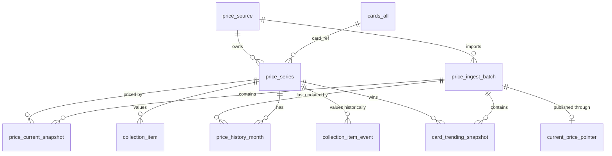

# PostgreSQL 价格域详细 DDL 设计

## 1. 结论与状态

本文给出 v1.1.0 价格域的 PostgreSQL 目标 DDL，覆盖 7 张持久业务表：

1. `price_source`
2. `price_series`
3. `price_ingest_batch`
4. `price_current_snapshot`
5. `current_price_pointer`
6. `price_history_month`
7. `card_trending_snapshot`

同时给出既有 `collection_item`、`collection_item_event` 增加 `price_series_id` 的兼容迁移设计。

**当前状态：本文仍是设计依据，不是部署脚本；对应 schema 已由 `0001_price_domain.sql`、`0003_price_history_visibility_guard.sql` 和 `0004_price_history_month_payload_limit.sql` 在共享 PlanetScale PostgreSQL 执行。** 7 张价格表当前均为空，旧 `tcg_price` 未迁移；正式价格数据导入、目标规模压测、R2 冷数据和 prod 流量验收尚未完成。实际部署证据以 [数据迁移](../migration.md) 和仓库 migration 为准。

目标执行环境是 PlanetScale Postgres 18.6，版本号以 2026-08-17 PlanetScale 控制台显示的已选实例为准；本文按 PostgreSQL 18 主版本语法设计，不再把 PostgreSQL 15 作为部署兼容基线。金额统一保存为 `bigint` micros，评级统一保存为 `smallint` 的十分制值，例如 7.5 保存为 `75`。扩展频繁的来源、状态和指标使用 `text + CHECK`，不创建 PostgreSQL enum。

## 2. 范围与依赖

### 2.1 本文范围

- 价格来源、价格序列、导入批次、当前快照、发布指针、月度历史和 Trending 派生快照。
- 当前搜索、详情、30/90/365 天历史、100 序列批量读取、Portfolio 估值和 Trending 所需的键与索引。
- 完整批次发布、最近快照保留、月分区保留、幂等、校验和回滚边界。
- Collection 当前状态和事件历史对稳定 `price_series_id` 的服务端关联。

### 2.2 不在本文范围

- `cards_all`、账号、订阅、订单和其他 D1 业务表的 PostgreSQL 全量重设计。
- `sold_listing`。它是成交明细域，不属于当前价格序列/快照模型。
- staging/COPY 临时表。它们是批次导入工具，不计入 7 张持久业务表。
- PostgreSQL 实例规格、采购容量和已通过的 P95/P99 声明；这些结论必须来自目标规模压测。

### 2.3 外部依赖

本文以迁移后的 `cards_all(product_id text primary key)` 作为目录 FK 目标，因为这是当前代码和 D1 Schema 的真实键。如果全库 PostgreSQL 设计后续把目录表正式更名为 `catalog_card`，只替换本文两处目录 FK，不改变 7 张价格域表的职责。



## 3. 建表顺序与基础 DDL

以下 DDL 按空库依赖顺序组织。生产 migration 需要使用项目最终确定的 schema 名称；本文默认使用当前 `search_path`。

### 3.1 `price_source`

```sql
CREATE TABLE price_source (
  source_id bigint GENERATED ALWAYS AS IDENTITY PRIMARY KEY,
  source_code text NOT NULL,
  display_name text NOT NULL,
  source_kind text NOT NULL,
  is_active boolean NOT NULL DEFAULT true,
  created_at timestamptz NOT NULL DEFAULT now(),
  updated_at timestamptz NOT NULL DEFAULT now(),

  CONSTRAINT uq_price_source_code UNIQUE (source_code),
  CONSTRAINT ck_price_source_code
    CHECK (source_code ~ '^[a-z0-9][a-z0-9_-]{0,62}$'),
  CONSTRAINT ck_price_source_display_name
    CHECK (btrim(display_name) <> ''),
  CONSTRAINT ck_price_source_kind
    CHECK (source_kind IN ('external', 'derived'))
);
```

| 字段 | 类型/空值 | 含义 |
|---|---|---|
| `source_id` | `bigint`，PK | 内部稳定来源 ID；下游不用可变名称作 FK。 |
| `source_code` | `text`，唯一 | 稳定机器码，例如 `tcgplayer`、`pricecharting`、`kando-derived`。 |
| `display_name` | `text` | 管理端显示名，不参与唯一性和关联。 |
| `source_kind` | `text` | `external` 表示外部数据源，`derived` 表示内部派生来源。 |
| `is_active` | `boolean` | 是否允许创建新序列/新批次；停用不删除历史。 |
| `created_at`、`updated_at` | `timestamptz` | UTC 语义的审计时间；`updated_at` 由写入方显式维护。 |

`uq_price_source_code` 已覆盖按 code 查来源的路径，不再增加重复索引。

### 3.2 `price_series`

```sql
CREATE TABLE price_series (
  series_id bigint GENERATED ALWAYS AS IDENTITY PRIMARY KEY,
  source_id bigint NOT NULL,
  source_record_id text NOT NULL,
  metric_code text NOT NULL,
  card_ref text NOT NULL,
  currency_code text NOT NULL,
  condition_code text,
  condition_name text,
  language_code text,
  language_name text,
  finish_code text,
  finish_name text,
  grader_code text NOT NULL,
  grade_min_x10 smallint,
  grade_max_x10 smallint,
  is_active boolean NOT NULL DEFAULT true,
  created_at timestamptz NOT NULL DEFAULT now(),
  updated_at timestamptz NOT NULL DEFAULT now(),
  deactivated_at timestamptz,

  CONSTRAINT fk_price_series_source
    FOREIGN KEY (source_id) REFERENCES price_source(source_id)
    ON DELETE RESTRICT,
  CONSTRAINT fk_price_series_card
    FOREIGN KEY (card_ref) REFERENCES cards_all(product_id)
    ON DELETE RESTRICT,
  CONSTRAINT uq_price_series_external_metric
    UNIQUE (source_id, source_record_id, metric_code),
  CONSTRAINT ck_price_series_source_record_id
    CHECK (btrim(source_record_id) <> ''),
  CONSTRAINT ck_price_series_metric_code
    CHECK (metric_code ~ '^[a-z0-9][a-z0-9_-]{0,62}$'),
  CONSTRAINT ck_price_series_currency
    CHECK (currency_code ~ '^[A-Z]{3}$'),
  CONSTRAINT ck_price_series_grader_code
    CHECK (btrim(grader_code) <> ''),
  CONSTRAINT ck_price_series_grade_pair CHECK (
    (grade_min_x10 IS NULL AND grade_max_x10 IS NULL)
    OR (
      grade_min_x10 BETWEEN 0 AND 100
      AND grade_max_x10 BETWEEN grade_min_x10 AND 100
    )
  ),
  CONSTRAINT ck_price_series_deactivation CHECK (
    (is_active AND deactivated_at IS NULL)
    OR (NOT is_active AND deactivated_at IS NOT NULL)
  )
);

CREATE INDEX idx_price_series_card_qualifiers
  ON price_series (
    card_ref,
    grader_code,
    grade_min_x10,
    grade_max_x10,
    condition_code,
    language_code,
    finish_code
  )
  INCLUDE (series_id, source_id, metric_code, currency_code)
  WHERE is_active;

CREATE INDEX idx_price_series_source_active
  ON price_series (source_id, is_active, series_id);
```

| 字段 | 类型/空值 | 含义 |
|---|---|---|
| `series_id` | `bigint`，PK | 一条可独立定价维度的内部 ID。 |
| `source_id` | `bigint`，FK | 数据来源；删除来源会被历史引用阻止。 |
| `source_record_id` | `text` | 来源侧稳定记录 ID；承接现有 `sku_id` 或 `pricecharting_id`。 |
| `metric_code` | `text` | 同一来源记录内的价格指标，例如 `ungraded`、`grade_70_75`、`psa_100`。 |
| `card_ref` | `text`，FK | 当前目录键 `cards_all.product_id`。 |
| `currency_code` | `text` | ISO 4217 三位大写币种；价格不做隐式跨币种比较。 |
| `condition_code/name` | 可空 `text` | 来源的品相代码与显示名。 |
| `language_code/name` | 可空 `text` | 来源的语言代码与显示名。 |
| `finish_code/name` | 可空 `text` | 来源的工艺/版本代码与显示名。 |
| `grader_code` | `text` | `RAW`、通用 Grade 或具体评级机构的稳定代码。 |
| `grade_min_x10/max_x10` | 可空 `smallint` | 评级范围；7/7.5 表示 `70..75`，未评级为两列同时 NULL。 |
| `is_active`、`deactivated_at` | `boolean`/可空时间 | 序列生命周期；历史序列停用，不物理删除。 |
| `created_at`、`updated_at` | `timestamptz` | UTC 审计时间。 |

外部唯一键固定为 `(source_id, source_record_id, metric_code)`。`idx_price_series_card_qualifiers` 服务卡牌详情、Collection 服务端映射和批量估值；所有 `*_code` 必须在导入层先规范化，查询不得临时对显示名做 `lower(trim(...))` 扫描。

### 3.3 `price_ingest_batch`

```sql
CREATE TABLE price_ingest_batch (
  batch_id bigint GENERATED ALWAYS AS IDENTITY PRIMARY KEY,
  scope_code text NOT NULL,
  source_id bigint NOT NULL,
  business_date date NOT NULL,
  idempotency_key text NOT NULL,
  input_object_key text NOT NULL,
  input_checksum_sha256 text NOT NULL,
  content_checksum_sha256 text,
  expected_series_count bigint,
  loaded_series_count bigint NOT NULL DEFAULT 0,
  distinct_series_count bigint NOT NULL DEFAULT 0,
  rejected_record_count bigint NOT NULL DEFAULT 0,
  min_observed_on date,
  max_observed_on date,
  status text NOT NULL DEFAULT 'loading',
  started_at timestamptz NOT NULL DEFAULT now(),
  validated_at timestamptz,
  published_at timestamptz,
  failed_at timestamptz,
  failure_reason text,
  updated_at timestamptz NOT NULL DEFAULT now(),

  CONSTRAINT fk_price_ingest_batch_source
    FOREIGN KEY (source_id) REFERENCES price_source(source_id)
    ON DELETE RESTRICT,
  CONSTRAINT uq_price_ingest_batch_idempotency
    UNIQUE (scope_code, idempotency_key),
  CONSTRAINT uq_price_ingest_batch_scope_id
    UNIQUE (scope_code, batch_id),
  CONSTRAINT ck_price_ingest_batch_scope
    CHECK (scope_code ~ '^[a-z0-9][a-z0-9:_-]{0,126}$'),
  CONSTRAINT ck_price_ingest_batch_idempotency
    CHECK (btrim(idempotency_key) <> ''),
  CONSTRAINT ck_price_ingest_batch_object_key
    CHECK (btrim(input_object_key) <> ''),
  CONSTRAINT ck_price_ingest_batch_input_checksum
    CHECK (input_checksum_sha256 ~ '^[0-9a-f]{64}$'),
  CONSTRAINT ck_price_ingest_batch_content_checksum
    CHECK (
      content_checksum_sha256 IS NULL
      OR content_checksum_sha256 ~ '^[0-9a-f]{64}$'
    ),
  CONSTRAINT ck_price_ingest_batch_counts CHECK (
    (expected_series_count IS NULL OR expected_series_count >= 0)
    AND loaded_series_count >= 0
    AND distinct_series_count >= 0
    AND rejected_record_count >= 0
    AND distinct_series_count <= loaded_series_count
  ),
  CONSTRAINT ck_price_ingest_batch_date_range CHECK (
    (min_observed_on IS NULL AND max_observed_on IS NULL)
    OR (
      min_observed_on IS NOT NULL
      AND max_observed_on IS NOT NULL
      AND min_observed_on <= max_observed_on
    )
  ),
  CONSTRAINT ck_price_ingest_batch_status
    CHECK (status IN ('loading', 'validated', 'published', 'superseded', 'failed')),
  CONSTRAINT ck_price_ingest_batch_complete CHECK (
    status NOT IN ('validated', 'published', 'superseded')
    OR (
      expected_series_count IS NOT NULL
      AND expected_series_count = loaded_series_count
      AND loaded_series_count = distinct_series_count
      AND rejected_record_count = 0
      AND content_checksum_sha256 IS NOT NULL
      AND validated_at IS NOT NULL
    )
  ),
  CONSTRAINT ck_price_ingest_batch_published CHECK (
    status NOT IN ('published', 'superseded') OR published_at IS NOT NULL
  ),
  CONSTRAINT ck_price_ingest_batch_failed CHECK (
    status <> 'failed'
    OR (
      failed_at IS NOT NULL
      AND failure_reason IS NOT NULL
      AND btrim(failure_reason) <> ''
    )
  )
);

CREATE INDEX idx_price_ingest_batch_source_date
  ON price_ingest_batch (source_id, business_date DESC, batch_id DESC);

CREATE INDEX idx_price_ingest_batch_unfinished
  ON price_ingest_batch (status, started_at)
  WHERE status IN ('loading', 'validated');
```

| 字段 | 类型/空值 | 含义 |
|---|---|---|
| `batch_id` | `bigint`，PK | 一次不可复用的导入/派生批次 ID。 |
| `scope_code` | `text` | 原子发布范围，例如 `current:tcgplayer`、`current:pricecharting`、`trending:global`。 |
| `source_id` | `bigint`，FK | 外部来源或 `kando-derived` 内部来源。 |
| `business_date` | `date` | 来源合同定义的业务日期，不由 Worker 接收时间推断。 |
| `idempotency_key` | `text` | 同一 scope 内稳定幂等键；重试不能生成重复批次。 |
| `input_object_key` | `text` | R2 原始对象或派生 manifest；Trending manifest 应列出全部输入 batch。 |
| `input_checksum_sha256` | `text` | 原始对象/manifest 的 SHA-256。 |
| `content_checksum_sha256` | 可空 `text` | 规范化后内容的 SHA-256；校验完成前可空。 |
| `expected/loaded/distinct_series_count` | 可空/非空 `bigint` | 完整性计数；可发布批次必须三者相等。 |
| `rejected_record_count` | `bigint` | 被拒记录数；非零批次不得发布。 |
| `min/max_observed_on` | 可空 `date` | 批次覆盖的业务日期范围，两列成对出现。 |
| `status` | `text` | `loading -> validated -> published -> superseded`，失败进入 `failed`。 |
| 时间与失败字段 | `timestamptz`/`text` | 阶段审计、失败诊断；不保存密钥或完整原始载荷。 |

数据库 CHECK 只保护可确定的完整性。状态转换的允许边必须由导入服务用条件 UPDATE 保证，不能用无条件覆盖把 `published` 改回 `loading`。

### 3.4 `price_current_snapshot`

```sql
CREATE TABLE price_current_snapshot (
  batch_id bigint NOT NULL,
  series_id bigint NOT NULL,
  observed_on date NOT NULL,
  amount_micros bigint NOT NULL,
  baseline_1d_on date,
  baseline_1d_amount_micros bigint,
  baseline_7d_on date,
  baseline_7d_amount_micros bigint,
  baseline_30d_on date,
  baseline_30d_amount_micros bigint,
  change_1d_percent numeric(30, 6) GENERATED ALWAYS AS (
    CASE WHEN baseline_1d_amount_micros > 0 THEN
      round(
        (amount_micros - baseline_1d_amount_micros)::numeric
        * 100 / baseline_1d_amount_micros,
        6
      )
    END
  ) STORED,
  change_7d_percent numeric(30, 6) GENERATED ALWAYS AS (
    CASE WHEN baseline_7d_amount_micros > 0 THEN
      round(
        (amount_micros - baseline_7d_amount_micros)::numeric
        * 100 / baseline_7d_amount_micros,
        6
      )
    END
  ) STORED,
  change_30d_percent numeric(30, 6) GENERATED ALWAYS AS (
    CASE WHEN baseline_30d_amount_micros > 0 THEN
      round(
        (amount_micros - baseline_30d_amount_micros)::numeric
        * 100 / baseline_30d_amount_micros,
        6
      )
    END
  ) STORED,
  created_at timestamptz NOT NULL DEFAULT now(),

  CONSTRAINT pk_price_current_snapshot PRIMARY KEY (batch_id, series_id),
  CONSTRAINT fk_price_current_snapshot_batch
    FOREIGN KEY (batch_id) REFERENCES price_ingest_batch(batch_id)
    ON DELETE RESTRICT,
  CONSTRAINT fk_price_current_snapshot_series
    FOREIGN KEY (series_id) REFERENCES price_series(series_id)
    ON DELETE RESTRICT,
  CONSTRAINT ck_price_current_snapshot_amount
    CHECK (amount_micros >= 0),
  CONSTRAINT ck_price_current_snapshot_1d CHECK (
    (baseline_1d_on IS NULL) = (baseline_1d_amount_micros IS NULL)
    AND (baseline_1d_on IS NULL OR baseline_1d_on <= observed_on)
    AND (baseline_1d_amount_micros IS NULL OR baseline_1d_amount_micros >= 0)
  ),
  CONSTRAINT ck_price_current_snapshot_7d CHECK (
    (baseline_7d_on IS NULL) = (baseline_7d_amount_micros IS NULL)
    AND (baseline_7d_on IS NULL OR baseline_7d_on <= observed_on)
    AND (baseline_7d_amount_micros IS NULL OR baseline_7d_amount_micros >= 0)
  ),
  CONSTRAINT ck_price_current_snapshot_30d CHECK (
    (baseline_30d_on IS NULL) = (baseline_30d_amount_micros IS NULL)
    AND (baseline_30d_on IS NULL OR baseline_30d_on <= observed_on)
    AND (baseline_30d_amount_micros IS NULL OR baseline_30d_amount_micros >= 0)
  )
) PARTITION BY LIST (batch_id);

CREATE INDEX idx_price_current_snapshot_series_date
  ON price_current_snapshot (series_id, observed_on DESC, batch_id);
```

| 字段 | 类型/空值 | 含义 |
|---|---|---|
| `batch_id + series_id` | 复合 PK | 同一完整批次每个序列恰好一条当前价。PK 包含分区键。 |
| `observed_on` | `date` | 当前点的来源业务日期。 |
| `amount_micros` | `bigint` | 当前金额 micros；不使用浮点。 |
| `baseline_1d/7d/30d_on` | 可空 `date` | 对应窗口实际使用的基准点日期，允许周末/缺价回退。 |
| `baseline_*_amount_micros` | 可空 `bigint` | 对应窗口基准金额；与日期成对出现。 |
| `change_*_percent` | STORED generated | 由当前值和基准值确定性计算，避免导入器与 API 算法漂移。基准为 0/NULL 时返回 NULL。 |
| `created_at` | `timestamptz` | 快照行写入时间。 |

不要对约 900 万行快照增加逐行业务触发器。完整性先在 staging/COPY 后做集合校验，再发布 batch。当前快照按 `batch_id` LIST 分区，导入前必须显式创建分区；不创建 DEFAULT 分区，让错误 batch 直接失败。

```sql
-- 模板：部署工具必须把名称和 batch ID 替换为已创建的确定值。
CREATE TABLE price_current_snapshot_b_123456
  PARTITION OF price_current_snapshot
  FOR VALUES IN (123456);
```

### 3.5 `current_price_pointer`

```sql
CREATE TABLE current_price_pointer (
  scope_code text PRIMARY KEY,
  batch_id bigint NOT NULL,
  updated_at timestamptz NOT NULL DEFAULT now(),
  updated_by text NOT NULL,

  CONSTRAINT fk_current_price_pointer_batch_scope
    FOREIGN KEY (scope_code, batch_id)
    REFERENCES price_ingest_batch(scope_code, batch_id)
    ON DELETE RESTRICT,
  CONSTRAINT ck_current_price_pointer_scope
    CHECK (scope_code ~ '^[a-z0-9][a-z0-9:_-]{0,126}$'),
  CONSTRAINT ck_current_price_pointer_updated_by
    CHECK (btrim(updated_by) <> '')
);

CREATE OR REPLACE FUNCTION assert_current_price_pointer_published()
RETURNS trigger
LANGUAGE plpgsql
AS $$
BEGIN
  IF NOT EXISTS (
    SELECT 1
    FROM price_ingest_batch AS batch
    WHERE batch.batch_id = NEW.batch_id
      AND batch.scope_code = NEW.scope_code
      AND batch.status = 'published'
  ) THEN
    RAISE EXCEPTION
      'pointer scope % must reference a published batch, got %',
      NEW.scope_code,
      NEW.batch_id;
  END IF;
  RETURN NEW;
END;
$$;

CREATE CONSTRAINT TRIGGER trg_current_price_pointer_published
AFTER INSERT OR UPDATE OF scope_code, batch_id
ON current_price_pointer
DEFERRABLE INITIALLY IMMEDIATE
FOR EACH ROW
EXECUTE FUNCTION assert_current_price_pointer_published();

CREATE OR REPLACE FUNCTION protect_pointed_price_batch()
RETURNS trigger
LANGUAGE plpgsql
AS $$
BEGIN
  IF NEW.status <> 'published'
     AND EXISTS (
       SELECT 1
       FROM current_price_pointer AS pointer
       WHERE pointer.batch_id = NEW.batch_id
     ) THEN
    RAISE EXCEPTION
      'batch % is still referenced by current_price_pointer',
      NEW.batch_id;
  END IF;
  RETURN NEW;
END;
$$;

CREATE TRIGGER trg_price_ingest_batch_protect_pointer
BEFORE UPDATE OF status
ON price_ingest_batch
FOR EACH ROW
EXECUTE FUNCTION protect_pointed_price_batch();
```

| 字段 | 类型/空值 | 含义 |
|---|---|---|
| `scope_code` | `text`，PK | 一个原子可见范围一行；既支持各来源当前价，也支持 `trending:global`。 |
| `batch_id` | `bigint`，复合 FK | 必须与同 scope 的 `published` batch 对应。 |
| `updated_at`、`updated_by` | 审计字段 | 记录发布器身份，不接受客户端自报。 |

复合 FK 保证 scope 一致，约束触发器保证 batch 已发布，batch 保护触发器保证仍被指向的 batch 不能先变为 `superseded`。这些触发器只作用于小型批次/指针表，不作用于快照大表。

### 3.6 `price_history_month`

```sql
CREATE TABLE price_history_month (
  series_id bigint NOT NULL,
  month_start date NOT NULL,
  points jsonb NOT NULL,
  point_count integer NOT NULL,
  first_observed_on date,
  last_observed_on date,
  content_checksum_sha256 text NOT NULL,
  last_batch_id bigint NOT NULL,
  created_at timestamptz NOT NULL DEFAULT now(),
  updated_at timestamptz NOT NULL DEFAULT now(),

  CONSTRAINT pk_price_history_month PRIMARY KEY (series_id, month_start),
  CONSTRAINT fk_price_history_month_series
    FOREIGN KEY (series_id) REFERENCES price_series(series_id)
    ON DELETE RESTRICT,
  CONSTRAINT fk_price_history_month_batch
    FOREIGN KEY (last_batch_id) REFERENCES price_ingest_batch(batch_id)
    ON DELETE RESTRICT,
  CONSTRAINT ck_price_history_month_start
    CHECK (extract(day FROM month_start) = 1),
  CONSTRAINT ck_price_history_month_points CHECK (
    CASE
      WHEN jsonb_typeof(points) = 'array'
      THEN jsonb_array_length(points) = point_count
      ELSE false
    END
  ),
  CONSTRAINT ck_price_history_month_count
    CHECK (point_count >= 0),
  CONSTRAINT ck_price_history_month_dates CHECK (
    (
      point_count = 0
      AND first_observed_on IS NULL
      AND last_observed_on IS NULL
    )
    OR (
      point_count > 0
      AND first_observed_on IS NOT NULL
      AND last_observed_on IS NOT NULL
      AND first_observed_on BETWEEN month_start
        AND (month_start + interval '1 month - 1 day')::date
      AND last_observed_on BETWEEN first_observed_on
        AND (month_start + interval '1 month - 1 day')::date
    )
  ),
  CONSTRAINT ck_price_history_month_checksum
    CHECK (content_checksum_sha256 ~ '^[0-9a-f]{64}$')
) PARTITION BY RANGE (month_start);
```

| 字段 | 类型/空值 | 含义 |
|---|---|---|
| `series_id + month_start` | 复合 PK | 每个序列每个自然月一个热历史块；PK 包含分区键。 |
| `points` | `jsonb` | 按日期升序的紧凑点数组，建议形态为 `[{"d":"2026-08-17","a":1234567}]`。 |
| `point_count` | `integer` | 数组元素数，与 `jsonb_array_length` 一致。 |
| `first/last_observed_on` | 可空 `date` | 快速判断覆盖范围；空数组时两列均 NULL。 |
| `content_checksum_sha256` | `text` | 规范化数组的 SHA-256，用于重放和对账。 |
| `last_batch_id` | `bigint`，FK | 最后一次确定该月内容的完整批次。 |
| `created_at`、`updated_at` | `timestamptz` | 月块审计时间。 |

数据库验证顶层 JSON 是数组、元素数一致，并由 `0004_price_history_month_payload_limit.sql` 限制 `octet_length(points::text) <= 24576`。元素字段、日期排序、同日重复、金额类型和 checksum 必须由确定性导入校验器处理；不为 `points` 建 GIN，因为当前查询只按 series/month 整块读取。配合单次最多 1,600 个自然月块，JSON 文本理论上限为 39,321,600 bytes（37.5 MiB），为 Hyperdrive 50 MB 响应边界中的其他列和协议开销保留余量。

```sql
-- 月分区模板：上界不包含。
CREATE TABLE price_history_month_2026_08
  PARTITION OF price_history_month
  FOR VALUES FROM (DATE '2026-08-01') TO (DATE '2026-09-01');
```

365 天滚动窗口通常跨 13 个自然月，而不是最多 12 个月。为保持图表连续性，还可能需要读取 cutoff 之前最近一个价格点；该点可能来自更早的一个月分区。热保留策略因此不能只写“保留 12 个分区”，必须依据稀疏序列和前置基准点 SLA 决定，默认评估至少 14 个自然月分区。

### 3.7 `card_trending_snapshot`

```sql
CREATE TABLE card_trending_snapshot (
  batch_id bigint NOT NULL,
  rank integer NOT NULL,
  card_ref text NOT NULL,
  winning_series_id bigint NOT NULL,
  observed_on date NOT NULL,
  amount_micros bigint NOT NULL,
  baseline_1d_on date NOT NULL,
  baseline_1d_amount_micros bigint NOT NULL,
  change_1d_percent numeric(30, 6) GENERATED ALWAYS AS (
    round(
      (amount_micros - baseline_1d_amount_micros)::numeric
      * 100 / baseline_1d_amount_micros,
      6
    )
  ) STORED,
  created_at timestamptz NOT NULL DEFAULT now(),

  CONSTRAINT pk_card_trending_snapshot PRIMARY KEY (batch_id, rank),
  CONSTRAINT uq_card_trending_snapshot_card UNIQUE (batch_id, card_ref),
  CONSTRAINT fk_card_trending_snapshot_batch
    FOREIGN KEY (batch_id) REFERENCES price_ingest_batch(batch_id)
    ON DELETE RESTRICT,
  CONSTRAINT fk_card_trending_snapshot_card
    FOREIGN KEY (card_ref) REFERENCES cards_all(product_id)
    ON DELETE RESTRICT,
  CONSTRAINT fk_card_trending_snapshot_series
    FOREIGN KEY (winning_series_id) REFERENCES price_series(series_id)
    ON DELETE RESTRICT,
  CONSTRAINT ck_card_trending_snapshot_rank CHECK (rank >= 1),
  CONSTRAINT ck_card_trending_snapshot_amount CHECK (
    amount_micros >= 0
    AND baseline_1d_amount_micros > 0
  ),
  CONSTRAINT ck_card_trending_snapshot_dates
    CHECK (baseline_1d_on <= observed_on),
  CONSTRAINT ck_card_trending_snapshot_change
    CHECK (change_1d_percent > 0)
);
```

| 字段 | 类型/空值 | 含义 |
|---|---|---|
| `batch_id + rank` | 复合 PK | 一个完整 Trending batch 中的稳定排序。 |
| `card_ref` | `text`，唯一/FK | 同一 batch 每张卡只出现一次。 |
| `winning_series_id` | `bigint`，FK | 该卡按确定性 winner 规则选出的价格序列。 |
| 当前值、1D 基准和变化 | 定点金额/日期/STORED generated | 固化派生证据并避免重复计算漂移，首页不再实时扫描和反连接全量价格表。 |
| `created_at` | `timestamptz` | 派生快照写入时间。 |

主键支持 `WHERE batch_id = ? ORDER BY rank LIMIT/OFFSET`；唯一键支持按 batch/card 对账，不再增加重复索引。Trending batch 通过 `current_price_pointer.scope_code = 'trending:global'` 原子发布。

## 4. 批次导入、校验与发布

### 4.1 导入顺序

1. 原始文件或派生 manifest 先写 R2，计算 `input_checksum_sha256`。
2. 用 `(scope_code, idempotency_key)` 插入 `loading` batch；唯一冲突时读取既有 batch 状态，不另建重复批次。
3. 为 current batch 创建独立 LIST 分区；用临时 staging 表和 `COPY` 批量加载。
4. 用集合 SQL 校验 source、series、重复、日期、金额、预期数、实际数和 checksum；任何拒绝记录都使 batch 失败。
5. 把 current 行写入该 batch 分区；月历史先保留在本批次 staging，不能在发布事务外改写 `price_history_month`。
6. 生成 Trending 派生 manifest 和独立 batch，写入 `card_trending_snapshot`。
7. 只有计数、日期和 checksum 全部通过，才在同一发布事务内按 `(series_id, month_start)` 幂等 upsert 月历史、把 batch 从 `validated` 发布并切换 pointer。

staging 表只存在于导入会话或独立 staging schema，成功/失败后均可重建，不属于业务真源。对 900 万级 current 行使用 `COPY` 和集合 SQL，不执行逐行 Worker `Promise.all`。

current batch 发布前还必须执行跨表来源校验。下列查询必须返回 0；月历史的 `last_batch_id` 也执行同等校验。这里使用集合验证，避免在 900 万行快照上增加逐行触发器或重复保存 `source_id`。

```sql
SELECT count(*) AS source_mismatch_count
FROM price_current_snapshot AS snapshot
JOIN price_series AS series
  ON series.series_id = snapshot.series_id
JOIN price_ingest_batch AS batch
  ON batch.batch_id = snapshot.batch_id
WHERE snapshot.batch_id = $1
  AND series.source_id <> batch.source_id;
```

### 4.2 发布事务

同一 `current:%` scope 的发布必须串行。月历史 upsert、batch 从 `validated` 变为 `published`、current pointer 切换和旧 batch supersede 必须在同一事务内完成；任一步失败都回滚，禁止先提交历史再切 pointer。`0003_price_history_visibility_guard.sql` 用 immediate BEFORE trigger 要求 INSERT/UPDATE 执行时的新 batch 属于同来源、`current:%` scope 且仍为 `validated`，再用 deferred constraint trigger 在提交时要求它已变为 `published` 并正被同 scope pointer 指向；因此 published batch 不能事后补写历史。内容、计数、覆盖日期或 checksum 变化还必须同时写入新的 `last_batch_id`，不能借用旧 lineage 原地改写。下面的 `$1` 是 `scope_code`，`$2` 是新 `batch_id`，`$3` 是受信任发布器标识；应用在同一事务内保存锁定时读到的旧 batch ID。`staging_price_history_month` 代表导入器为该 batch 校验完成的 staging 关系。

```sql
BEGIN;

SELECT pg_advisory_xact_lock(hashtextextended($1, 0));

SELECT batch_id
FROM current_price_pointer
WHERE scope_code = $1
FOR UPDATE;

SELECT batch_id
FROM price_ingest_batch
WHERE batch_id = $2
  AND scope_code = $1
  AND status = 'validated'
FOR UPDATE;

-- 上一条必须恰好返回一行，否则应用回滚，不继续执行。
INSERT INTO price_history_month (
  series_id, month_start, points, point_count,
  first_observed_on, last_observed_on, content_checksum_sha256,
  last_batch_id, created_at, updated_at
)
SELECT series_id, month_start, points, point_count,
  first_observed_on, last_observed_on, content_checksum_sha256,
  $2, now(), now()
FROM staging_price_history_month
WHERE batch_id = $2
ON CONFLICT (series_id, month_start) DO UPDATE
SET points = EXCLUDED.points,
    point_count = EXCLUDED.point_count,
    first_observed_on = EXCLUDED.first_observed_on,
    last_observed_on = EXCLUDED.last_observed_on,
    content_checksum_sha256 = EXCLUDED.content_checksum_sha256,
    last_batch_id = EXCLUDED.last_batch_id,
    updated_at = now();

UPDATE price_ingest_batch
SET status = 'published',
    published_at = now(),
    updated_at = now()
WHERE batch_id = $2
  AND scope_code = $1
  AND status = 'validated';

INSERT INTO current_price_pointer (scope_code, batch_id, updated_at, updated_by)
VALUES ($1, $2, now(), $3)
ON CONFLICT (scope_code) DO UPDATE
SET batch_id = EXCLUDED.batch_id,
    updated_at = EXCLUDED.updated_at,
    updated_by = EXCLUDED.updated_by;

-- 使用事务开始时锁定并保存的旧 batch ID；首次发布时跳过。
UPDATE price_ingest_batch
SET status = 'superseded',
    updated_at = now()
WHERE batch_id = $4
  AND batch_id <> $2
  AND status = 'published';

COMMIT;
```

`UPDATE ... status = 'published'` 的受影响行数必须等于 1；不能依赖后续 pointer FK 才发现状态竞争。Hyperdrive 查询缓存不会因数据库写入自动失效，切换后还需按最终缓存策略失效对应读缓存。

### 4.3 快照回退

回退不是重导数据，而是在确认旧 batch 分区和校验记录仍完整后，用同一发布事务把 pointer 指回旧 batch：先把旧 batch 从 `superseded` 条件更新为 `published`，再切 pointer，最后把问题 batch 标为 `superseded`。若 PostgreSQL 已成为账号、资产或订阅的唯一写真源，不能用价格 pointer 回退代替全库增量对账。

## 5. 分区与保留

### 5.1 Current 快照

- 每个完整 batch 一个 LIST 分区，只保留最近 2-3 个已验证快照用于快速回退。
- 删除候选必须满足：不被任何 pointer 指向、状态为 `superseded`、R2 原始对象和 checksum 可用、保留窗口已过。
- 先按精确分区名 `DETACH PARTITION`，观察后再 `DROP TABLE`；两步均是运维变更，需要独立授权。
- batch 审计行很小，可比大分区保留更久；被 `price_history_month.last_batch_id` 引用时不得删除。

### 5.2 月度历史

- 按 `month_start` RANGE 月分区，不按 card 或 series 分区。
- 365 天窗口通常涉及 13 个自然月，并可能再访问 cutoff 前基准点所在分区。
- 冷归档前先从 R2 原始对象确定性重建并比对 series 数、point 数、首尾日期和 checksum。
- 热历史保留期、冷历史恢复 SLA 和历史纠错规则未冻结前，不执行分区删除。

## 6. Collection 关联迁移

### 6.1 设计原则

`collection_item.price_series_id` 表示当前持仓使用的价格维度；`collection_item_event.price_series_id` 表示事件发生时记录的价格维度。事件必须按自身保存的 grader/grade/condition/language/finish 独立匹配，不能把当前 Item 的 series 无条件复制到全部历史事件。

两个字段先保持可空：`sealed`、`other`、当前未启用的 sports、来源缺失和歧义映射都可能暂时没有可用序列。API 必须把它们显示为“无价格”，不得任意选择候选。`price_series_id` 只能由服务端根据受信任来源和 qualifier 解析，不能信任客户端自报。

### 6.2 Expand

`CREATE INDEX CONCURRENTLY` 不能放在事务块内；正式 migration 应按项目迁移器能力拆步执行。

```sql
ALTER TABLE collection_item
  ADD COLUMN price_series_id bigint;

ALTER TABLE collection_item_event
  ADD COLUMN price_series_id bigint;

ALTER TABLE collection_item
  ADD CONSTRAINT fk_collection_item_price_series
  FOREIGN KEY (price_series_id)
  REFERENCES price_series(series_id)
  ON DELETE RESTRICT
  NOT VALID;

ALTER TABLE collection_item_event
  ADD CONSTRAINT fk_collection_item_event_price_series
  FOREIGN KEY (price_series_id)
  REFERENCES price_series(series_id)
  ON DELETE RESTRICT
  NOT VALID;

CREATE INDEX CONCURRENTLY idx_collection_item_price_series
  ON collection_item (price_series_id)
  WHERE price_series_id IS NOT NULL;

CREATE INDEX CONCURRENTLY idx_collection_item_event_price_series_time
  ON collection_item_event (price_series_id, effective_at)
  WHERE price_series_id IS NOT NULL;
```

### 6.3 Backfill

正式回填前必须冻结：Portfolio 默认来源优先级、币种、Raw condition 映射、语言/finish 规范化、Grade 范围命中和多个候选的拒绝规则。不能继续依赖当前名称字段的隐式 `lower(trim(...))` 排序。

回填器应分别产生两个可审计映射集，并通过 `COPY` 放入临时表：

```sql
BEGIN;

CREATE TEMP TABLE collection_item_price_series_map (
  collection_item_id text PRIMARY KEY,
  price_series_id bigint NOT NULL,
  match_rule_version text NOT NULL
) ON COMMIT DROP;

CREATE TEMP TABLE collection_item_event_price_series_map (
  collection_item_event_id text PRIMARY KEY,
  price_series_id bigint NOT NULL,
  match_rule_version text NOT NULL
) ON COMMIT DROP;

-- COPY 两张映射表后，先验证 card_ref 和 series 一致。
SELECT count(*) AS mismatched_item_count
FROM collection_item_price_series_map AS mapping
JOIN collection_item AS item
  ON item.id = mapping.collection_item_id
JOIN price_series AS series
  ON series.series_id = mapping.price_series_id
WHERE series.card_ref <> item.card_ref;

SELECT count(*) AS mismatched_event_count
FROM collection_item_event_price_series_map AS mapping
JOIN collection_item_event AS event
  ON event.id = mapping.collection_item_event_id
JOIN price_series AS series
  ON series.series_id = mapping.price_series_id
WHERE series.card_ref <> event.card_ref;

-- 两项都必须为 0，才允许更新。
UPDATE collection_item AS item
SET price_series_id = mapping.price_series_id
FROM collection_item_price_series_map AS mapping
WHERE item.id = mapping.collection_item_id
  AND item.price_series_id IS DISTINCT FROM mapping.price_series_id;

UPDATE collection_item_event AS event
SET price_series_id = mapping.price_series_id
FROM collection_item_event_price_series_map AS mapping
WHERE event.id = mapping.collection_item_event_id
  AND event.price_series_id IS DISTINCT FROM mapping.price_series_id;

COMMIT;
```

每次回填必须输出总数、唯一匹配、零匹配、多匹配、按 object type/source/rule version 的分布以及抽样对账。零匹配和多匹配保持 NULL 并进入人工/规则修订队列，不得用 `LIMIT 1` 静默消除歧义。相同规则版本重复运行应得到相同映射，且 UPDATE 使用 `IS DISTINCT FROM` 保持幂等。

### 6.4 Validate 与 Contract

```sql
ALTER TABLE collection_item
  VALIDATE CONSTRAINT fk_collection_item_price_series;

ALTER TABLE collection_item_event
  VALIDATE CONSTRAINT fk_collection_item_event_price_series;
```

只有在新旧 Worker 共存窗口完成、所有受支持对象均已稳定写入 `price_series_id`、读比对通过后，才能停止名称 qualifier 回退逻辑。本文不建议立即设置 `NOT NULL`，也不建议在本阶段删除 `card_ref` 和事件 qualifier；它们仍是目录展示、审计和重新映射证据。

## 7. 查询与索引矩阵

| 业务查询 | 主过滤/排序 | 使用的键或索引 | 约束的业务意图 |
|---|---|---|---|
| 卡牌详情全部价格维度 | `card_ref + active qualifiers` | `idx_price_series_card_qualifiers` | 一次取回该卡所有 Raw/评级维度，不解析 9 个硬编码列。 |
| 当前价 | pointer scope -> `batch_id + series_id` | pointer PK、snapshot PK | 只读取完整 published batch，不暴露半批数据。 |
| 搜索页 40 张卡当前价 | `card_ref IN (...)` + pointer batch | series qualifier 索引、snapshot PK | 使用集合 SQL，不做逐卡 `Promise.all`。 |
| 单序列 30/90/365 天 | `series_id + month_start range` | history PK + 月分区裁剪 | 读取月块；365 天通常 13 个自然月。 |
| cutoff 前基准点 | `series_id`，`month_start < cutoff_month DESC` | history PK 的 series/month 顺序 | 保持图表与 Portfolio 起点连续。 |
| 100 序列历史 | `series_id = ANY($1)` + month range | history PK + 分区裁剪 | 一个集合查询，限制响应体和 Worker 内存。 |
| Trending 首页 | `trending pointer batch + rank` | trending PK | 直接读取派生小表，不实时执行 `NOT EXISTS` winner。 |
| Collection 当前估值 | `collection_item.price_series_id` | partial index + series/current PK | 服务端稳定绑定到价格维度。 |
| Portfolio 历史估值 | event owner/time -> event series IDs -> month blocks | 既有 owner/time 索引、event series/time 索引、history PK | 事件按发生时维度估值，避免当前 Item 反推历史。 |
| 导入状态/恢复 | `source_id + business_date`、未完成 status | 两个 batch 索引 | 监控卡住批次、定位重放范围。 |

索引是基于当前查询合同的设计输入，不是性能已经达标的证据。正式价格数据导入和 prod 流量切换前必须用目标数量级数据运行 `EXPLAIN (ANALYZE, BUFFERS, WAL)` 并记录 P95/P99、WAL、vacuum、分区 planning time 和 Hyperdrive 端到端指标。

## 8. 幂等、失败与回滚

- 同一 `(scope_code, idempotency_key)` 只能存在一个 batch。失败重试读取原 batch 并按状态决定重放，不生成平行副本。
- source、series 和月块的规范化、排序和 checksum 必须由常规代码确定性完成；模型不参与路由、重试或数据转换。
- `price_series` 通过外部唯一键 upsert；不再出现的序列设为 inactive，不删除。
- current 分区只有在整批校验通过后才切 pointer；失败分区不进入读路径，可在保留诊断证据后按明确目标清理。
- 月块 upsert 必须携带 `last_batch_id` 和 checksum；同一输入重放不应改变规范化内容。
- 价格 canary 可通过 pointer 或读开关回退；全库 OLTP 已切写后，必须先停写并对账，不能直接切回落后的 D1。
- 未获得生产写入、部署、分区删除和 D1 退役授权前，不执行这些操作。

## 9. 尚未冻结的合同

下列事项会改变导入器或查询规则，但不要求推翻 7 表职责。正式 migration 和回填前必须逐项批准：

| 待确认项 | 影响 |
|---|---|
| 来源字段所有权与 `source_record_id` 生成规则 | 外部唯一键和可重放性。 |
| 来源币种、小数位和是否允许合法 0 价 | micros 转换、CHECK 和跨币种展示。 |
| 同一序列同一天是否允许多个点 | 月块去重、排序和 `point_count`。 |
| 已完成月份的历史纠错与迟到数据策略 | 月块是否可更新、revision/审计要求。 |
| Search 默认 condition/language/finish/source | 搜索页选哪个 series。 |
| Collection 默认来源与 qualifier 映射 | 两张 Collection 表回填及未来写入。 |
| Trending winner、平局、窗口和跨来源规则 | `card_trending_snapshot` 生成器。 |
| 365 天前置基准点与冷热历史恢复 SLA | 月分区热保留数量。 |
| 重度 owner 的 Portfolio 上限 | 是否需要额外可重建日估值表；本文未猜测增加。 |
| 目标实例、连接、RPO/RTO 和维护窗口 | 分区运维、批次时限和容量。 |

## 10. 实施验收清单

- [x] PlanetScale Postgres 18.6 实机版本、schema 名和 `cards_all` 目录 FK 已冻结并通过连接会话复核。
- [x] 7 张表已在目标库按顺序创建，约束、索引和发布保护 trigger 已核验。
- [ ] current LIST 分区和 history RANGE 分区模板由 migration/运维工具确定性生成。
- [ ] 一份真实批次通过 staging/COPY、计数、日期、重复和 checksum 校验。
- [ ] 1D/7D/30D 基准和 generated change 与黄金样本一致。
- [ ] pointer 并发发布、旧 batch 回退和非法状态切换均被验证。
- [ ] Collection 两套映射分别输出零匹配、多匹配和抽样对账，FK 已 `VALIDATE`。
- [ ] Search、详情、30/90/365 天、100 序列、Trending、Portfolio 使用集合查询并完成读比对。
- [ ] 真实规模压测记录 DB/API P95/P99、WAL、vacuum、磁盘和导入期间 OLTP 退化。
- [ ] R2 重放、分区 detach/drop 和 PITR 恢复演练完成。
- [ ] dev 验收通过后，另行取得 prod Worker 部署、生产流量与数据写入授权。

只有带 `[x]` 的 schema 基础项已有实机证据；其余清单不能因“DDL 文档已完成”自动视为通过。
