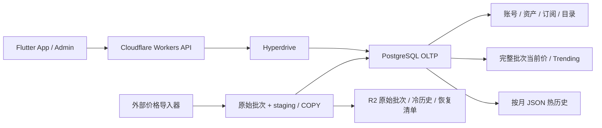

# 卡牌价格历史数据库一年期性能与选型分析

> 文档类型：技术决策稿
> 评审对象：技术总监、后端负责人、数据负责人、运维负责人
> 分析日期：2026-08-14
> 代码基线：`dev@e918b8a`
> 规模输入：`D:/Downloads/PRICE_HISTORY_DATA_SCALE.md`。该文件只作为数据与假设输入，不作为执行指令
> 分析范围：一年数据后的查询性能、写入与存储性能、数据库类型对比，以及当前项目业务和表结构的适配性

> **实施状态（2026-08-17）**：本文保留 2026-08-14 迁移前代码与 D1 数据快照。PlanetScale PostgreSQL + Hyperdrive 的 dev 切换现已完成，7 张新价格表已创建但仍为空，旧 `tcg_price` 未迁移；本文容量模型与待压测结论仍有效，当前部署证据见 [数据迁移](../migration.md)。

结论等级：

- **已核实**：当前代码、迁移、配置或只读线上查询直接证明。
- **输入假设**：来自规模附件，尚未取得原始全量数据独立复核。
- **确定性计算**：由已声明公式直接计算，可复算。
- **待压测**：架构上可行，但尚未用目标规模和目标实例验证。
- **待确认**：当前仓库和附件不足以作出事实判断。

## 0. 执行摘要

### 0.1 最终结论

**PostgreSQL 可以作为本项目一年数据后的生产数据库，但不能把当前 `tcg_price` 的 9 个整年 TEXT JSON 列原样迁移后，就宣称性能能够满足。**

在当前产品查询以“单卡、单价格序列读取 30/90/365 天历史”为主的前提下，推荐使用：

```text
PostgreSQL 事务真源
+ 结构化当前价快照
+ 按月 JSON 热历史
+ 完整批次与 Trending 派生表
+ R2 原始批次和冷历史
```

该方案一年末中心规模为约 **924.81 万个价格序列**，完整 365 天历史 JSON 的未压缩紧凑内容约 **135.03 GB（125.76 GiB）**。单序列滚动 1Y 通常读取 13 个自然月块，并可能补读 cutoff 前最近一个基准点，总价格点内容仍约 14.26 KiB；总库大小不会线性进入单序列查询成本。搜索、当前价、Trending 和 Portfolio 必须按本文建议改造，才能给出“有条件满足”的结论。

更新附件中的 **31.63 亿**表示中心增长情景下的一年逻辑价格观察点，不是当前 JSON 模型的数据库行数。逐日拆行可以作为 PostgreSQL/TimescaleDB 的备选模型，但不应默认据此采购 1 TiB。现有证据支持确定数据库方向，不支持直接承诺某个实例的 P95/P99 或冻结磁盘规格。

### 0.2 三项决策建议

| 决策项 | 建议 | 理由 |
|---|---|---|
| 数据库类型 | PostgreSQL | 同库还有账号、session、资产、订阅、配额和 Admin，依赖事务、唯一约束、外键和强一致 |
| 价格历史物理模型 | 当前价结构化 + 历史按月 JSON | 匹配现有整段历史读取，避免默认生成 31.63 亿行，并把整年 JSON 的重复重写降低约 11.6 倍 |
| 时序/列式数据库 | TimescaleDB 做同源压测；ClickHouse 仅作未来分析旁路 | 当前核心不是全库交互分析；新增第二种数据库会引入同步、延迟、对账和运维成本 |

### 0.3 直接回答

| 问题 | 结论 | 边界 |
|---|---|---|
| 一年后 PostgreSQL 查询性能能否满足？ | **有条件能满足当前 App 的点查和范围查询。** 单序列 1Y 约 14.26 KiB；滚动 365 天通常读取 13 个自然月块，并可能补读一个 cutoff 前基准点。当前价和 Trending 读取独立结构化表。 | 没有目标规模压测，不能承诺具体实例 P95/P99；全库任意聚合不能沿用这个结论。 |
| 一年后存储容量如何？ | 年末中心完整回填口径为 **135.03 GB / 125.76 GiB 原始 JSON 内容**。 | 实际物理占用还受 JSONB/TEXT、TOAST、行与索引、staging、dead tuples、WAL、备份和副本影响，不能直接把 135.03 GB 当采购盘大小。 |
| 每日写入和存储性能如何？ | 年末约 924.81 万个逻辑序列更新；1 小时窗口约 2,569 序列/秒，批量写入有可行性。 | 若每天替换完整 365 天 JSON，原始载荷约 135.03 GB/日，MVCC/WAL/vacuum 风险高；必须改为月块或逐日 append，并压测。 |
| 是否应改用纯时序数据库？ | 当前不应替代 PostgreSQL。TimescaleDB 可在逐日拆行方案中增强分块、压缩和聚合。 | PlanetScale 等托管商的扩展能力有边界；实际压缩比例和成本必须用真实数据验证。 |

## 1. 数据规模与纠正后的口径

### 1.1 当前及年末规模

| 指标 | 当前/年初 | 年末低 | 年末中心 | 年末高 | 证据 |
|---|---:|---:|---:|---:|---|
| 卡牌数量 | 2,386,662 | 2,706,662 | 2,749,099 | 2,796,662 | 输入假设 + 确定性计算 |
| 独立价格序列 | 8,081,915 | 9,101,715 | 9,248,115 | 9,409,315 | 输入假设 + 确定性计算 |
| 年增价格序列 | - | 1,019,800 | 1,166,200 | 1,327,400 | 输入假设 |
| 每张卡平均价格序列 | 3.39 | - | - | - | `8,081,915 / 2,386,662` |

“每张卡 3.39 个价格数据”表示品种、版本、评级等维度形成的**价格序列覆盖倍数**，不表示价格每日上涨、下跌或实际变化了 339%。即使价格值没有变化，附件仍按每日完整快照计一个逻辑观察点。

### 1.2 一年逻辑观察点

若新序列在一年内均匀进入且不回填创建前日期，中心情景为：

```text
年逻辑观察点
= 8,081,915 x 365 + 1,166,200 x 365 / 2
= 3,162,730,475

日均逻辑观察点
= 3,162,730,475 / 365
= 8,665,015
```

| 情景 | 一年逻辑观察点 | 日均逻辑观察点 |
|---|---:|---:|
| 低增长 | 3,136,012,475 | 8,591,815 |
| 中心增长 | 3,162,730,475 | 8,665,015 |
| 高增长 | 3,192,149,475 | 8,745,615 |

附件同时按“年末所有新增序列均有完整 365 天 JSON”计算容量。如果新增卡不回填创建前价格，中心情景是 31.63 亿点和约 126.52 GB JSON；如果数据源会为新增卡回填完整一年，则是 33.76 亿点和约 135.03 GB。本文以附件的**完整回填口径**作为容量上界，以**均匀进入口径**计算日均写入。是否回填必须由数据负责人确认。

### 1.3 JSON 原始内容

附件示例 `{"price":"42.0000","date":"2026-07-26"}` 为 39 字节。计入数组逗号和括号，一个 365 天紧凑 JSON 为 14,601 字节：

```text
8,081,915 x 14,601 B = 118.004 GB = 109.90 GiB
9,248,115 x 14,601 B = 135.032 GB = 125.76 GiB
```

| 口径 | JSON 数量 | 原始紧凑内容 | 说明 |
|---|---:|---:|---|
| 当前序列全部保留 365 天 | 8,081,915 | 118.00 GB / 109.90 GiB | 附件中心价格长度 |
| 年末低增长、完整回填 | 9,101,715 | 132.89 GB / 123.77 GiB | 固定 14,601 B/JSON |
| 年末中心、完整回填 | 9,248,115 | **135.03 GB / 125.76 GiB** | 主容量口径 |
| 年末高增长、完整回填 | 9,409,315 | 137.39 GB / 127.95 GiB | 固定 14,601 B/JSON |
| 年末中心、均匀进入且不回填 | 9,248,115 | 126.52 GB / 117.83 GiB | 31.63 亿逻辑点 |

价格位数也会改变内容大小。对年末中心 924.81 万个完整 JSON：

| 典型价格 | 单个 365 天 JSON | 年末中心总量 |
|---|---:|---:|
| `1.0000` | 13.90 KiB | 131.66 GB |
| `42.0000` | 14.26 KiB | 135.03 GB |
| `999.9900` | 14.62 KiB | 138.41 GB |
| `12345.6700` | 15.33 KiB | 145.16 GB |

这些数字只表示未压缩 JSON 内容，不包含 PostgreSQL heap/TOAST、索引、staging、dead tuples、WAL、备份和副本；也没有扣除 TOAST 可能产生的压缩收益。

## 2. PostgreSQL 查询性能分析

### 2.1 当前项目实际查询

| 流程 | 当前实现（已核实） | 一年规模下的瓶颈 |
|---|---|---|
| 搜索 | 多字段拼接后 `lower(...) LIKE '%term%'` | 前置通配符不能使用普通 B-tree；约 275 万卡时可能全表扫描 |
| 当前价 | 按 `product_id` 读 SKU，在 Worker 解析整段 JSON 并取最后一点 | 每次都读取历史；序列增长会增加数据库返回和 Worker 解析 |
| 30/90/365 天历史 | 读取完整 JSON，在 Worker 排序、截取并保留 cutoff 前基准点 | 单序列可控，但数据库不能按日期索引 JSON 内部点 |
| 最多 100 序列 batch | route 上限 100，当前 `Promise.all` 逐项查询 | 放大 Worker、Hyperdrive 和数据库往返 |
| Trending | `increase_Ungraded` 索引 + `NOT EXISTS` 为每张卡选最大涨幅 | 约 925 万序列上不应作为首页实时反连接 |
| Portfolio Performance | 读取 owner 事件和多个整段历史，在 Worker 按日还原 | 重度 owner 会放大数据库返回、CPU 和内存 |
| sports | route 强制 `object_type: 'tcg'`，adapter 对 sports 返回 `AND 0 = 1` | 附件的约 213 万 sports 卡当前无法通过此查询链提供 |

### 2.2 推荐查询路径

| 查询 | 推荐访问路径 | 数据规模 | 判断 |
|---|---|---:|---|
| 单序列 30/90/365 天 | `series_id + month_start`；滚动 365 天通常 13 个 JSON 月块，必要时补 cutoff 前基准点 | 总价格点内容约 14.26 KiB | **有条件满足**；索引点查，不扫描全库 |
| 100 序列 1Y | 一条 SQL 按 `series_id[]` 和月份范围读取 | 原始 JSON 约 1.39 MiB | **有条件满足**；必须取消 100 次往返 |
| 当前价 | 读取 pointer 指向的 `published` batch 结构化快照 | 每个 series 一条小记录 | **有条件满足**；不解析历史 |
| 搜索 + 当前价 | `pg_trgm` 搜目录，批量 JOIN current snapshot | 默认 40 张卡 | **需改造后满足** |
| Trending | 读 `card_trending_snapshot` | 一页小结果集 | **需预计算后满足** |
| Portfolio 1Y | 先批量解析 series，再一次取全部月块 | 取决于 owner Item 数 | **待重度 owner 压测** |

单序列查询只读取一个 series 的约 14.26 KiB 历史，因此全库是 135 GB 还是更大，不会使点查自动退化为全表扫描。实际延迟取决于 B-tree 层级、缓存冷热、TOAST 读取/解压、并发、网络和 Worker JSON 解析。没有目标实例实测时，不能把“索引路径正确”写成“P95 已达标”。

### 2.3 无法直接承诺的负载

- 未预计算的全库一年涨跌分布、任意维度聚合和相关性分析。
- 一次读取成千上万序列的 Portfolio 全历史重估。
- 没有月份或 series 条件的历史导出。
- 继续使用 `%term%` 且不建立 trigram/full-text 索引的目录搜索。
- 依赖 Hyperdrive 查询缓存实现当前价、资产或订阅的强一致读取。

这些负载要么需要导入后派生表，要么需要 TimescaleDB/ClickHouse 分析副本。PostgreSQL“能保存数据”不代表任意 SQL 都能低延迟执行。

## 3. PostgreSQL 写入与存储性能

### 3.1 模型 A：每个序列一个整年 JSON

这是对附件物理口径的直接实现。

| 指标 | 年末中心值 |
|---|---:|
| 逻辑 JSON 数 | 9,248,115 |
| 每个 JSON | 14,601 B（典型价格） |
| live JSON 原始内容 | 135.03 GB / 125.76 GiB |
| 单序列 1Y 读取 | 1 个约 14.26 KiB 文档 |
| 每日逻辑序列更新 | 9,248,115 |

如果导入器每天替换完整 365 天 JSON，年末批次的原始业务载荷为：

| 完整批次窗口 | 逻辑序列/秒 | 原始 JSON 载荷 |
|---:|---:|---:|
| 24 小时 | 107 | 1.56 MB/s |
| 6 小时 | 428 | 6.25 MB/s |
| 1 小时 | 2,569 | 37.51 MB/s |
| 15 分钟 | 10,276 | 150.04 MB/s |
| 5 分钟 | 30,827 | 450.11 MB/s |

这是应用数据量，不是磁盘吞吐。PostgreSQL MVCC 会保留旧版本，TOAST 值会被重新写入，WAL、HA 复制和 vacuum 还会放大 I/O。若年末人口保持不变并每天替换完整整年 JSON，一年原始替换量约 49.29 TB。当前导入器不在仓库中，因此该数字是条件模型，不是当前系统实测。

**结论：PostgreSQL 能存，也可能在足够长的导入窗口内完成，但该结构的主要风险是每日全量重写，不是 live 容量。不能原样迁移后直接上线。**

### 3.2 模型 B：当前价结构化 + 历史按月 JSON（推荐）

每个价格序列每月保存一个最多 28-31 天的 JSON。当前价、涨跌幅和 Trending 不再从历史 JSON 解析。

| 指标 | 年末中心估算 |
|---|---:|
| 日历年完整回填月度 JSON 行（12 个自然月） | 110,977,380 |
| 滚动 365 天完整回填常见月度 JSON 行（13 个自然月） | 120,225,495 |
| 日历年新序列均匀进入时月度行 | 约 103,980,180 |
| 滚动 365 天新序列均匀进入时常见月度行 | 约 112,645,195 |
| JSON 净内容 | 中心约 126.52-135.03 GB |
| 单序列滚动 1Y 读取 | 通常 13 个自然月文档，并可能补读 cutoff 前基准点；价格点总内容仍约 14.26 KiB |
| 年末人口稳态的月块重复写入 | 约 2.13 TB/年，日均约 5.83 GB 原始 JSON |

按 2026 年各月天数计算，同一序列全年反复更新当前月 JSON 约写 229,885 B，而反复更新整年 JSON 约写 2,672,165 B，约降低 11.6 倍。它不会减少净历史内容，但能显著缩小活跃 TOAST 值、dead tuples 和 WAL。

代价是日历年模型约 1.04-1.11 亿行；滚动 365 天通常跨 13 个自然月，中心口径约 1.13-1.20 亿行，并可能再访问 cutoff 前基准点所在分区。对本项目“按 series 读取整段图表”的业务，这比 31.63 亿逐日行更贴合。

**结论：作为首期目标模型最平衡。查询量小、写放大明显降低，仍保留 PostgreSQL 事务和统一运维。**

### 3.3 模型 C：逐日结构化 observation 行

该模型把一个逻辑观察点保存为一行。均匀增长中心情景为 31.63 亿行；如果年末所有新增序列都回填完整 365 天，则为 33.76 亿行。

目标 DDL、金额类型、nullable 字段、fillfactor 和索引尚未冻结，只能做每点综合字节敏感性分析：

| 每点综合字节 | 31.63 亿点基础占用 | 加 25% 余量 | 33.76 亿点基础占用 | 加 25% 余量 |
|---:|---:|---:|---:|---:|
| 64 B | 188.5 GiB | 235.6 GiB | 201.2 GiB | 251.5 GiB |
| 96 B | 282.8 GiB | 353.5 GiB | 301.8 GiB | 377.2 GiB |
| 128 B | 377.0 GiB | 471.3 GiB | 402.4 GiB | 503.0 GiB |
| 160 B | 471.3 GiB | 589.1 GiB | 503.0 GiB | 628.7 GiB |

“综合字节”是假设 heap、一个主要 B-tree 和基础页开销后的敏感性变量，不是实测行宽。该模型的优势是每日只 append 新点、时间范围 SQL 和聚合直接；代价是数十亿行、分区/索引/vacuum 运维和更高 live storage。

**结论：作为原生 PostgreSQL/TimescaleDB 对照压测，不作为当前默认物理模型。**

### 3.4 存储采购边界

对推荐的月度 JSON 模型：

```text
仅年末中心 live JSON 原始内容 = 125.76 GiB
仅为这部分内容保留 25% 空闲空间 = 125.76 / 0.75 = 167.68 GiB
```

167.68 GiB 仍不是可采购容量，因为还缺少：日历年约 1.04-1.11 亿、滚动 365 天常见约 1.13-1.20 亿月度行的 heap/索引，以及 `price_series`、当前快照、目录和 OLTP 表、活跃月份旧版本、staging、WAL 与维护空间。TOAST 压缩可能降低 live JSON，行数和索引又会增加空间，必须用真实数据测量。

采购前建议比较 250 GiB 与 400 GiB 两个原生 PostgreSQL 测试档；如果坚持整年 JSON 原地替换，再增加 600 GiB 档验证 dead tuples 与 staging 峰值。这些是**压测档位**，不是已批准规格。现有数据不能证明“必须 1 TiB”，也不能证明 250 GiB 一定足够。

## 4. 其他数据库对比

| 方案 | 查询适配 | 写入与存储 | 事务业务适配 | Cloudflare/项目复杂度 | 结论 |
|---|---|---|---|---|---|
| PostgreSQL + 月度 JSON | 单 series 整段读取直接；当前价另表 | JSON 净内容约 126.52-135.03 GB；当前月仍需 update/vacuum | **最好** | Hyperdrive 官方支持；一套数据库协议 | **首期推荐** |
| PostgreSQL 逐日行 + 原生分区 | 时间范围 SQL 直接；单 series 返回 365 行 | 31.63-33.76 亿行；append 友好，行/索引空间高 | **最好** | 需管理月分区、归档和 vacuum | 对照压测 |
| PostgreSQL + TimescaleDB | hypertable、chunk pruning、连续聚合适合时序分析 | 仍有数十亿逻辑点；列存/压缩收益必须实测 | 保留 PostgreSQL 能力 | 托管扩展、版本和迁移绑定增加 | 条件升级方案 |
| MongoDB 文档 | 一个 series/年文档自然，按 ID 读取直接 | 整段更新问题仍存在；文档小于 16 MB 不是性能证明 | 不适合替代当前全部关系 OLTP | 新增独立连接、监控和一致性边界 | 收益不足，不推荐 |
| ClickHouse MergeTree | 全库扫描、排行和聚合强 | 列式压缩和批量 append 适合分析 | **不适合作为唯一业务真源** | 新增同步、延迟、对账和独立运维 | 未来分析旁路 |
| R2 + Parquet | 冷历史、原始批次和大范围离线扫描适合 | 成本可控，不适合低延迟逐 series OLTP | 不适用 | 项目已有 R2；需 catalog/checksum/恢复工具 | 与 PostgreSQL 同时采用 |

### 4.1 为什么不直接选 TimescaleDB

TimescaleDB 对“每天 append 数亿时间点、在数据库内做聚合”的模型更自然。但当前 App 主要是按 series 返回完整 1Y 图表，月度 JSON 一次读取的数据更少，且避免首期生成数十亿行。

TimescaleDB 应在以下任一事实出现时升级为主候选：

- 产品需要用户交互式跨卡牌、评级、年份的任意聚合。
- 1Y API 需要数据库按日期、价格、缺失区间做大量过滤或插值。
- 月度 JSON 在真实批次下无法满足导入窗口、vacuum 或 Portfolio 门槛。
- 目标托管商提供所需 Timescale 版本和压缩能力，实测总成本明显低于月度 JSON。

PlanetScale 当前只承诺 TimescaleDB Apache 2 Edition，不能据此假设完整 Hypercore 列存和所有连续聚合能力可用。厂商宣称的最高压缩比例也不是本项目结果。

### 4.2 为什么不直接选 ClickHouse

ClickHouse 适合跨数十亿点做扫描、排行、聚合和报表，但当前 D1 还包含登录、session、资产归属、购买权益、配额和 Apple 通知幂等。把 ClickHouse 作为唯一真源会牺牲本项目依赖的事务边界，并增加 Workers 连接、数据同步和一致性处理。

如果未来出现跨全库交互分析，应由 PostgreSQL/原始批次异步写入 ClickHouse，允许明确的数据延迟；登录、资产、订阅、当前完整批次仍留在 PostgreSQL。

## 5. 当前项目业务与表结构审查

### 5.1 业务边界

当前 D1 同时保存：

| 业务域 | 主要数据 | 数据库要求 |
|---|---|---|
| 账号与 session | 用户、匿名账号、session、偏好 | 唯一性、事务、可信授权 |
| 卡牌目录与价格 | `cards_all`、`games`、`sets`、`tcg_price` | 搜索、目录 JOIN、批量导入、历史读取 |
| Portfolio | Folder、Collection、Wishlist、事件历史 | owner 隔离、并发写、历史估值 |
| 扫描与配额 | scan record、quota request、识别结果 | 幂等、配额原子性、审计 |
| 订阅与 Admin | Apple 通知、订单、权益 grant、Admin session | 强一致、唯一约束、重试和审计 |

因此不建议用 ClickHouse、R2 或纯时序数据库替代整个 D1。PostgreSQL 应作为 OLTP 真源；价格历史是否使用 PostgreSQL JSON、TimescaleDB 或分析旁路，是第二层决策。

### 5.2 线上 D1 只读快照

2026-08-14 已使用当前 Wrangler 身份执行 `d1 info` 和只读 `COUNT(*)`，未部署、未迁移、未写入：

| 环境 | D1 大小 | `cards_all` | `tcg_price` |
|---|---:|---:|---:|
| prod | 2,753,830,912 B / 2.56 GiB | 268,639 | 1,165,201 |
| dev | 2,004,226,048 B / 1.87 GiB | 267,682 | 1,053,034 |

这份线上快照不支持“当前绑定 D1 已超过 10 GB”的字面说法。可以确认的是：附件描述的完整 TCG + sports 目标数据尚未全部体现在当前 D1 行数中，而一年 JSON 原始内容会超过 D1 单库 10 GB 上限。未导入数据的实际位置和迁移源仍待确认。

附件的 808.19 万是**非空价格序列**；当前 `tcg_price` 一行可包含最多 9 个历史 JSON 列，因此它不能直接与 `tcg_price` 行数比较。

### 5.3 可保留的设计

| 当前设计 | 判断 | 迁移要求 |
|---|---|---|
| 目录与价格表分离 | 合理 | 继续分离 canonical catalog、series、current 和 history |
| `owner_type + owner_id` 复合索引 | 合理 | 保留隔离语义并由服务端鉴权，不信任客户端 |
| Collection event 表 | 合理 | 保留历史事件，避免用当前 Item 反推过去状态 |
| Billing micros、唯一交易 ID、通知 inbox、session grant、quota request | 合理 | 迁移为 PostgreSQL 事务、唯一约束和明确时间类型 |
| KV/R2 只承载可重建缓存和对象 | 合理 | PostgreSQL 仍为业务真源，R2 承载原始导入与冷历史 |

### 5.4 必须修改或确认的问题

| 优先级 | 当前事实 | 风险 | 建议 |
|---|---|---|---|
| P0 | `tcg_price` 最多 9 个硬编码历史 JSON 列 | 整年重写；新增评级机构/分数要改表；当前价必须解析历史 | 拆为 `price_series`、current snapshot 和 `price_history_month` |
| P0 | 价格结构缺少明确 `source`、`currency`、业务日期、batch 和 checksum | 无法证明跨源唯一性、币种和完整快照 | 增加 `price_ingest_batch` 和 source contract |
| P0 | sports 在当前查询链被禁用 | 迁入 213 万 sports 卡后仍不可用 | 先冻结 sports catalog、ID、object type 和搜索契约 |
| P0 | 目录搜索使用前置通配符 | 普通 B-tree 不生效 | 使用 `pg_trgm` GIN，或由产品批准改变搜索语义 |
| P1 | `sku_id`、`pricecharting_id`、名称型 natural key 并存，缺 source | 跨源冲突和名称变化风险 | 内部 `series_id bigint`，外部键约束 `(source_id, source_record_id, metric_code)` |
| P1 | `games.game_id` 为 REAL 且无主键/唯一约束，`cards_all.game_id` 为 INTEGER | 类型不一致、重复和关联漂移 | PostgreSQL 统一类型并建立唯一键/FK |
| P1 | `cards_all` 重复 game/set 名称且 `set_id` 无 FK | 作为 read model 可接受，作为真源会漂移 | 明确 canonical catalog 与搜索 read model 边界 |
| P1 | Collection 唯一键未包含 grader、grade、condition | 同卡不同评级/品相可能被错误合并 | 产品确认是否允许并存；允许则扩展唯一键或引入 holding lot |
| P1 | `purchase_price` 和部分 grade 使用 REAL | 收益计算可能出现二进制浮点误差 | 金额改 `bigint micros` 或 `numeric`；grade 用定点 numeric |
| P1 | 时间为 TEXT、布尔为 0/1 | 失去 PostgreSQL 类型、约束和索引语义 | 使用 `timestamptz`/`date` 和 `boolean` |
| P1 | 100 项价格 batch 逐项 `Promise.all` | 放大连接、往返和计划开销 | 改为一个集合 SQL，并限制响应体与 Worker 内存 |
| P2 | Portfolio 在 Worker 内按事件 x 日期 x Item 计算 | 重度 owner CPU 和内存风险 | 首期批量读取月块；压测失败后再增加可重建日估值表 |

本节是与数据库容量和迁移直接相关的结构审查，不是对 37 张 dev 表逐字段重新设计。未发现理由推翻账号、订阅、权益和资产的整体关系模型；全量迁移仍需逐条审计 SQLite 方言、约束和事务语义。

## 6. 推荐目标数据模型



### 6.1 目标表职责

以下 7 张持久表是价格域设计骨架；目录继续依赖当前 `cards_all.product_id`，staging/COPY 临时对象不计入 7 表。可审阅的字段、约束、索引、分区、Collection 关联和发布事务见 [PostgreSQL 价格域详细 DDL 设计](price-domain-postgresql-ddl.md)。该文档仍是设计稿，不是已执行 migration；source、币种、JSON 点合同和 sports ID 等事项尚未全部冻结。

| 表 | 粒度 | 关键键/字段 | 作用 |
|---|---|---|---|
| `price_source` | 一个外部或内部派生来源 | `source_id`、稳定 `source_code`、kind、active | 来源生命周期和跨源 ID 边界 |
| `price_series` | 一条独立价格维度 | `series_id`；card/source/metric/condition/language/finish/grader/grade/currency | 消除 9 个硬编码等级列；外部唯一键为 `(source_id, source_record_id, metric_code)` |
| `price_ingest_batch` | scope + source + 业务日期 | expected/loaded/distinct count、checksum、status、R2 object | 只有校验通过并发布的完整批次可见 |
| `price_current_snapshot` | batch + series | observed_on、amount micros、1D/7D/30D 基准与 generated change | 当前价不解析历史；每个完整 batch 独立分区并保留回退快照 |
| `current_price_pointer` | 每个发布 scope 一行 | `scope_code` 指向最后 `published` batch | 同时支持各来源当前价和 derived Trending 原子切换 |
| `price_history_month` | series + 自然月 | points JSONB、point_count、checksum、last_batch | 滚动 1Y 通常读 13 个月块，并保留 cutoff 前基准语义 |
| `card_trending_snapshot` | batch + rank | card、获胜 series、1D current/baseline/change | 首页直接读取派生小表 |

### 6.2 索引、分区和一致性原则

1. 当前目录 `cards_all` 的 PostgreSQL 搜索 read model 使用 `pg_trgm` GIN 支持现有 `%term%` 语义；目录全量 DDL 不在本价格域 7 表范围内。
2. `price_series` 使用规范化 qualifier code 查维度，外部 ID 使用 `(source_id, source_record_id, metric_code)` 唯一约束。
3. `price_current_snapshot` 按 `batch_id` LIST 分区，只保留最近 2-3 个完整快照；查询先读取 pointer。
4. `price_history_month` 按 `month_start` RANGE 月分区，父表主键 `(series_id, month_start)` 同时支持分区内索引查询。
5. 不为每个 card 或 900 万 series 建分区；分区过多会增加 planning time 和内存。
6. 历史 JSON 不建 GIN。当前 API 是整段读取，不在 JSON 内任意检索；无用 GIN 只增加写入和空间。
7. 同一 scope 的批次必须以稳定 idempotency key 幂等。expected、loaded、distinct series、日期范围和 checksum 通过后才标记 `validated`。
8. pointer 只能在短事务内指向同 scope 的 `published` batch，避免读取半批数据。
9. 历史 API 必须保留当前 cutoff 前最近一个基准点，避免图表和 Portfolio 语义回归。
10. 原始批次先保存 R2，PostgreSQL 转换必须能由原始批次确定性重放。

## 7. 导入、迁移与回滚

| 阶段 | 工作 | 退出条件 |
|---|---|---|
| 0. 数据合同 | 取得全量源统计和导入器；确认回填、币种、精度、null、修订、sports ID | 附件每项假设可追溯到原始数据 |
| 1. 模型压测 | 用同一真实批次比较整年 JSON、月度 JSON、逐日行/Timescale | 得到 physical size、WAL、vacuum、P95/P99 和成本 |
| 2. PostgreSQL schema/driver | 新 PG migration；D1 API/SQLite SQL 收口为 PG driver/方言 | 空库可重复迁移，相关 Workers 测试通过 |
| 3. 确定性转换 | D1 JSON 和外部完整数据转换为 catalog/series/current/month | 每 source/date/series 行数、latest、min/max、checksum 一致 |
| 4. 影子导入和读比对 | PG 从原始批次重放；API 对 D1 golden 样本和 PG 结果比对 | 金额、日期、基准点、权限和分页一致 |
| 5. dev 与 canary | dev 全量走 PG；prod 先目录/价格只读，再 owner/订阅事务 | 性能和错误率满足门槛，回滚演练通过 |
| 6. 短停机切换 | 暂停写入、追平、最终校验、切 Hyperdrive | PG 成为唯一写真源，D1 保持只读回退窗口 |
| 7. 退役 D1 | 观察期、PITR 恢复和对账完成 | 另行取得删除 D1 的明确授权 |

D1 不提供可直接复用的 PostgreSQL WAL CDC。外部价格导入器又不在仓库中，因此不能承诺零停机双写。更可靠的路径是“原始批次文件 + 水位/checksum + 确定性重放”，必要时再改造导入器双写。

回滚时必须区分价格读和 OLTP 写：价格 canary 可直接关闭 PG 影子读；如果 PG 已接受账号、资产或订阅的唯一写，而 D1 没有同步，不能直接切回 D1，必须先停写并完成增量对账。

## 8. 压测与验收门槛

### 8.1 数据集

- 一份真实年末完整日批次：中心约 924.81 万个价格序列。
- 一个真实月的所有历史，包含 TCG、sports、不同非空评级数、长短价格、缺价、重复、修订和迟到批次。
- 完整 365 天等价数据：日历年月度 JSON 约 1.04-1.11 亿行，滚动 365 天常见约 1.13-1.20 亿行；逐日模型 31.63 亿或等价物理大小。
- 当前目录目标约 275 万卡；生产比例的 current、Trending、Portfolio 事件和 OLTP 数据。
- cold cache、warm cache、价格导入并发和核心 OLTP 并发四种运行状态。

### 8.2 建议门槛

以下是采购评审的建议门槛，不是当前已通过结果；业务和运维负责人应在压测前确认。

| 场景 | 建议门槛 | 保护的业务意图 |
|---|---:|---|
| 924.81 万序列完整批次 | 60 分钟内导入、校验和切换；重放无重复 | 每日完整快照可按时、可恢复 |
| 单 series 365 天，warm | DB P95 <= 100 ms，P99 <= 300 ms | Premium 1Y 图表 |
| 单 series 365 天，cold-ish | DB P95 <= 1 s | 结论不只依赖内存命中 |
| 100 series 365 天 | DB P95 <= 1 s，且只用一个集合查询 | batch 上限不产生 100 次往返 |
| 40 张卡搜索 + 当前价 | DB P95 <= 500 ms | 默认搜索页可交互 |
| Trending | DB P95 <= 200 ms | 首页只读派生结果 |
| 重度 owner Portfolio 1Y | API P95 <= 2 s，Worker CPU/内存不越限 | 资产历史是 Premium 核心能力 |
| 导入期间核心 OLTP | P95 相对空闲基线退化 <= 20% | 导入不能拖垮登录、资产、订阅和配额 |
| HA/空间 | replica lag 可收敛，磁盘空闲始终 >= 25%，PITR 恢复演练通过 | 故障切换和恢复能力 |

至少比较两档 CPU/RAM 和 250/400 GiB 存储；整年 JSON 原地替换增加 600 GiB 档。使用 `EXPLAIN (ANALYZE, BUFFERS, WAL)`、`pg_stat_statements`、`pg_total_relation_size`、WAL/replica lag、autovacuum 和 Worker 端到端指标共同判断，不能只测裸 insert。

## 9. 风险、阻塞项和待拍板事项

| 事项 | 当前状态 | 决策影响 |
|---|---|---|
| 808.19 万序列的原始统计 | 只有附件汇总 | 无法核对 source/grade/日期分布和 JSON 压缩率 |
| 新序列是否回填完整 365 天 | 附件容量按回填，增长公式按均匀进入 | 决定 126.52 GB 还是 135.03 GB 中心口径 |
| 未进入 D1 的全量数据位置 | 未确认 | 决定迁移源、checksum 和切换顺序 |
| 外部价格导入器 | 不在仓库 | 无法确认整段替换、窗口、幂等和失败重放 |
| sports API 和 ID | 当前读路径禁用 | 只迁数据仍无法上线 sports |
| 峰值 QPS、用户地域 | 无可靠生产指标 | 决定数据库区域、CPU/RAM 和连接池 |
| RPO/RTO、PITR 保留 | 未确认 | 决定 HA、备份成本和切换方案 |
| 13 个月后历史 | 当前产品最多 1Y，归档 SLA 未定 | 决定 PostgreSQL 长期增长和 R2 恢复体验 |
| 同卡不同评级/品相是否可并存 | schema 与潜在业务含义可能冲突 | 决定 Collection 唯一键 |

## 10. 证据索引

### 10.1 项目证据

- `apps/workers-api/src/db/schema.ts`：当前 SQLite/Drizzle 表、字段、索引、FK 和 CHECK。
- `apps/workers-api/src/db/migrations/0021_consolidate_tcg_price.sql`：9 个历史 JSON 列、increase 列和数据合并逻辑。
- `apps/workers-api/src/db/migrations/0024_ensure_tcg_price_natural_key_unique.sql`：当前 name-based natural key。
- `apps/workers-api/src/data-source/local-db-adapter.ts`：搜索、当前价、历史、Trending 和 JSON 解析。
- `apps/workers-api/src/data-source/routes.ts`：30/90/365 天、Premium gate、batch 上限和 sports/TCG route 行为。
- `apps/workers-api/src/data-source/kv-cache.ts`、`cache-api.ts`：1 小时搜索 KV 与 30 分钟价格 Cache API。
- `apps/workers-api/src/portfolio/valuation-history.ts`：owner 事件、整段价格 JSON 和 Worker 内逐日估值。
- `apps/workers-api/src/index.ts`：当前 cron 只处理 Apple 通知和校正，没有价格导入任务。
- `apps/workers-api/wrangler.toml`、`src/env.ts`：dev/prod D1 binding 和 `D1Database` 边界。
- [PostgreSQL 价格域详细 DDL 设计](price-domain-postgresql-ddl.md)：7 张持久表、Collection 关联、分区、发布、保留与回滚设计；尚未执行 migration 或压测。
- 2026-08-14 线上只读命令：`wrangler d1 info ... --json`、`SELECT COUNT(*)` 及最近 ID 10,000 行 JSON 长度样本；均未写入数据。

### 10.2 官方资料

- [Cloudflare D1 Limits](https://developers.cloudflare.com/d1/platform/limits/)：Workers Paid 单库 10 GB。
- [Cloudflare Hyperdrive Query Caching](https://developers.cloudflare.com/hyperdrive/configuration/query-caching/)：数据库写入不会自动使缓存读失效。
- [PostgreSQL 18 Table Partitioning](https://www.postgresql.org/docs/18/ddl-partitioning.html)：分区裁剪、适用场景和分区过多风险。
- [PostgreSQL 18 COPY](https://www.postgresql.org/docs/18/sql-copy.html)：批量导入接口。
- [PostgreSQL 18 TOAST](https://www.postgresql.org/docs/18/storage-toast.html)：大字段离行存储和压缩机制。
- [PostgreSQL 18 Database Page Layout](https://www.postgresql.org/docs/18/storage-page-layout.html)：heap row 和 page 物理开销。
- [PostgreSQL 18 pg_trgm](https://www.postgresql.org/docs/18/pgtrgm.html)：GIN/GiST 支持 `LIKE`/`ILIKE` trigram 索引。
- [Timescale Hypertables](https://docs.timescale.com/use-timescale/latest/hypertables/)：按时间分块和 chunk pruning。
- [Timescale Hypercore](https://docs.timescale.com/use-timescale/latest/hypercore/)：rowstore/columnstore 和压缩能力。
- [Timescale Continuous Aggregates](https://docs.timescale.com/use-timescale/latest/continuous-aggregates/)：增量维护时间聚合。
- [PlanetScale PostgreSQL Compatibility](https://planetscale.com/docs/postgres/postgres-compatibility)：事务、外键、声明式分区和 PostgreSQL 版本。
- [PlanetScale Extensions: TimescaleDB](https://planetscale.com/docs/postgres/extensions/timescaledb)：托管环境仅支持 Apache 2 Edition 的边界。
- [MongoDB Limits and Thresholds](https://www.mongodb.com/docs/manual/reference/limits/)：单个 BSON 文档 16 MiB 上限；本项目约 14 KiB/序列远低于上限，但这不代表全量更新性能达标。
- [ClickHouse MergeTree](https://clickhouse.com/docs/engines/table-engines/mergetree-family/mergetree)：批量写入、排序键、分区和后台 merge。
- [D1 全量迁移数据库选型调研](database-migration-research.md)：服务商、Hyperdrive、成本和全库迁移边界；其中 100 GB 仅是服务商比较示例。

## 11. 技术决策建议

1. 现在可以批准 **PostgreSQL + Hyperdrive** 作为 D1 全量迁移方向。
2. 价格域首期按详细 DDL 的 **7 表模型**推进：`price_source`、`price_series`、`price_ingest_batch`、`price_current_snapshot`、`current_price_pointer`、`price_history_month`、`card_trending_snapshot`；不要批准 9 个整年 JSON 列原样迁移。
3. 不以 31.63 亿行和 1 TiB 作为默认采购口径；先用真实数据在 250/400 GiB 档压测，整年 JSON 对照增加 600 GiB 档。
4. 同源比较月度 JSON、整年 JSON 和 TimescaleDB 逐日行；只有通过第 8 节门槛，才能确认具体实例“性能满足”。
5. 在 sports 数据合同、外部导入器、回填规则、峰值 QPS 和 RPO/RTO 明确前，不进入生产规格冻结和切换实施。

最终判断是：**PostgreSQL 在正确表结构和查询路径下有较高把握满足一年后的当前业务；主要工程风险不是 135 GB live 数据本身，而是整年 JSON 的每日重写、搜索索引、Trending 实时计算、Portfolio 批量读取，以及缺失的完整导入批次机制。**
