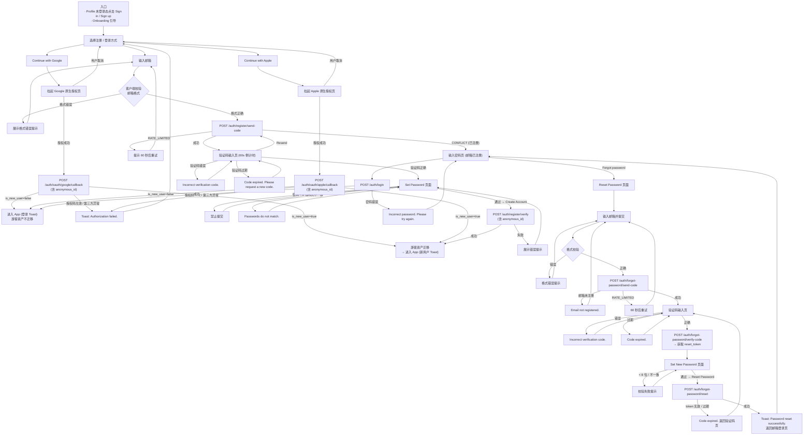
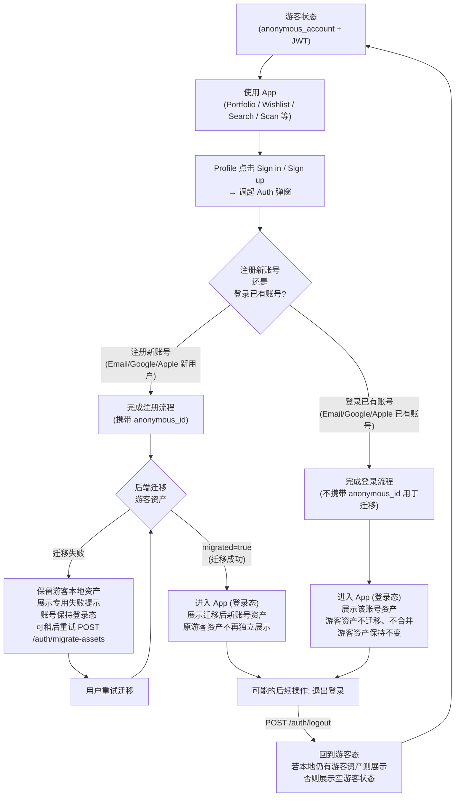
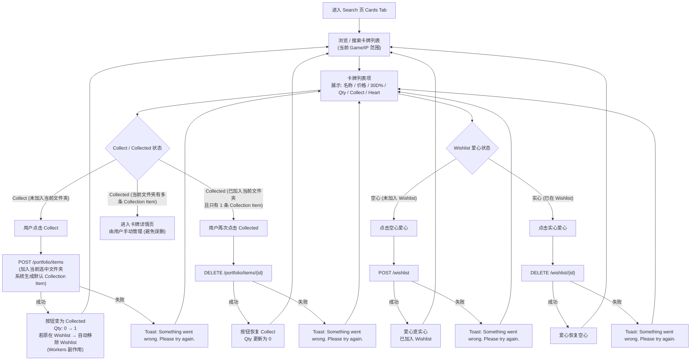
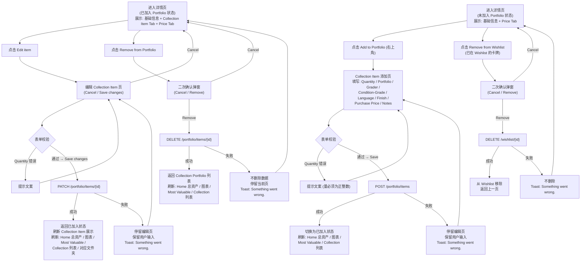
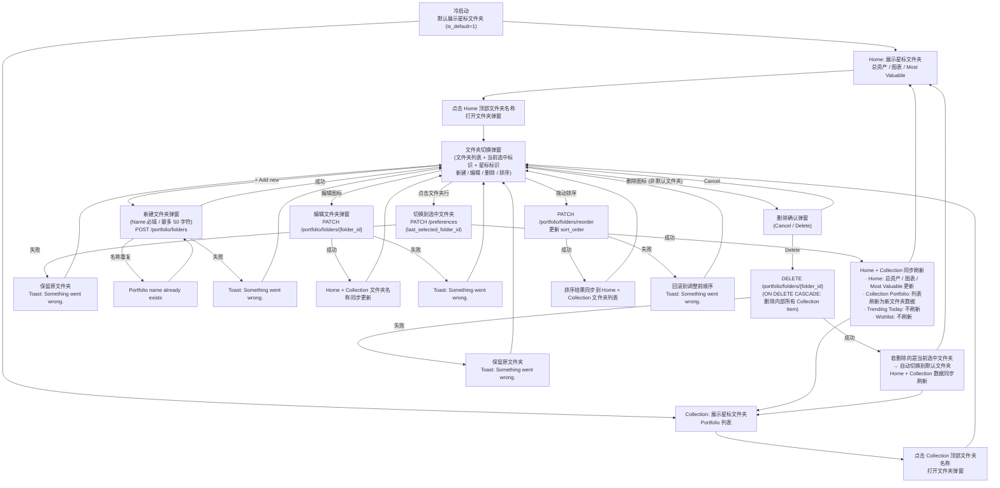
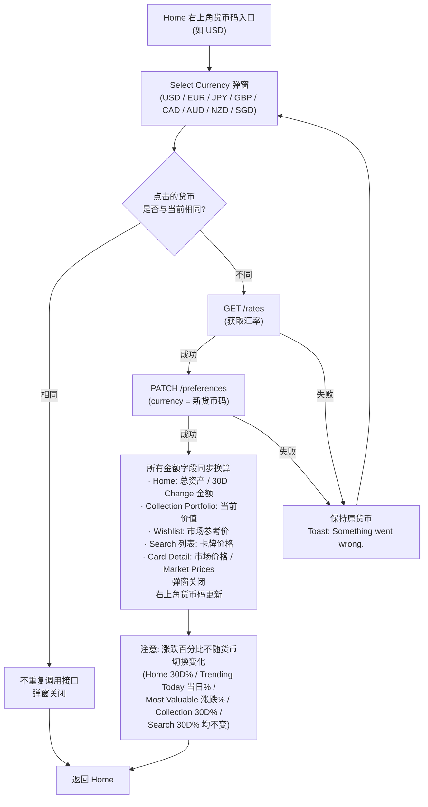

# 业务流程图

> **定位**：本文件汇总 tcg-card v1.0 核心业务端到端流程图，使用 Mermaid flowchart TD 语法绘制，每图配文字说明并链接对应模块 PRD。
>
> **日期**：2026-06-30
>
> **来源**：
> - Auth 模块 PRD [`../00-product/modules/auth.md`](../00-product/modules/auth.md)
> - Profile 模块 PRD [`../00-product/modules/profile.md`](../00-product/modules/profile.md)
> - Home 模块 PRD [`../00-product/modules/home.md`](../00-product/modules/home.md)
> - Collection 模块 PRD [`../00-product/modules/collection.md`](../00-product/modules/collection.md)
> - Search 模块 PRD [`../00-product/modules/search.md`](../00-product/modules/search.md)
> - Card Detail 模块 PRD [`../00-product/modules/card-detail.md`](../00-product/modules/card-detail.md)
> - 全局规则 [`../00-product/modules/global-rules.md`](../00-product/modules/global-rules.md)

---

## 目录

1. [注册 / 登录 / 找回密码端到端](#一注册--登录--找回密码端到端)
2. [游客使用→注册迁移 / 游客→登录已有账号](#二游客使用注册迁移--游客登录已有账号)
3. [Search → Collect 加入 Portfolio](#三search--collect-加入-portfolio)
4. [卡牌详情 添加 / 编辑 / 移除 Collection Item](#四卡牌详情-添加--编辑--移除-collection-item)
5. [文件夹切换对 Home / Collection 的联动](#五文件夹切换对-home--collection-的联动)
6. [货币切换刷新链路](#六货币切换刷新链路)

---

## 一、注册 / 登录 / 找回密码端到端

> 对应 PRD：[auth.md](../00-product/modules/auth.md)

### 说明

用户通过两个入口进入 Auth 流程：Profile 未登录态点击 **Sign in / Sign up**，或 Onboarding 结束页引导。进入后选择注册 / 登录方式（Google / Apple / Email），三条路径最终都收敛到「进入 App」。Email 流程内置验证码校验与密码设置；Google / Apple 走 OAuth 授权码回调。找回密码独立于注册/登录，从 Email 登录页的 Forgot password 入口触发。

---

## 二、游客使用→注册迁移 / 游客→登录已有账号

> 对应 PRD：[global-rules.md §十四](../00-product/modules/global-rules.md)、[profile.md §三](../00-product/modules/profile.md)、[auth.md §八](../00-product/modules/auth.md)

### 说明

App 首次启动时，后端自动创建 `anonymous_account`（持有 JWT，关联 `device_id`），用户可在游客状态下完整使用 Portfolio、Wishlist、Search 等功能，产生的数据均存储在该匿名账号下。

当游客选择**注册新账号**时，客户端在注册请求中携带 `anonymous_id`，后端将游客资产迁移到新账号（`migrated=true`）；若迁移在注册请求中失败，可通过 `POST /auth/migrate-assets` 显式重试。

当游客选择**登录已有账号**时，游客资产**不迁移、不合并**，登录后展示该账号资产。

---

## 三、Search → Collect 加入 Portfolio

> 对应 PRD：[search.md §十三](../00-product/modules/search.md)、[search.md §十五](../00-product/modules/search.md)

### 说明

用户在 Search 的 Cards 列表中浏览或搜索卡牌，通过 Collect 按钮快捷加入当前选中 Portfolio 文件夹（系统自动生成默认 Collection Item，无需填写表单）。若已在 Wishlist 中，加入 Portfolio 后系统自动将其从 Wishlist 移除（同一对象不可同时在两处）。Collected 再次点击可撤销加入。

> **互斥说明**：
> - **强制方向（PRD 明确）**：同对象不可同时在 Portfolio 与 Wishlist。点击 **Collect 加入 Portfolio 时，若对象已在 Wishlist，自动移除 Wishlist**（search.md §十三、§十四.6，Workers 副作用，已在上图 `COLLECTED_STATE` 节点体现）。
> - **反向行为 ⚠️ TBD**：对象已在 Portfolio（Collected 状态）时点击空心 Heart 加入 Wishlist 的行为，PRD 未明确。建议：已 Collect 状态下 Heart 禁用，或加入 Wishlist 时先移出 Portfolio——待产品确认。本图 Heart 加入 Wishlist 路径仅陈述成功加入 Wishlist，不在成功节点上断言互斥裁决。

---

## 四、卡牌详情 添加 / 编辑 / 移除 Collection Item

> 对应 PRD：[card-detail.md](../00-product/modules/card-detail.md)

### 说明

卡牌详情页有两种状态：**未加入 Portfolio** 展示基础信息 + Price Tab；**已加入 Portfolio** 额外展示 Collection Item Tab，支持编辑和移除。

- **添加**：从未加入状态点击 Add to Portfolio，填写 Collection Item 信息后保存，卡牌进入当前文件夹。
- **编辑**：从已加入状态进入编辑页，修改数量 / 文件夹 / Grader / 品相等，保存后刷新相关数据。
- **移除**：点击 Remove from Portfolio，经二次确认弹窗后删除，返回 Collection 列表并刷新 Home 数据。

---

## 五、文件夹切换对 Home / Collection 的联动

> 对应 PRD：[home.md §八](../00-product/modules/home.md)、[collection.md §十一](../00-product/modules/collection.md)

### 说明

文件夹切换入口位于 Home 顶部文件夹名称和 Collection 顶部文件夹名称（两处共享同一弹窗逻辑）。切换后，Home 总资产卡片（总金额 / 图表 / Most Valuable）和 Collection - Portfolio 列表同时刷新至新文件夹数据；Trending Today 和 Wishlist 不受文件夹影响。冷启动后默认展示星标（default）文件夹；本次会话手动切换优先级高于默认，但不跨冷启动。

---

## 六、货币切换刷新链路

> 对应 PRD：[global-rules.md §七](../00-product/modules/global-rules.md)、[home.md §九](../00-product/modules/home.md)

### 说明

货币切换入口位于 Home 右上角货币码。点击后弹出 `Select currency` 弹窗，选择新货币后，客户端调用汇率接口（`GET /rates`）获取换算比率，并持久化用户偏好（`PATCH /preferences`）。切换成功后，App 内**所有**金额字段同步换算（Home 总资产、Collection 当前价值、Search 卡牌价格、卡牌详情价格等）；**涨跌百分比不变**。货币偏好与账号绑定，游客账号同样有效。

