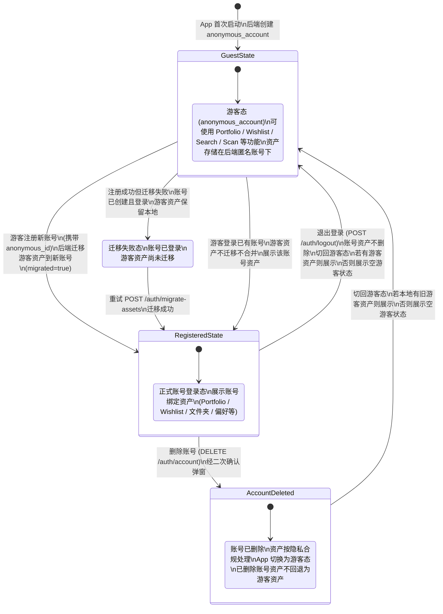
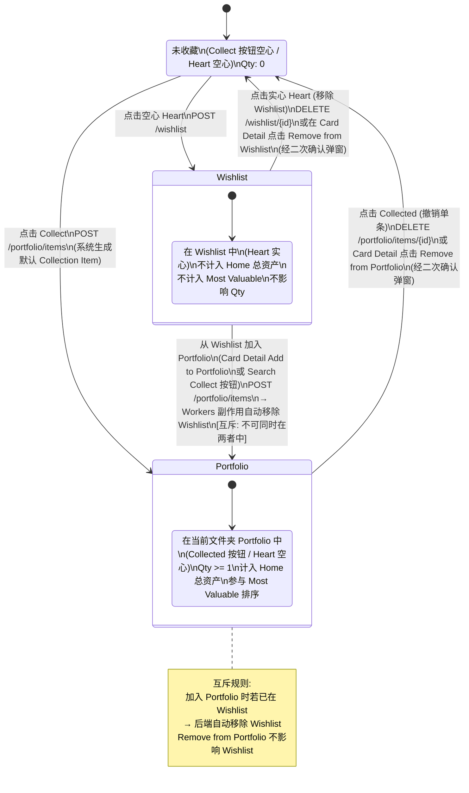
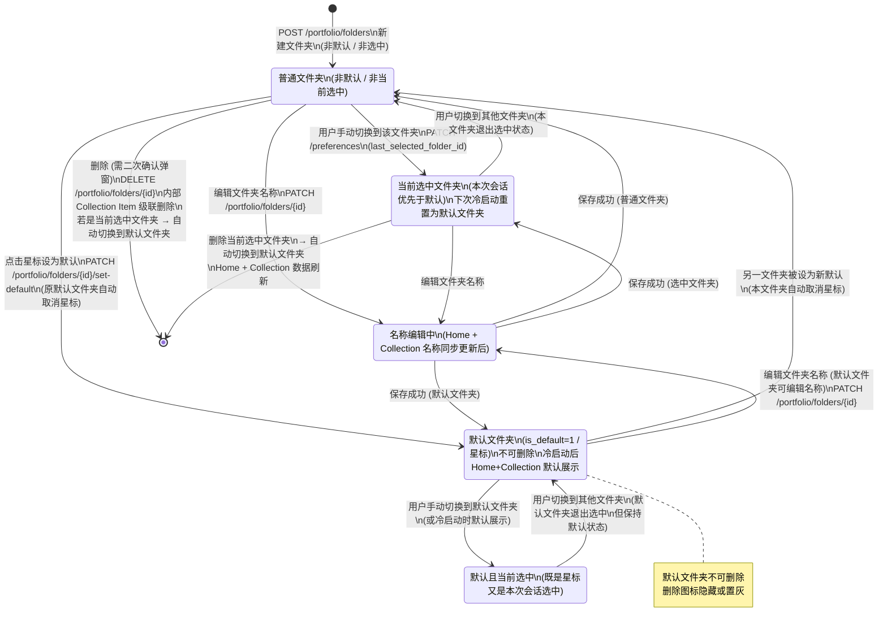
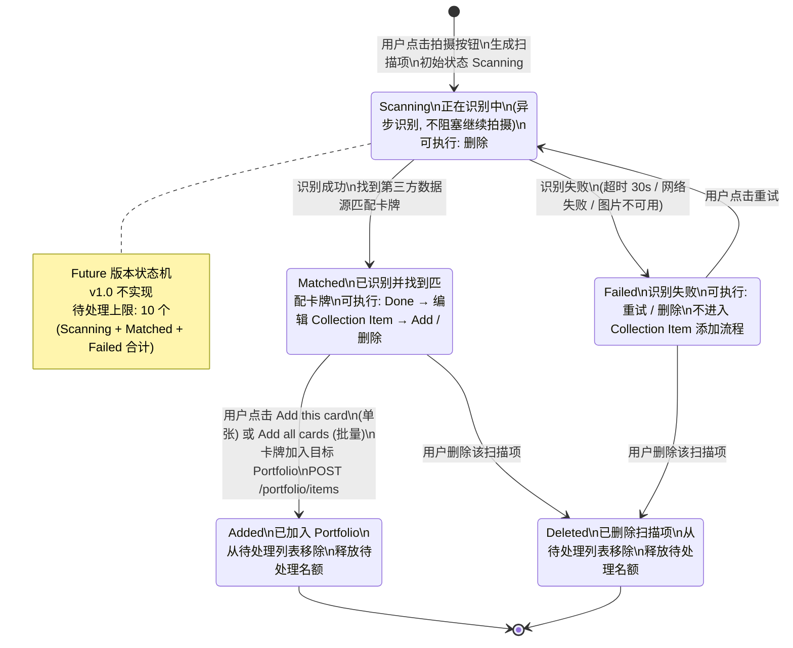

# 关键状态机

> **定位**：本文件汇总 tcg-card v1.0 关键业务对象的状态机，使用 Mermaid stateDiagram-v2 语法绘制，每图配文字说明并链接对应模块 PRD。
>
> **日期**：2026-06-30
>
> **来源**：
> - 全局规则 [`../00-product/modules/global-rules.md`](../00-product/modules/global-rules.md)（spec §4.5 / §十四 游客口径）
> - Auth 模块 PRD [`../00-product/modules/auth.md`](../00-product/modules/auth.md)
> - Profile 模块 PRD [`../00-product/modules/profile.md`](../00-product/modules/profile.md)
> - Home 模块 PRD [`../00-product/modules/home.md`](../00-product/modules/home.md)
> - Collection 模块 PRD [`../00-product/modules/collection.md`](../00-product/modules/collection.md)
> - Search 模块 PRD [`../00-product/modules/search.md`](../00-product/modules/search.md)
> - Card Detail 模块 PRD [`../00-product/modules/card-detail.md`](../00-product/modules/card-detail.md)
> - Scan 模块 PRD [`../00-product/modules/scan.md`](../00-product/modules/scan.md)（Scan 状态机为 future 留档）

---

## 目录

1. [账号身份状态机](#一账号身份状态机)
2. [收藏对象状态机](#二收藏对象状态机)
3. [Portfolio 文件夹状态机](#三portfolio-文件夹状态机)
4. [Scan 扫描项状态机（future 留档）](#四scan-扫描项状态机future-留档)

---

## 一、账号身份状态机

> 对应 PRD：[global-rules.md §十四](../00-product/modules/global-rules.md)、[auth.md](../00-product/modules/auth.md)、[profile.md](../00-product/modules/profile.md)
>
> 对齐口径：spec §4.5、global-rules §十四（匿名账号同步机制、注册迁移、登录不合并）

### 说明

App 首次启动时后端自动创建 `anonymous_account`（持有 JWT，关联 `device_id`），用户始终处于「游客态」或「正式账号登录态」之一。

核心规则（来自 global-rules §十四）：
- **游客注册新账号**：资产迁移到新账号（`POST /auth/register/verify` 携带 `anonymous_id`），迁移失败时账号仍登录但资产保留在游客侧，可重试 `POST /auth/migrate-assets`。
- **游客登录已有账号**：游客资产**不迁移、不合并**，登录后展示该账号资产。
- **退出登录**：切回游客态；若本地仍有游客资产则展示，否则展示空游客状态。
- **删除账号**：账号资产按隐私合规处理；切回游客态；已删除账号资产**不**回退为游客资产。

---

## 二、收藏对象状态机

> 对应 PRD：[search.md §十三](../00-product/modules/search.md)、[search.md §十四](../00-product/modules/search.md)、[card-detail.md §十](../00-product/modules/card-detail.md)、[collection.md §九](../00-product/modules/collection.md)

### 说明

每个收藏对象（卡牌 / Sealed Product / 其他）相对于当前账号和当前选中文件夹，存在三种互斥状态：**未收藏**、**在 Wishlist** 中、**在 Portfolio** 中。

**核心互斥规则**（来自 search.md §十四 规则 6、collection.md §九.3）：
- 同一对象**不可同时存在于 Portfolio 和 Wishlist**。
- 点击 Collect（加入 Portfolio）时，若对象已在 Wishlist，后端 Workers 副作用自动将其从 Wishlist 移除。
- 从 Wishlist 加入 Portfolio 后，自动从 Wishlist 移除。
- Remove from Portfolio 后，不影响 Wishlist 状态（即 Portfolio 和 Wishlist 移除彼此独立）。

注意：Portfolio 状态是相对「当前选中文件夹」的；同一对象可在不同文件夹中有不同 Collection Item，但 Wishlist 跨文件夹全局唯一。

---

## 三、Portfolio 文件夹状态机

> 对应 PRD：[home.md §八](../00-product/modules/home.md)、[collection.md §十一](../00-product/modules/collection.md)

### 说明

Portfolio 文件夹（`portfolio_folder`）有以下几个维度的状态：是否为「默认文件夹」（星标）、是否为「当前选中文件夹」、生命周期（存在 / 删除）。

核心规则：
- **默认文件夹**（`is_default=1`）唯一，不可删除，可编辑名称；冷启动后 Home 和 Collection 始终展示默认文件夹。
- **当前选中文件夹**：用户手动切换后，本次会话内此文件夹优先级高于默认；下次冷启动重置为默认文件夹。
- **删除**：只有非默认文件夹可删除，需经二次确认弹窗；删除后内部所有 Collection Item 级联删除（`ON DELETE CASCADE`）；若删除的是当前选中文件夹，自动切换到默认文件夹。

---

## 四、Scan 扫描项状态机（future 留档）

> **⚠️ 注意：本节描述的 Scan 扫描识别功能在 v1.0 不实现。**
> **v1.0 Scan Tab 仅交付占位页（展示「扫描功能即将上线」引导 + 跳转 Search 按钮），不打开相机，不请求相机权限。**
> 本节内容完整保留原始扫描识别设计，供后续版本参考。
>
> 对应 PRD：[scan.md §二十八（Future）](../00-product/modules/scan.md)

### 说明（Future）

在 Future 版本中，每次拍摄生成一个扫描项，独立经历以下状态流转：`Scanning`（识别中）→ `Matched`（识别成功并找到匹配卡牌）/ `Failed`（识别失败 / 超时 / 网络失败）→ 用户操作后进入 `Added`（已加入 Portfolio）或 `Deleted`（已删除）。

核心规则（Future）：
- `Scanning` 状态不阻塞继续拍摄，多个扫描项可并行处于 `Scanning`。
- `Failed` 状态可重试（回到 `Scanning`）或删除。
- `Matched` 状态须用户手动确认并点击 Add 才进入 `Added`，扫描结果不自动保存。
- 同时只允许最多 10 个待处理扫描项（`Scanning` + `Matched` + `Failed` 合计），上限时拍摄按钮不可用。
- `Added` 和 `Deleted` 状态从待处理列表移除，释放名额。

