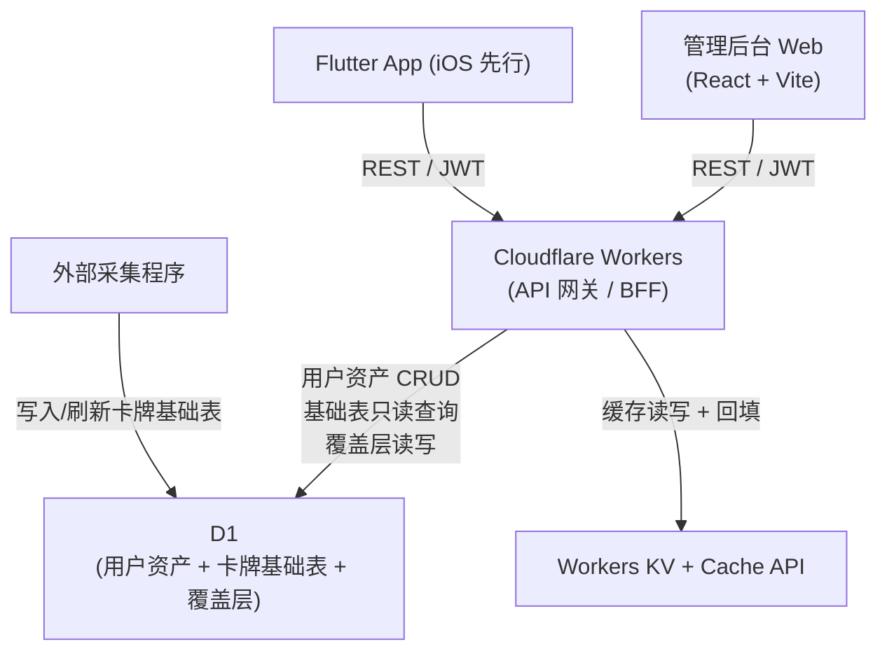
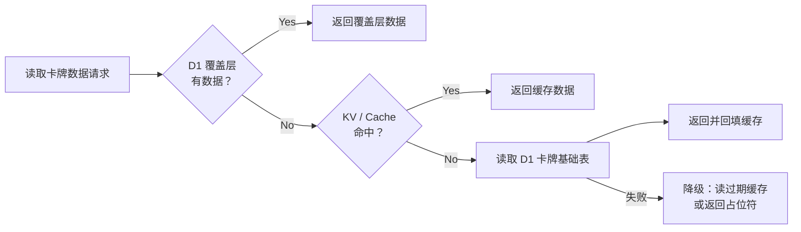

# tcg-card 技术架构

> **定位**：描述 tcg-card v1.0 系统整体分层、Workers 职责划分、数据策略、货币与涨跌幅口径、缓存与降级策略。
> **最后更新**：2026-06-30
> **上游来源**：[`docs/superpowers/specs/2026-06-30-tcg-card-preparation-design.md`](../../superpowers/specs/2026-06-30-tcg-card-preparation-design.md) §4.1–4.4

---

## 1. 整体分层

**说明**：

- App 和管理后台均通过 Cloudflare Workers 统一接入，**不直连采集程序或外部数据源**。
- Workers 是唯一出口，对外暴露 REST 接口（鉴权由 JWT 校验）。
- 数据写入路径：用户资产 → D1；卡牌基础数据由外部采集程序写入同一个 D1；Workers 只读查询基础表并写入 KV / Cache API 缓存。
- **缓存回填由 Workers 完成**：Workers 读取 D1 基础表并组装响应后写入 KV / Cache API；采集程序不直连缓存层。

---

## 2. Workers 职责

Workers 作为统一 API 网关（BFF），对内分两类职责：

### 2.1 用户资产 CRUD（写入 D1）

| 业务域 | 说明 |
|---|---|
| `folders` | 文件夹增删改查（含 default_folder 管理） |
| `collection_items` | Portfolio 持有记录增删改查 |
| `wishlist` | 心愿单增删改查 |
| `user_preferences` | 用户偏好（货币选择、默认文件夹等） |
| `auth` | 注册 / 登录 / 会话管理 / 游客匿名账号创建与升级 |
| `card_overrides` | 卡牌覆盖层 CRUD（管理后台专用接口） |

操作结果落 D1，不经过第三方。

### 2.2 D1 卡牌基础数据代理 + 缓存

| 代理类型 | 说明 |
|---|---|
| 卡牌搜索 | 查询 `cards_all`，写 KV 缓存 |
| 卡牌价格 | 从 `tcgplayer_skus.price_history` 解析 Raw / Sealed 价格，写 Cache API |
| Trending Today | 先查 `trending_pin` 并回查 `cards_all`，写 KV 缓存 |
| 成交记录 | 当前基础表无真实成交记录，接口按空列表降级，写 Cache API |

**关键约束**：App 和管理后台的所有卡牌数据请求均经 Workers 代理；客户端不可直接访问 D1 或采集程序。

---

## 3. 两层数据策略

### 3.1 D1 卡牌基础数据层

- **数据来源**：同一个 D1 数据库中的 `cards_all` / `games` / `sets` / `tcgplayer_skus`，由外部采集程序写入。
- **存储**：基础表长期存储在 D1；Workers KV / Cache API 只保存接口响应缓存。
- **内容**：卡牌目录、SKU 维度价格历史；Trending 非置顶和成交记录若基础表无数据则按接口降级。
- **性质**：只读，不允许 App 或管理后台写入

### 3.2 D1 覆盖层（override layer）

- **存储**：D1 `card_overrides` 表
- **内容**：
  - ① 补充基础表缺失的卡牌
  - ② 纠正基础表数据错误（名称、系列、图片等）
  - ③ 补充卡牌图片（基础表无图时兜底）
  - ④ 运营数据（如 Trending 置顶、特殊标注）
- **维护入口**：管理后台"卡牌数据运维"模块

### 3.3 读取规则

> **覆盖层优先，回落 D1 卡牌基础数据。**

该规则适用于：卡牌详情、价格、Trending、成交记录等所有卡牌数据代理场景。

---

## 4. 货币与涨跌幅口径

### 4.1 货币存储与展示

- **存储**：金额字段存**原始货币 + 原值**（如 `price_usd: 150.00`）；不在 D1 存换算后金额。
- **展示**：客户端按用户选择的显示货币，通过汇率接口换算后展示（⚠️ TBD：汇率接口提供方，见 spec §6）。
- **货币切换**：只影响展示金额，不影响存储值；切换后重新换算，无需重新拉取数据。

### 4.2 涨跌幅口径

- **百分比按原始价格序列计算，不随货币切换变化**。
- 计算公式（7D / 30D / 通用）以 [`../00-product/modules/global-rules.md`](../00-product/modules/global-rules.md) 为单一真相源，本文档不重复定义。
- 缺失历史价格时的占位符规则同 global-rules.md。

---

## 5. 缓存与降级策略

### 5.1 缓存层级

| 缓存类型 | 适用场景 | TTL（参考） |
|---|---|---|
| Workers KV | Trending Today、搜索结果 | ⚠️ TBD（实现阶段确定） |
| Cache API | 卡牌价格、成交记录 | ⚠️ TBD（实现阶段确定） |

### 5.2 降级策略

D1 基础表读取或缓存读取失败时，按以下顺序降级：

1. **读取有效缓存**（KV / Cache API 中未过期数据）
2. **读取过期缓存**（stale-while-revalidate 策略，如有）
3. **返回占位符**：数值字段展示 `--`，涨跌字段展示 `-/-`

占位符的具体展示规则见 [`../00-product/modules/global-rules.md`](../00-product/modules/global-rules.md)。

### 5.3 缓存回填时机

- Workers 成功读取 D1 基础表并组装响应后，**同步写入**对应缓存层。
- 缓存 Key 设计原则：包含卡牌 ID + 数据类型 + 时间粒度，避免跨类型污染。

---

## 6. 鉴权架构

- **Auth 自建于 Workers + D1**：D1 存用户信息、密码哈希、会话；Workers 负责签发和校验 JWT。
- **Google / Apple OAuth**：Workers 实现 OAuth 回调，凭证 ⚠️ TBD（见 spec §6）。
- **游客匿名账号**：首次启动即在后端创建匿名账号（绑定设备标识），资产实时同步到 D1；口径以 [`../00-product/glossary.md`](../00-product/glossary.md) `GuestAccount` 条目为准。
- 所有接口（含代理接口）均需 JWT 校验，游客使用匿名账号 JWT。
