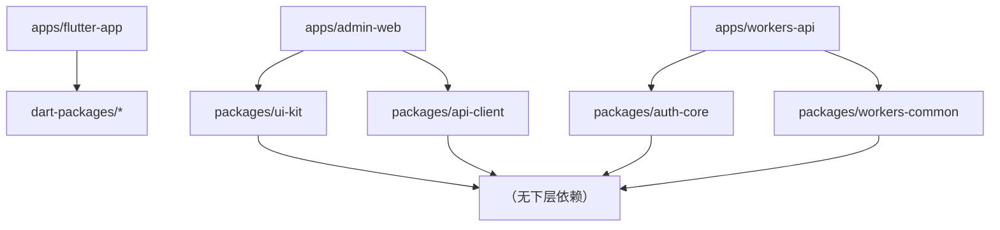

# tcg-card Monorepo 划分

> **定位**：描述 tcg-card v1.0 Monorepo 目录结构、公有化模块边界、双工具链协作约定与依赖方向规则。
> **最后更新**：2026-06-30
> **上游来源**：[`docs/superpowers/specs/2026-06-30-tcg-card-preparation-design.md`](../../superpowers/specs/2026-06-30-tcg-card-preparation-design.md) §4.6

---

## 1. 顶层目录草案

```
kando-global-project/              # 顶层 Monorepo 根
├── apps/
│   ├── flutter-app/               # Flutter App（iOS 先行，Android 预留）
│   ├── admin-web/                 # 管理后台（React + Vite + TypeScript）
│   └── workers-api/               # Cloudflare Workers 后端（Hono + Drizzle ORM）
├── packages/                      # TS/JS 通用包（pnpm workspaces 管理）
│   ├── auth-core/                 # 鉴权通用逻辑
│   ├── api-client/                # 客户端网络层
│   ├── ui-kit/                    # 通用 UI 组件
│   └── workers-common/            # D1 访问 / JWT / 缓存 / 错误处理
├── dart-packages/                 # Dart/Flutter 共享包（Melos 管理）
│   └── (按需扩展，v1.0 视实际拆分情况定)
├── turbo.json                     # Turborepo 任务配置（TS 侧）
├── melos.yaml                     # Melos 配置（Dart 侧）
├── pnpm-workspace.yaml            # pnpm workspaces 声明
└── package.json                   # 顶层 package.json（scripts 入口）
```

**说明**：

- `apps/` 存放可部署/可交付的应用；`packages/` 存放跨应用复用的 TS/JS 包；`dart-packages/` 存放 Dart/Flutter 共享包。
- 本次任务为纯文档，**不搭建目录骨架**，结构为草案供开发阶段参考。

---

## 2. 公有化模块边界

公有化模块的设计原则：**与 tcg-card 球星卡业务无关，可跨项目复用**。各包职责如下：

### 2.1 `auth-core`（鉴权通用逻辑）

**职责**：

- JWT 签发与校验（`sign` / `verify`）
- 会话管理（刷新 Token、吊销）
- 密码哈希工具（bcrypt / argon2）
- OAuth 回调通用流程抽象（Google / Apple）

**边界约定**：

- 不包含 tcg-card 业务实体（用户表具体字段、Portfolio、卡牌等）
- 不包含邮件发送逻辑（发送由 `workers-api` 调用邮件服务处理）
- 可被 `workers-api` 及未来其他 Workers 项目直接引用

### 2.2 `api-client`（Web 侧客户端网络层）

**职责**：

- HTTP 请求封装（基于 fetch 的 Web 侧实现）
- 统一错误处理与错误类型定义
- Token 注入拦截器
- 重试与超时策略

**边界约定**：

- **作用范围限 Web 侧**（`apps/admin-web`）：`api-client` 是 TS 包，归属 `packages/`，仅供 Web 侧使用。
- **Flutter 侧网络封装不在此包**：Flutter 侧基于 Dio 的网络层归属 `dart-packages/`（Dart 包），与本 TS 包语言边界天然隔离。
- 不包含 tcg-card 特定业务接口定义（具体 API 路径在 `apps/admin-web` 维护）
- 提供通用请求基类和拦截器，业务侧继承/组合使用

### 2.3 `ui-kit`（通用 UI 组件）

**职责**：

- 通用基础组件（Button、Input、Toast、Loading、空状态、错误状态）
- 主题/色板定义（Design Token）
- 可复用布局组件

**边界约定**：

- 不包含 tcg-card 业务专属组件（卡牌卡片、Portfolio 列表项等业务组件在 `apps/` 各自维护）
- Web 侧 `ui-kit` 与 Ant Design 互补，不重复封装 Ant Design 已有的成熟组件
- Flutter 侧通用 Widget 可抽取到 `dart-packages/` 下的对应包，而非 `packages/ui-kit`（TS 包）

### 2.4 `workers-common`（Workers 通用能力）

**职责**：

- D1 数据库访问基础工具（连接封装、事务辅助）
- 缓存工具（KV 读写封装、Cache API 封装）
- 统一错误处理与 HTTP 响应格式
- 环境变量类型安全读取工具

**边界约定**：

- 不包含 tcg-card 业务 Schema（D1 表定义在 `apps/workers-api` 维护）
- 不包含具体路由（路由在 `workers-api` 中用 Hono 定义）
- 可被未来其他 Cloudflare Workers 项目直接引用

---

## 3. TS 与 Dart 双 Monorepo 工具协作

tcg-card 涉及两套语言生态（TypeScript + Dart），分别使用各自的 Monorepo 工具。

### 3.1 Turborepo 管 TS 侧

- **范围**：`apps/admin-web`、`apps/workers-api`、`packages/` 下全部 TS 包
- **职责**：任务编排（`build`、`lint`、`test`、`type-check`）、增量缓存、并行执行
- **配置文件**：`turbo.json`（顶层）

### 3.2 Melos 管 Dart 侧

- **范围**：`apps/flutter-app`、`dart-packages/` 下全部 Dart/Flutter 包
- **职责**：包依赖管理（`melos bootstrap`）、跨包脚本（`flutter test`、`dart analyze`）、版本发布
- **配置文件**：`melos.yaml`（顶层）

### 3.3 顶层协作约定

| 场景 | 执行方式 |
|---|---|
| 启动 TS 侧开发 | `pnpm turbo dev --filter=admin-web` |
| 启动 Flutter App | `melos run dev` 或直接 `cd apps/flutter-app && flutter run` |
| 全量 CI 构建 | 拆分为两个 Job：TS Job（`pnpm turbo build`）+ Dart Job（`melos run build`） |
| 类型共享 | TS 侧类型可通过生成 JSON Schema 或 OpenAPI 规范，用于 Dart 侧代码生成（⚠️ TBD：工具选型实现阶段确定） |

**顶层 `package.json` scripts** 仅作为快捷入口，不替代各工具原生命令。

---

## 4. 依赖方向规则



**规则**：

1. **业务包（`apps/`）→ 通用包（`packages/` / `dart-packages/`）**：允许。
2. **通用包 → 业务包**：**禁止**。通用包不得引用 `apps/` 下任何业务逻辑。
3. **通用包之间**：尽量避免；若必要，以最小化方式引用，并在 PR 时说明理由。
4. **TS 包 → Dart 包**（或反向）：语言边界天然隔离，运行时不互相引用；类型共享通过 Schema 生成（见 §3.3）。

违反依赖方向的 PR 在 Code Review 阶段应被拒绝，CI 可通过 `depcheck` 或自定义脚本辅助检查。
