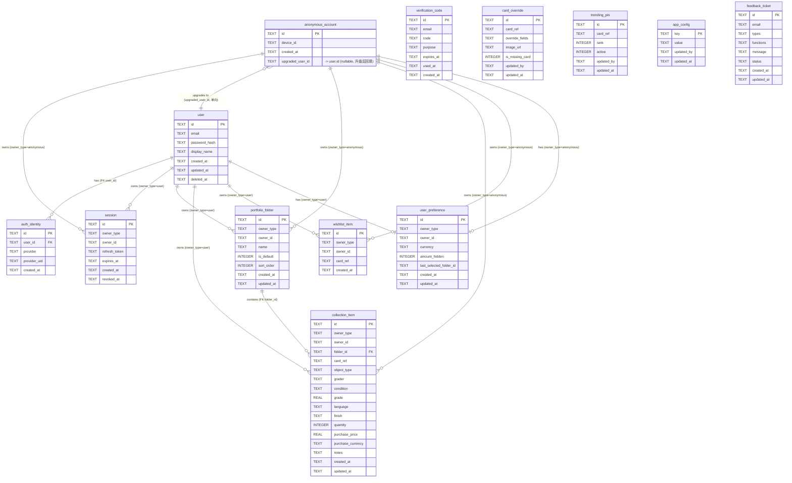

# tcg-card D1 数据模型

> **定位**：定义 tcg-card v1.0 的全量 D1 表结构（表名 / 字段 / 类型 / 约束 / 说明），是 API 规范、管理后台、模块 PRD 的引用基础。第三方实时数据（目录 / 价格）不落 D1，不在此定义。
> **日期**：2026-06-30
> **来源**：
> - Spec [`docs/superpowers/specs/2026-06-30-tcg-card-preparation-design.md`](../../superpowers/specs/2026-06-30-tcg-card-preparation-design.md) §4.3、§4.5、§8
> - 架构 [`docs/tcg-card/02-architecture/architecture.md`](../02-architecture/architecture.md)
> - 术语 [`docs/tcg-card/00-product/glossary.md`](../00-product/glossary.md)
> - 跨切面规则 [`docs/tcg-card/00-product/modules/global-rules.md`](../00-product/modules/global-rules.md)

---

## 1. 数据分层说明

tcg-card 的数据分为两层，本文档只定义写入 D1 的部分：

| 层 | 存储位置 | 说明 |
|---|---|---|
| **D1 用户资产 + 覆盖层** | Cloudflare D1 | 用户账号、资产、偏好、卡牌覆盖层、运营配置——本文档全部覆盖 |
| 第三方实时层 | Workers KV / Cache API | 卡牌目录 / 价格，不落 D1，见 [`third-party.md`](./third-party.md) |

读取规则：**D1 覆盖层优先，回落第三方实时数据**（见架构文档 §3.3）。

---

## 2. owner 多态口径

`portfolio_folder`、`collection_item`、`wishlist_item`、`user_preference` 四张表的持有者可以是**正式账号（user）** 或**匿名账号（anonymous_account）**。

**选定方案：`owner_type` + `owner_id` 复合多态外键**

| 字段 | 类型 | 说明 |
|---|---|---|
| `owner_type` | TEXT | 枚举：`user` 或 `anonymous` |
| `owner_id` | TEXT | 对应表的主键 |

理由：
1. `user` 与 `anonymous_account` 生命周期不同（匿名账号升级后 `anonymous_account` 记录保留，`user` 记录新建），两张表结构不对称，不适合合并为一张表。
2. 升级时只需把资产表的 `owner_type` 改为 `user`、`owner_id` 改为新 `user.id`，原 `anonymous_account` 行不删除（保留后台可见性）。
3. 后续若增加其他账号类型（如 B2B 机构账号），只需新增枚举值，无需改表结构。

**约束**：资产表不设外键到具体账号表（SQLite 不跨表 FK 多态），由 Workers 层保证 `owner_type` + `owner_id` 的引用完整性。

---

## 3. 用户 / 账号层

### 3.1 user（正式账号）

```sql
CREATE TABLE user (
    id            TEXT PRIMARY KEY,          -- ULID，生成后不变
    email         TEXT NOT NULL UNIQUE,      -- 登录邮箱
    password_hash TEXT,                      -- bcrypt hash；OAuth 注册可为 NULL
    display_name  TEXT,                      -- 展示名（可选）
    created_at    TEXT NOT NULL,             -- ISO 8601 UTC
    updated_at    TEXT NOT NULL,
    deleted_at    TEXT                       -- 软删除；NULL 表示正常账号
);
```

说明：
- `id` 使用 ULID（可排序的唯一 ID），后续 API 统一以此作为 `user_id`。
- `password_hash` 在 OAuth 唯一注册时为 NULL；混合注册时非 NULL。
- `deleted_at` 非 NULL 表示账号已被删除，Workers 层在读取时过滤此类账号，资产数据按隐私合规保留策略处理。

### 3.2 anonymous_account（匿名账号）

```sql
CREATE TABLE anonymous_account (
    id               TEXT PRIMARY KEY,       -- ULID
    device_id        TEXT NOT NULL,          -- 客户端设备标识（App 生成，首次启动上报）
    created_at       TEXT NOT NULL,
    upgraded_user_id TEXT                    -- 升级后回填 user.id；NULL = 仍为游客
);
```

说明：
- 用户首次启动 App 即在后端创建，绑定 `device_id`，资产实时同步到 D1（见 Spec §4.5）。
- 匿名账号**无登录凭证**，不可跨设备恢复；换设备 = 新匿名账号。
- **升级路径**：用户注册成功后，Workers 将当前 `anonymous_account` 的资产（`owner_type = 'anonymous'`、`owner_id = anonymous_account.id`）批量更新为 `owner_type = 'user'`、`owner_id = 新 user.id`，并回填 `upgraded_user_id`。原 `anonymous_account` 行保留，管理后台可追溯。
- 登录已有账号**不迁移**匿名资产（见 Spec §4.5、PRD 全局补充事项 §十四）。

### 3.3 auth_identity（第三方登录绑定）

```sql
CREATE TABLE auth_identity (
    id           TEXT PRIMARY KEY,
    user_id      TEXT NOT NULL REFERENCES user(id) ON DELETE CASCADE,
    provider     TEXT NOT NULL,              -- 'google' | 'apple'
    provider_uid TEXT NOT NULL,              -- 第三方返回的用户唯一 ID
    created_at   TEXT NOT NULL,
    UNIQUE (provider, provider_uid)
);
```

说明：
- 一个 `user` 可绑定多条 `auth_identity`（如同时绑定 Google 和 Apple）。
- OAuth 凭证 ⚠️ TBD（见 Spec §6 TBD #4）。

### 3.4 session（JWT 会话）

```sql
CREATE TABLE session (
    id            TEXT PRIMARY KEY,          -- ULID
    owner_type    TEXT NOT NULL,             -- 'user' | 'anonymous'
    owner_id      TEXT NOT NULL,             -- user.id 或 anonymous_account.id
    refresh_token TEXT NOT NULL UNIQUE,      -- 刷新令牌（哈希存储）
    expires_at    TEXT NOT NULL,             -- 刷新令牌过期时间
    created_at    TEXT NOT NULL,
    revoked_at    TEXT                       -- NULL = 有效；非 NULL = 已吊销
);
CREATE INDEX idx_session_owner ON session(owner_type, owner_id);
```

说明：
- Access Token（JWT）由 Workers 签发，不存 D1；D1 只存 Refresh Token 用于续签和吊销。
- 退出登录时设置 `revoked_at`，Workers 验签时过滤已吊销记录。

### 3.5 verification_code（邮箱验证码）

```sql
CREATE TABLE verification_code (
    id         TEXT PRIMARY KEY,
    email      TEXT NOT NULL,
    code       TEXT NOT NULL,                -- 6位数字，明文存储（短期有效）
    purpose    TEXT NOT NULL,                -- 枚举：'register' | 'reset_password'（API / 前端按此对齐）
    expires_at TEXT NOT NULL,                -- 通常 10 分钟后过期
    used_at    TEXT,                         -- 使用时间；NULL = 未使用
    created_at TEXT NOT NULL
);
CREATE INDEX idx_verification_code_email ON verification_code(email, purpose);
```

说明：
- 验证码验证后立即设置 `used_at`，防止重放。
- 同一 email + purpose 同时只应有一条有效验证码；Workers 层在发送新验证码前使旧的过期或删除。
- 邮件服务：默认 Resend，备选 SES（⚠️ TBD，见 Spec §6 TBD #3）。

---

## 4. 资产层

### 4.1 portfolio_folder（Portfolio 文件夹）

```sql
CREATE TABLE portfolio_folder (
    id         TEXT PRIMARY KEY,
    owner_type TEXT NOT NULL,                -- 'user' | 'anonymous'
    owner_id   TEXT NOT NULL,
    name       TEXT NOT NULL,                -- 文件夹名称
    is_default INTEGER NOT NULL DEFAULT 0,   -- 1 = 默认文件夹（星标）；每个 owner 唯一
    sort_order INTEGER NOT NULL DEFAULT 0,   -- 排序权重，越小越靠前
    created_at TEXT NOT NULL,
    updated_at TEXT NOT NULL,
    UNIQUE (owner_type, owner_id, name),     -- 同一 owner 名称唯一
    -- 默认文件夹唯一约束由 Workers 层保证（SQLite 不支持条件唯一索引时）
    CHECK (is_default IN (0, 1))
);
CREATE INDEX idx_portfolio_folder_owner ON portfolio_folder(owner_type, owner_id);
```

说明：
- 首次创建匿名账号时，Workers 自动创建名为 "Main" 的默认文件夹（`is_default = 1`）。
- 默认文件夹不可删除；用户可通过点击星标切换默认文件夹。
- 同 owner 下 `is_default = 1` 全局唯一，Workers 层在切换默认文件夹时事务性更新。
- `sort_order` 支持用户手动拖拽排序。

### 4.2 collection_item（Portfolio 持有记录）

```sql
CREATE TABLE collection_item (
    id                TEXT PRIMARY KEY,
    owner_type        TEXT NOT NULL,         -- 'user' | 'anonymous'
    owner_id          TEXT NOT NULL,
    folder_id         TEXT NOT NULL REFERENCES portfolio_folder(id) ON DELETE CASCADE,
    card_ref          TEXT NOT NULL,         -- 第三方卡牌唯一标识（⚠️ TBD：格式由接入厂商确定）
    object_type       TEXT NOT NULL,         -- 'tcg' | 'sports' | 'sealed' | 'other'
    grader            TEXT NOT NULL,         -- 'Raw' | 'PSA' | 'BGS' | 'CGC' | 'SGC' | 'TAG' | 'AGS'
    condition         TEXT,                  -- Raw 品相；grader = 'Raw' 时使用；其余 NULL
    grade             REAL,                  -- 评级等级（如 9、9.5、10）；grader ≠ 'Raw' 时使用
    language          TEXT,                  -- 'English' 等；主要 TCG 单卡使用
    finish            TEXT,                  -- 'Holofoil' 等；主要 TCG 单卡使用
    quantity          INTEGER NOT NULL DEFAULT 1 CHECK (quantity >= 1),
    purchase_price    REAL,                  -- 用户购买成本原值；NULL = 未填写
    purchase_currency TEXT,                  -- 购买成本货币代码，如 'USD'；与 purchase_price 配套
    notes             TEXT,                  -- 用户备注；最多 500 字符
    created_at        TEXT NOT NULL,
    updated_at        TEXT NOT NULL
);
CREATE INDEX idx_collection_item_owner ON collection_item(owner_type, owner_id);
CREATE INDEX idx_collection_item_folder ON collection_item(folder_id);
CREATE INDEX idx_collection_item_card ON collection_item(card_ref);
```

说明：
- **同一张卡可存在多条 `collection_item`**（如同时持有 Raw 和 PSA 9 各一张），每条独立记录，分别参与价值计算。
- `grader = 'Raw'` 时，`condition` 必填，`grade` 为 NULL。
- `grader` 为评级机构时，`grade` 必填，`condition` 为 NULL。
- `object_type = 'sealed'` 时，`grader` 固定为 `'Raw'`（Sealed 无评级），`condition` / `grade` 均为 NULL。
- `purchase_price` 存原始货币原值，不参与市场价值计算，只作成本记录；展示时按 `purchase_currency` 换算显示货币（见架构文档 §4.1）。
- `card_ref` 格式取决于接入的第三方厂商（⚠️ TBD）。

### 4.3 wishlist_item（心愿单）

```sql
CREATE TABLE wishlist_item (
    id         TEXT PRIMARY KEY,
    owner_type TEXT NOT NULL,                -- 'user' | 'anonymous'
    owner_id   TEXT NOT NULL,
    card_ref   TEXT NOT NULL,                -- 第三方卡牌唯一标识
    created_at TEXT NOT NULL,
    UNIQUE (owner_type, owner_id, card_ref)  -- 同一卡不可重复加入心愿单
);
CREATE INDEX idx_wishlist_item_owner ON wishlist_item(owner_type, owner_id);
```

说明：
- Wishlist 无文件夹，无数量；只记录"用户想要这张卡"的意图。
- 同一卡牌不可同时存在于 Wishlist 和 Portfolio，由 Workers 层在 Collect 操作时自动从 Wishlist 移除（见 glossary Wishlist 条目）。

### 4.4 user_preference（用户偏好）

```sql
CREATE TABLE user_preference (
    id                     TEXT PRIMARY KEY,
    owner_type             TEXT NOT NULL,    -- 'user' | 'anonymous'
    owner_id               TEXT NOT NULL,
    currency               TEXT NOT NULL DEFAULT 'USD',  -- 展示货币
    amount_hidden          INTEGER NOT NULL DEFAULT 0,   -- 1 = 资产金额隐藏
    last_selected_folder_id TEXT,            -- 上次选中的文件夹；NULL = 使用默认文件夹
    created_at             TEXT NOT NULL,
    updated_at             TEXT NOT NULL,
    UNIQUE (owner_type, owner_id)            -- 每个 owner 只有一条偏好记录
);
```

说明：
- 首次创建账号时由 Workers 自动初始化（`currency = 'USD'`、`amount_hidden = 0`）。
- `last_selected_folder_id` 用于记录手动切换的文件夹；冷启动时优先使用 `is_default = 1` 的文件夹（见 glossary default_folder 条目）。
- `last_selected_folder_id` **软引用 `portfolio_folder.id`**，不设 DB 级 FK；文件夹删除时由 Workers 层将此字段置 NULL（回落到默认文件夹）。

---

## 5. 覆盖层 + 运营 + 反馈

### 5.1 card_override（卡牌覆盖层）

```sql
CREATE TABLE card_override (
    id              TEXT PRIMARY KEY,
    card_ref        TEXT NOT NULL UNIQUE,    -- 第三方卡牌唯一标识，或管理员自定义 ID（缺失卡）
    override_fields TEXT,                    -- JSON：字段级覆盖（卡名、系列、编号等）
    image_url       TEXT,                    -- 覆盖图片 URL；NULL = 使用第三方图片
    is_missing_card INTEGER NOT NULL DEFAULT 0 CHECK (is_missing_card IN (0,1)),
                                             -- 1 = 第三方无此卡，手动录入
    updated_by      TEXT,                    -- 软引用 user.id（操作管理员），无 DB 级 FK
    updated_at      TEXT NOT NULL
);
```

说明：
- `override_fields` 为 JSON 对象，只存需要覆盖的字段，其余字段仍由第三方数据提供。
- `is_missing_card = 1` 表示该卡在第三方无数据，完全依赖覆盖层提供信息（图片、名称、系列等）。
- 读取时：先查此表，有记录则用覆盖字段覆盖第三方数据；无记录则直接用第三方数据。
- `updated_by` **软引用 `user.id`**，可空、不设 DB 级 FK，由 Workers 层在写入时填充。
- 由管理后台"卡牌数据运维"模块维护。

### 5.2 trending_pin（运营置顶）

```sql
CREATE TABLE trending_pin (
    id         TEXT PRIMARY KEY,
    card_ref   TEXT NOT NULL UNIQUE,         -- 置顶卡牌标识
    rank       INTEGER NOT NULL,             -- 展示排序（从 1 开始）
    active     INTEGER NOT NULL DEFAULT 1 CHECK (active IN (0,1)),
                                             -- 1 = 生效；0 = 暂停
    updated_by TEXT,                         -- 软引用 user.id（操作管理员），无 DB 级 FK
    updated_at TEXT NOT NULL
);
CREATE INDEX idx_trending_pin_rank ON trending_pin(active, rank);
```

说明：
- Workers 在返回 Trending Today 时，先查此表；`active = 1` 的卡牌按 `rank` 置于列表首位，后接第三方返回的涨幅数据。
- `updated_by` **软引用 `user.id`**，可空、不设 DB 级 FK，与 `card_override.updated_by` 处理一致。
- 运营可通过管理后台随时启停置顶。

### 5.3 app_config（运营配置 KV）

```sql
CREATE TABLE app_config (
    key        TEXT PRIMARY KEY,             -- 配置键（见下方说明）
    value      TEXT NOT NULL,                -- 配置值（字符串或 JSON 字符串）
    updated_by TEXT,                         -- 软引用 user.id（操作管理员），无 DB 级 FK
    updated_at TEXT NOT NULL
);
```

常用 key 说明（由运营在管理后台维护）：

| key | value 说明 |
|---|---|
| `onboarding_images` | 启动引导页图片 URL 数组（JSON） |
| `upgrade_prompt` | 版本升级提示内容（JSON：最低版本 / 文案 / 链接） |
| `announcement` | 首页公告内容（JSON：标题 / 正文 / 过期时间） |
| `terms_url` | 服务条款链接（⚠️ TBD） |
| `privacy_url` | 隐私政策链接（⚠️ TBD） |
| `app_store_url` | App Store 下载链接（⚠️ TBD） |

### 5.4 feedback_ticket（客服工单）

```sql
CREATE TABLE feedback_ticket (
    id         TEXT PRIMARY KEY,
    email      TEXT NOT NULL,                -- 用户提供的联系邮箱
    types      TEXT NOT NULL,                -- JSON 数组：'Bug Report'|'Feature Request'|'Improvement'|'Other'
    functions  TEXT NOT NULL,                -- JSON 数组：'Scan'|'Search'|'Collection'|'Portfolio'|'Wishlist'|'Account'|'Price Data'|'Other'
    message    TEXT NOT NULL,                -- 用户反馈内容；最多 1000 字符
    status     TEXT NOT NULL DEFAULT 'open', -- 'open' | 'in_progress' | 'closed'
    created_at TEXT NOT NULL,
    updated_at TEXT NOT NULL
);
CREATE INDEX idx_feedback_ticket_status ON feedback_ticket(status, created_at);
```

说明：
- `types` / `functions` 均支持多选，存为 JSON 数组（如 `["Bug Report", "Improvement"]`）。
- `status` 初始为 `'open'`，管理后台可更新为 `'in_progress'` 或 `'closed'`。
- 首版不含 Subscription 相关的 Function 选项（已从 PRD 中移除）。

---

## 6. ER 图



> **图例说明**：
> - 上图只绘制**强关系**——即 DB 级 FK（`auth_identity.user_id`、`collection_item.folder_id`）与 owner 多态归属关系（由 Workers 层保证引用完整性）。
> - **软引用不画关系线**，避免被误读为 DB 级 FK。以下字段均为可空、无 `REFERENCES`、由 Workers 层维护的软引用，统一不入图：
>   - `card_override.updated_by` → 软引用 `user.id`
>   - `trending_pin.updated_by` → 软引用 `user.id`
>   - `app_config.updated_by` → 软引用 `user.id`
>   - `user_preference.last_selected_folder_id` → 软引用 `portfolio_folder.id`
> - `anonymous_account` 升级为 `user` 是**单向**关系（一个匿名账号最多升级为一个 user，`upgraded_user_id` 回填后不再变更）。

---

## 7. 关键约束汇总

| 约束 | 说明 |
|---|---|
| `user.email` UNIQUE | 邮箱全局唯一 |
| `auth_identity(provider, provider_uid)` UNIQUE | 同一第三方账号不可绑定多个 user |
| `session.refresh_token` UNIQUE | 刷新令牌全局唯一 |
| `portfolio_folder(owner_type, owner_id, name)` UNIQUE | 同一 owner 文件夹名唯一 |
| `portfolio_folder.is_default = 1` 每 owner 唯一 | Workers 层事务保证 |
| `collection_item.quantity >= 1` | 数量必须为正整数 |
| `wishlist_item(owner_type, owner_id, card_ref)` UNIQUE | 同一卡不可重复加入心愿单 |
| `user_preference(owner_type, owner_id)` UNIQUE | 每个 owner 只有一条偏好记录 |
| `card_override.card_ref` UNIQUE | 每张卡最多一条覆盖记录 |
| `trending_pin.card_ref` UNIQUE | 每张卡最多一条置顶记录 |
| `app_config.key` PRIMARY KEY | 配置 key 全局唯一 |

---

## 8. 字段类型约定

| 类型 | 存储格式 |
|---|---|
| 主键 / 外键 ID | TEXT（ULID） |
| 时间戳 | TEXT（ISO 8601 UTC，如 `2026-06-30T12:00:00Z`） |
| 布尔值 | INTEGER（0 / 1） |
| 金额 | REAL（原始货币原值） |
| 货币代码 | TEXT（ISO 4217，如 `USD`） |
| 枚举 | TEXT（Workers 层校验有效性） |
| 多值字段 | TEXT（JSON 数组字符串） |

所有时间戳均存 UTC，客户端按时区换算显示。
