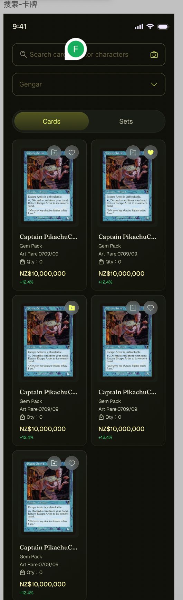
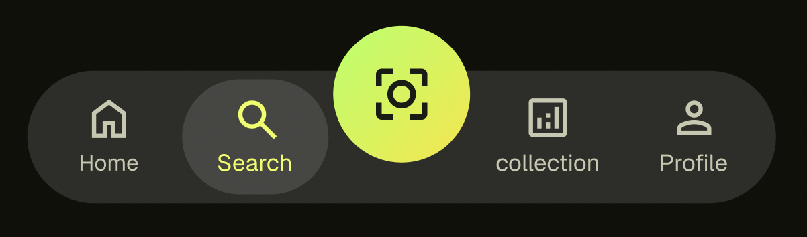
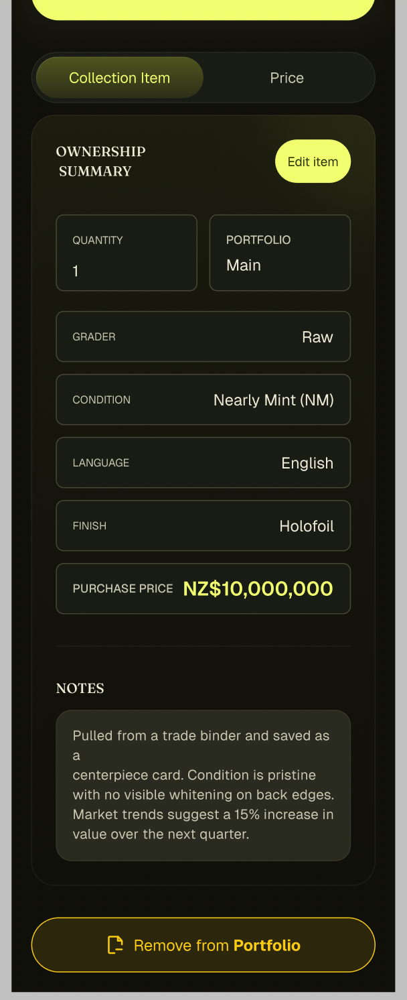

# 图标动效

## 1. 统一收藏成功 / 加入成功

- 参考链接：<https://lottiefiles.com/free-animation/success-0u6rqMvimp>

## 2. 爱心和文件夹

- 爱心图标：<https://lordicon.com/icons/system/regular?c=3&f=free&i=48-favorite-heart>
- 文件夹图标：<https://lordicon.com/icons/system/regular?c=3&f=free&i=44-folder>

## 3. 底部菜单切换

- 参考链接：<https://motion.dev/examples/vue-tab-select>

## 4. 详情页 Tab 切换

- 参考链接：<https://motion.dev/examples/react-smooth-tabs>

## 5. Loading 页面

- 参考链接：<https://loading-ui.com/docs/components/orbit-ring>

